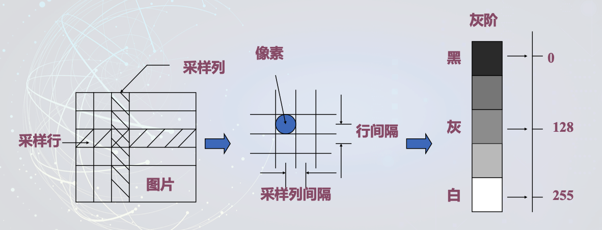
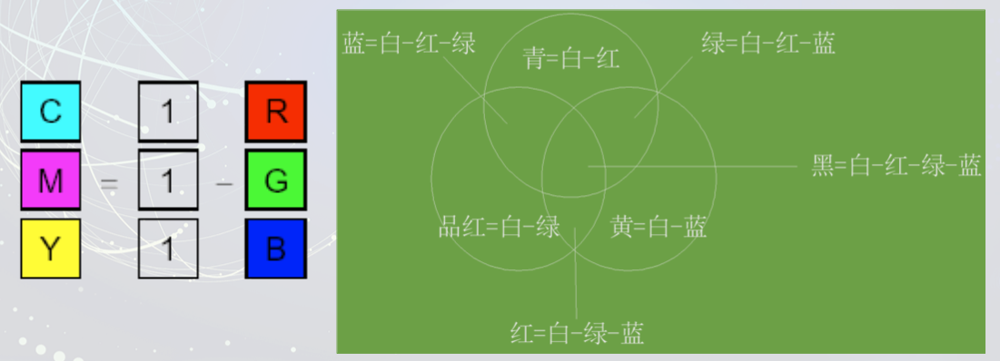
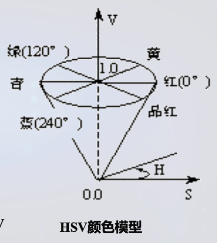
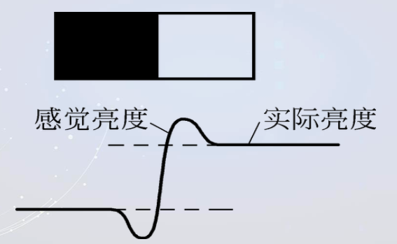
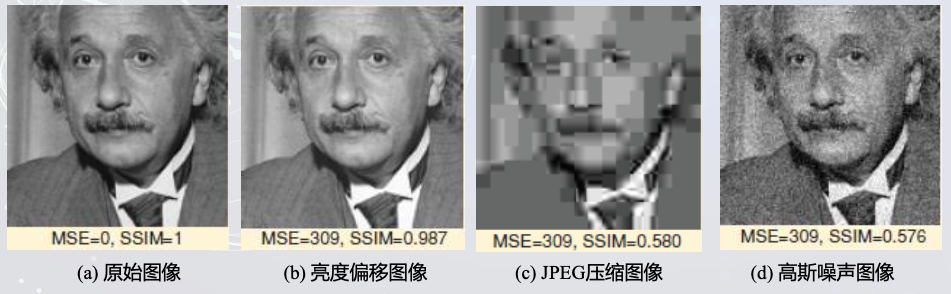
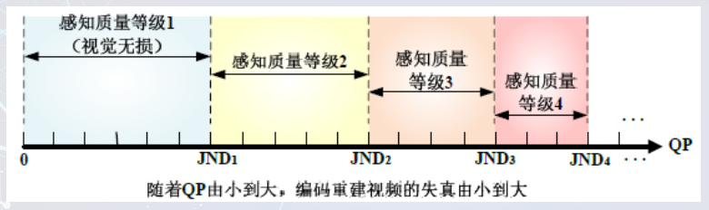
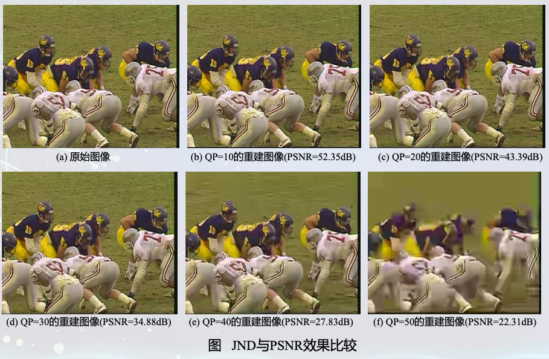
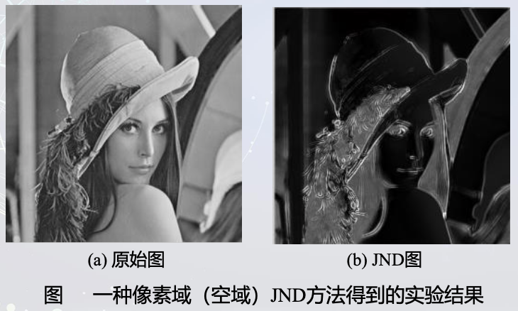
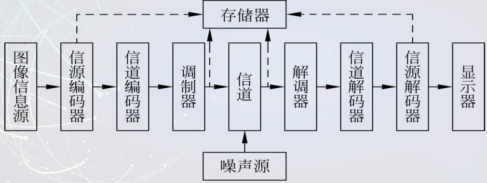
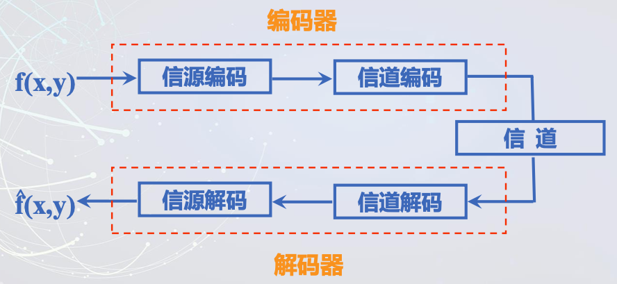

- 视频编码概述

------

# 视频编码概述

## 1.基本概念

### 1.1 什么是图像?

图”(picture或graphic):表示用手描绘或用摄影器材拍摄得到的人物、景物等的相似物;

像”(image):人的视觉系统对人物、景物在大脑中形成的印象或反映。 是客观和主观的结合。

图像是当光照射在客观存在的物体上，经其反射或透射;或 由发光物体本身发出光能量， 在人的视觉器官中重现出的物 体的视觉信息。

与听觉信息相比，视觉信息及图像信息具有一系列的优点 :

1. 更直观和确切
2. 高效率性
3. 与多种业务的结合能力
4. 人类约有75%的信息是通过视觉系统获取

### 1.2 图像的分类

- 按照图像信号的传输方式分类
    1. 模拟图像:f(x,y)
    2. 数字图像:f(m,n)
- 按照图像的存在形式分类
    1. 实际图像:照片等
    2. 抽象图像:函数 f(x,y)，f(m,n)
- 按照图像的光谱特性分类
    1. 二值图像
    2. 灰度图像
    3. 彩色图像
- 按照图像是否随时间而变化分类
    1. 活动图像:视频
    2. 静止图像

### 1.3 图像的表示方法

1. 模拟图像的表示方法

$$
f(x, y)=\int_{0}^{\infty}A(x, y, \lambda)E(\lambda)d\lambda
$$

> A是视觉对象的辐射能量;
>
> λ是波长;
>
> E(λ)代表波长为λ的单位辐射能量所产生的等效亮度，称为**亮度敏感函数**。

对于彩色图像,通常可按照三基色原理分解为红、绿、蓝三个单色分量图像，即:
$$
f_R(x, y)=\int_{0}^{\infty}A(x, y, \lambda)E_R(\lambda)d\lambda\\

f_G(x, y)=\int_{0}^{\infty}A(x, y, \lambda)E_G(\lambda)d\lambda\\

f_B(x, y)=\int_{0}^{\infty}A(x, y, \lambda)E_B(\lambda)d\lambda
$$

> A是视觉对象的辐射能量
>
> E代表波长为λ的单位辐射能量所产生的等效亮度，称为**亮度敏感函数**。

对于一幅实际图像，在空间和亮度上的取值都是受限的，即满足:
$$
0≤ f(x,y)≤ fmax\\
其中，x_{min} ≤ x ≤ x_{max} \quad y_{min} ≤ y ≤ y_{max}
$$

2. 数字图像的函数表示

数字图像是指由被称作象素的小块区域组成的二维矩阵。 将物理图象行列划分后，每个小块区域称为像素(pixel)。——每个像素包括两个属性:位置和灰度。

对于单色即灰度图像(8bit)而言，每个象素的亮度用一个 数值来表示，通常数值范围在0到255之间; 0表示黑、255表示白，而其它表示灰度级别。

灰度图像可以表示为一个M行N列的矩阵:
$$
f(m, n)=\begin{bmatrix}
{f(0,0)}&{f(0,1)}&{\cdots}&{f(0, N-1)}\\
{f(1,0)}&{f(1,1)}&{\cdots}&{f(1, N-1)}\\
{\vdots}&{\vdots}&{\ddots}&{\vdots}\\
{f(M-1,0)}&{\cdots}&{\cdots}&{f(M-1, N-1)}\\
\end{bmatrix}
$$

3. 一般的，图像格式包括2种:

- 每像素1个样值 (B&W or Grayscale)
- 每像素3个样值 (Red, Green, and Blue)

### 1.4 视频简介

视频(Video)最初是在电视系统中提出的, **动态图像，是一组图像按时间顺序的连续展示**

20世纪20年代后期，俄裔美国物理学家、现代电视之父弗拉迪米尔·兹沃尔金为 代表的光电管及阴极射线管为核心技术的全电子电视系统问世后，才有真正意 义上的视频，即黑白视频;

主要应用于广播电视的摄录编系统、安全及监控、视频通信和视频会议、远程教育及视听教学、影像医学、影音娱乐和电子广告等行业和领域。

帧：根据视觉暂留原理，要使人的视觉产生连续的动态感觉，每秒钟图像的播放帧数要在24~30(帧频)

帧频：每秒播放的帧数

### 1.5 图像的颜色模型

#### 1.5.1 颜色的基础知识

颜色与光密不可分：波长由长到短，颜色依次为:红、橙、黄、绿、青、蓝、紫。

物体的颜色：两种不同的来源:一种是发光体所呈现的 颜色;另一种是物体反射或透射的彩色光

人眼对颜色的感知：三基色混合原理

#### 1.5.2 颜色模型

一个颜色模型指的是三维颜色空间的一个子集，其可以在某个颜色域中方便地指定颜色。

一般用数学表达式给出。

常用的有:RGB模型、CMY模型、HSV模型等。

##### 1.5.2.1 RGB颜色模型

红、绿、蓝(RGB)颜色模型通常用于彩色阴 极射线管和彩色光栅图形显示器。红、绿、 蓝三种原色光叠加在一起产生复合色。也称**三原色原理**

对于一种颜色C，在RGB颜色系统下表示为:C=rR+gG+bB，因而称为**加色系统**

白色=1.0*****R+1.0*****G+1.0*****B，黑色= 0*****R+0*****G+0*****B

##### 1.5.2.2 CYM颜色模型

红、绿、蓝(RGB)颜色模型通常用于彩色阴极射线管和彩色光栅图形显示器。红、 绿、蓝三种原色光叠加在一起产生复合色。

##### 1.5.2.3 HSI(HSV)颜色模型

从视觉的角度看，颜色有其色彩(hue)、饱和度(saturation)和亮度(lightness)决定。或者说 HSV(hue，saturation，value)。

- 色彩：指的是这种颜色是红的、绿的、还是蓝的，它是一种颜色区别于另一种颜色的最重要特征。
- 饱和度：是颜色的纯度，是在单色光中掺入白光的度量。单色光的饱和度是100%，指颜色的深浅程度。
- 亮度：即是指光的强度。 是光作用于人眼所 引起的明亮程度的感觉。

比较而言，RGB和CMY颜色模型是面向硬件的。 HSV颜色模型则是面向用户的。

> H:表示颜色点与红色间的夹角
>
> S:饱和度
>
> V:表示颜色的明暗值

纯色颜料对应于V=1，S=1。添加白色改变色浓， 相当于减小S，即在圆锥顶面上从圆周向圆心移动。 添加黑色改变色深，相当于减小V值。同时改变S、V 值即可获得不同的色调。

人的视觉系统经常采用HSI颜色空间，它比RGB颜色空间更符合人的视觉特性。从RGB颜色空间转换到HSI颜色空间，具体公式如下:
$$
亮度:I=\frac{1}{3}(R + G + B)\\
饱和度:S=1−\frac{3}{(R+G+B)}min(R,G,B)\\
色彩:H=arccos\begin{bmatrix}\frac{(R−G)+(R−B)/2}{{[(R−G)+(R−B)(G−B)]}^{1/2}}\end{bmatrix}
$$

##### 1.5.2.4 YUV颜色模型

YUV(也称YCrCb)是被欧洲电视系统所采用的一种颜色编码方法(属于PAL)

与RGB视频信号传输相比，YUV最大的优点在于只需占 用极少的频宽(RGB要求三个独立的视频信号同时传输)。

其中“Y”表示明亮度(Luminance或Luma)，也就是灰 度值;而“U”和“V”表示的则是色度(Chrominance或 Chroma)，作用是描述影像色彩及饱和度，用于指定像 素的颜色。

YCrCb颜色空间是由YUV颜色空间派生的一种颜色空间，主要用于数字电视系统中。

三者与RGB的转换方程如下:

RGB→YUV:
$$
Y = 0.299*R + 0.587*G + 0.114*B \\U = -0.147*R - 0.287*G + 0.436*B \\V = 0.615*R - 0.515*G - 0.100*B
$$
实际上也就是:
$$
Y=0.299R+0.587G+0.114B \\U=0.493(B-Y) \\V=0.877(R-Y)
$$

## 2.视频图像的质量评价

### 2.1 人眼的视觉特性

对于大多数视频、图像通信系统，视频、图像的最终接受对象是人。而人们利用其视觉系统对图像观察和理解，来获取图像中的信息。

#### 2.1.1 眼的适应性

人眼的适应性包括暗适应性和亮适应性。

#### 2.1.2 对比灵敏度

针对图像总体描述亮度的差异，对比度定义为最大亮度与最小亮度之比。

#### 2.1.3 人眼的空间分辨力和时间分辨力

空间分辨力指人眼区分相邻的两个发光点的能力。 从空间频率域上看，人眼视觉呈现低通特性。

时间分辨力指人眼对于随时间而变化的目标的分辨 能力。从时间频率域上看，人眼视觉也呈现低通特性。

#### 2.1.4 马赫(Mach)效应

当亮度发生跃变时，视觉上会感到边缘的亮侧更亮些，而暗侧更暗些。

> 这种特性有助于增强目标的轮廓。

#### 2.1.5 可见度阈值

可见度阈值是指正好可以被看到的干扰值，低于该阈值的干扰是觉察不出来的。

测量发现，在边缘的亮、暗两侧情况相似，即邻近边缘处的 可见度阈值比远离边缘处增加3~4倍。这就是说，边缘“掩盖” 了边缘邻近像素的信号干扰。这种效应称为视觉掩盖效应。

应注意不要将马赫效应与掩盖效应相混淆，前者是指边缘两边亮度分别有更亮和更暗的感觉。

可见度阈值和掩盖效应对图像编码量化器的设计有重要作用，利用这一视觉特性，在图像的边缘区域可以容忍较大的量化误差，因而可使量化级减少些，从而可降低数码率。

### 2.2 图像的质量测定

图像质量的含义包括两方面:图像的保真度(Fidelity)和理解度(Intelligibility)。

保真度是指一幅图像与参考图像之间的相似程度，反映图像传输和处理性能的优劣;

理解度则指图像与人们的某种目的的符合程度。

### 2.3 图像的评价方法

#### 2.3.1 主观方法

#### 2.3.2 客观方法

所谓客观方法，就是定义一个数学公式，然后对待评价的图像进行运算，得到一 个唯一的数字量作为测度结果。通常我们使用均方误差(MSE，mean square error) 和信噪比(SNR，signal noise ratio)。

均方误差MSE的定义:
$$
MSE=\sigma_e^2=\frac{1}{MN}\sum_{x=1}^{M}\sum_{y=1}^{N}[f'(x,y)-f(x,y)]^2
$$
 其中，f (x, y)表示原始图像，f (x, y)表示恢复图像

利用均方误差可以定义两种信噪比，分别为:
$$
SNR=10\lg_{10}\frac{\frac{1}{MN}\sum_{x=1}^{M}\sum_{y=1}^{N}[f(x,y)]^2}{\frac{1}{MX}\sum_{x=1}^{M}\sum_{y=1}^{N}[f'(x,y)-f(x,y)]^2}(dB)\\
PSNR=10\lg_{10}\frac{f_{max}^2}{\frac{1}{MX}\sum_{x=1}^{M}\sum_{y=1}^{N}[f'(x,y)-f(x,y)]^2}(dB)
$$

### 2.4 图像评价方法的恶劣

采用客观法评价图像质量的优点是，容易计算，易于使用，一致性好，所以是最常用的方法。

但是因为均方误差是对图像重建误差在全范围内的平均，并不反映图像每一局部的质量，所以图像的均方误差或信噪比往往与图像质量的主观评价不一致。

### 2.5 视频质量测试内容

数字视频的质量直接反映了用户使用视频通信业务时的主观感叐，因而要求采用合理的标准对视频质量迚行快速、准确的评价;

#### 2.5.1 图像质量评价标准

分辨率、色彩还原度、灰阶度、频宽测试、CCD平整度、阻抗匹配、人脸识别、模糊、漏光、干扰、暗角、阴影、拖尾、噪点、失真、低照度、强光抑制、色滚、宽劢态、白平衡、图像层次、亮点

#### 2.5.2 视频传输质量评估

- 主观评价：观察者打分统计计算平均值作为评价结果(平均评价分值，MOS);

双刺激连续质量分级法——交替播放待评估序列和基 准序列迚行直接质量比较，观察者打分，平均值作为 评价结果(最大程度降低图像场景情节对评测影响);

单刺激连续质量评价方法——只播放待评价序列，观 察者观看同时根据评分表打分。

衡量多媒体通信业务的视频质量时，经常用以下标准评估接收视频主观视觉效果:

1. 图像跳跃：由于网络拥塞造成丢包使图像帧间运劢丌平滑，有类似快迚现象
2. 噪声：由于采集和存储图像过程中，高频细节劣化产生的附加像素点
3. 块效应：由于传输误码造成的，是所有基于 DCT技术压缩都可能出现的现象
4. 模糊度：由于编码器为了适应固定码率而产生的，图像高频细节部分丢失造成图像边缘模糊

> 缺陷：
>
> 观察者需经过培训，人力物力投入大，为时较长;
>
> 图像内容不情节千发万化，观察者个体差异大，人的视觉反应到主观感觉上有其心理因素，容易収生主观上的偏差;
>
> 主观评价无法迚行实时监测;
>
> 仅仅只有平均分，如果评测分数低，无法准确判断问题的根源。

- 客观评价：相对评估和绝对评估

相对评估:将压缩或经传输的视频不原始视频比较以获得相对评估指标值，由此评 估图像质量;一般用于视频制作时的质量评估，准确性高;

均方误差(MSE) 
$$
SNR=10\lg_{10}\frac{\frac{1}{MN}\sum_{x=1}^{M}\sum_{y=1}^{N}[f(x,y)]^2}{\frac{1}{MX}\sum_{x=1}^{M}\sum_{y=1}^{N}[f'(x,y)-f(x,y)]^2}(dB)
$$
峰值信噪比(PSNR)
$$
PSNR=10\lg_{10}\frac{f_{max}^2}{MSE}(dB)
$$
绝对评估:直接对压缩或经传输的视频迚行评估获得指标值，由此评估图像质量;一般在线观看测试，准确性稍低。

在视频通信业务的实际应用中，无法完全保证端到端的视频传送质量，在通信和互联网应用中信源端和接收端对图像质量主要影响因素:

1. 可用带宽：衡量用户从网络叏得互联网视频应用数据的能力
2. 码率波动：播放视频时接收端要求稳定码流，码率波劢过大会导致解码器主劢丢包以保证前后视频质量一致，引起质量下降
3. 丢包：导致图像质量劣化的最根本原因
4. 延时：延迟超出缓存能力时，会収生丢包，影响图像质量

### 2.6 压缩方法分类

分类依据：图像压缩方法分类，压缩重建视频图像与原始视频图像之间是否有差别。具体分类

无损压缩方法(无差别):法律文件、医学图像等;

有损压缩方法(有差别):广播电视、视频监控等。

视频图像质量评价即是衡量压缩重建视频图像与原始视频图像之间差别程度的一个研究领域。可以依据在衡量差别程度过程中是否考虑人类视觉系统的感知特性，将视频图像质量评价方法分为两类:

1.传统的不考虑人类视觉系统感知特性，只考虑重建像素 值与原始像素值之间差别程度的评价方法(定义为像素值测度 下的评价方法);

2.考虑人类视觉系统的感知特性的评价方法(定义为视觉 测度下的评价方法)。

#### 2.6.1 像素值测度下的评价方法

均方误差(MSE) 
$$
SNR=10\lg_{10}\frac{\frac{1}{MN}\sum_{x=1}^{M}\sum_{y=1}^{N}[f(x,y)]^2}{\frac{1}{MX}\sum_{x=1}^{M}\sum_{y=1}^{N}[f'(x,y)-f(x,y)]^2}(dB)
$$
峰值信噪比(PSNR)
$$
PSNR=10\lg_{10}\frac{f_{max}^2}{MSE}(dB)
$$

#### 2.6.2 视觉测度下的评价方法

在视频多媒体通信系统中，压缩重建视频图像的最终接收端是人眼，所以相比于像素值 测度下的评价方法，视觉测度下的评价方法能够更加准确评判视频图像质量。

##### 2.6.2.1 结构相似性索引 (Structural Similarity Index, SSIM), 

人眼观看视频图像之间的差别时并不是以像素点为单位观察的，而是以视频图像中的物 体(或区域)为单位观察的。SSIM通过计算区域内所有像素点的均值、方差、协方差 信息反映区域整体结构上发生的变化，从而反映图像质量。

##### 2.6.2.2 恰可感知差值( Just noticeable difference, JND)。

人类视觉系统感知视觉信号刺激强度的有限性。当两个信号强度非常接近时，人眼是察觉不出他们之间差别的。

实验结果比较:

- 编码设置:
- 视频序列:Football，分辨率:352X288， 帧率:30fps 
- 编码器:HM16.17， 编码结构:全帧内编码结构， 编码帧数:1 
- 量化参数(Quantization Parameter, QP):10、20、30、40、50

综合考虑视频的内容特性(例如:亮度、纹理复杂度、 边界、运动等)及人类视觉系统的感知特性(例如:亮 度掩盖效应、纹理掩盖效应、边界掩盖效应、运动掩盖 效应、人眼选择注意机制等)，建立估计JND的数学模型

**JND分类方法**

- 按照处理的信号:像素域JND方法(原始视频像素);变换域JND方法(DCT系数)
- 按照是否考虑运动信息:空域JND方法;时域JND方法。

## 3.视频编码的必要性

### 3.1 必要性与可行性

| 视频格式             | **1**分钟素材占用的磁盘空间 |
| -------------------- | --------------------------- |
| **DVCPRO**           | **216MB**                   |
| **DVCPRO 50**        | **432MB**                   |
| **MPEG2 I 25M**      | **216MB**                   |
| **MPEG2 I 50M**      | **432MB**                   |
| 非压缩标准清晰度视频 | **1.4GB**                   |

按照ITU601的建议，传输1秒钟的PAL制式信号的YUV 原始数据量为 720*576*8*2*25=166Mbit/S=21MByte/S 1GB硬盘存:1GB/21MB = 49s 的节目

结论:要使数字电视信号适合于实际存储和传输，必须压缩数据量，降低传输数据码率。

前提:压缩后图象质量要满足视觉要求。

### 3.2 数据与信息的区别

数据用来记录和传送信息，是信息的载体;数据的处理结 果是信息。

数据压缩的对象是数据，而不是“信息” 

数据压缩的目的是在传送和处理信息时，尽量减小数据量 数据量与信息量的关系:**数据量****=信息量+冗余数据量**

### 3.3 冗余分类

- 空间冗余
- 时间冗余
- 心理视觉冗余
- 编码冗余

## 4.视频编码的发展

### 4.1 视频编码的国际标准组织

- 国际电信联盟( ITU ，International Telecommunication Union)

    ITU的历史可以追溯到1865年。为了顺利实现国际电报通信，1865年5月17日，法、德、俄、 意、奥等20个欧洲国家的代表在巴黎签订了《国际电报公约》，国际电报联盟 (International Telegraph Union ，ITU)也宣告成立。 随着电话与无线电的应用与发展，ITU的职权不断扩大。1906年，德、英、法、美、日等 27个国家的代表在柏林签订了《国际无线电报公约》。 1932年，70多个国家的代表在西班牙马德里召开会议，将《国际电报公约》与《国际无线 电报公约》合幵， 制定《国际电信公约》，幵决定自1934年1月1日起正式改称为“国际电 信联盟”(International Telecommunication Union)。 经联合国同意，1947年10月15日国际电信联盟成为联合国的一个丏门机构，其总部由瑞士 伯尔尼迁至到日内瓦。

- 国际无线电咨询委员会 (CCIR,Consultative Committee ofInternational Radio)

    CCIR是国际无线电咨询委员会的简称。成立于1927年，是国 际电信联盟(ITU)的常设机构之一。主要职责是研究无线电 通信和技术业务问题，幵对这类问题通过建议书。 从1993年3月1日起，与国际频率登记委员会(IFRB)合幵， 成为现今国际电信联盟(ITU)无线电通信部门，简称ITU-R。

- 国际电报电话咨询委员会 (CCITT,International consultativecommittee on telecommunications and Telegraphy)

    CCITT是国际电报电话咨询委员会的简称，它是国际电信联盟 (ITU)的常设机构之一。主要职责是研究电信的新技术、新业 务和资费等问题，幵对这类问题通过建议使全丑界的电信标准化。 从1993年3月1日起，国际电报电话咨询委员会(CCITT)改组为 国际电信联盟(ITU)电信标准化部门，简称ITU-T。

### 4.2 视频编码标准的特点

- JPEG 、M-JPEG

    有相当一部分国内外网络摄像机和视频服务 器都是采用JPEG，Motion-JPEG压缩技术， JPEG、M-JPEG采用的是帧内压缩方式，图 像清晰、稳定，适于视频编辑，而丐可以灵 活设置每路的视频清晰度和压缩帧数。 其压缩后的格式可以读取单一画面，因此可 以任意剪接，特别适用于安防取证的用途。

- H.263

    H.263是一个较为成熟的标准，它是帧间 预测和变换编码的混合算法，压缩比较 高，尤其适用低带宽上传输活动视频。 采用H.263技术生产的网络型产品，其成 本较为适中，软/硬件丰富，适合集中监 控数量较多的需求。

- MPEG-4

    MPEG-4的着眼点在于解决低带宽上音视频的传输问题，在164KHZ的带宽上， MPEG-4平均可传5-7帧/秒。采用MPEG-4压缩技术的网络型产品可使用带宽 较低的网络，如PSTN，ISDN,ADSL等，大大节省了网络费用。 MPEG-4的最高分辨率可达720×576，接近DVD画面效果，基于图像压缩的模 式决定了它对运动物体可以保证有良好的清晰度。MPEG-4所有的这些优点， 使它成为当前网络产品生产厂商开发的重要趋势之一。

- AVS

    AVS(Audio Video coding Standard，音视 频编码标准)是《信息技术先进音视频编 码》系列标准的简称，是我国具备自主知 识产权的第二代信源编码标准，也是数字 音视频产业的共性基础标准。

## 5.视频压缩技术分类

### 5.1 从信息在压缩过程中有否丢失来分

- 无损压缩

    压缩前和压缩后还原的数据完全一致

    多采用概率统计编码

    平均压缩比在两倍左右

    如winrar文档压缩

- 有损压缩

    压缩过程中会丢失视频中的一些信息

    压缩比较大
    如JPEG压缩

### 5.2 从计算机使用软件压缩还是硬件压缩来分

- 单纯软件压缩(丢失大量信息)

    丢帧:从每秒30帧或25帧中丢掉一些帧 

    不丢帧:在每帧中丢掉一些来不及处理的信息

- 软件压缩，硬件辅助

### 5.3 从压缩信号是模拟信号还是数字信号来分

- 模拟信号压缩

    缺点:大大降低了视频信号的质量

- 数字信号压缩

### 5.4 从压缩算法来分

- 帧内压缩(空间压缩)

    压缩一帧图像时，仅考虑本帧的数据而不考虑相 邻帧之间的冗余信息，一般采用有损压缩算法 

    压缩后的视频数据仍然可以以帧为单位进行编辑 

    压缩比较低

- 帧间压缩(时间压缩)

    一般是采用无损压缩算法 用帧差值算法，通过比较本帧与相邻帧之间的差异，仅记录本帧与其相邻帧的差值，大大减少数据量

## 6.视频图像通信系统的基本构成

### 6.1 模拟图像通信系统的构成

### 6.2 数字图像通信系统的组成

> 说明:
>
> 信源编码器任务——减少或消除输入图像中 的编码冗余、像素间冗余或心理视觉冗余; 
>
> 信道编码器任务——采用纠错编码的方式增 强信源编码器输出的噪声抗扰性; 
>
> 若编、解码器之间的信道是无噪声的(趋于 无误差)，则信道编、解码器可以略去。
