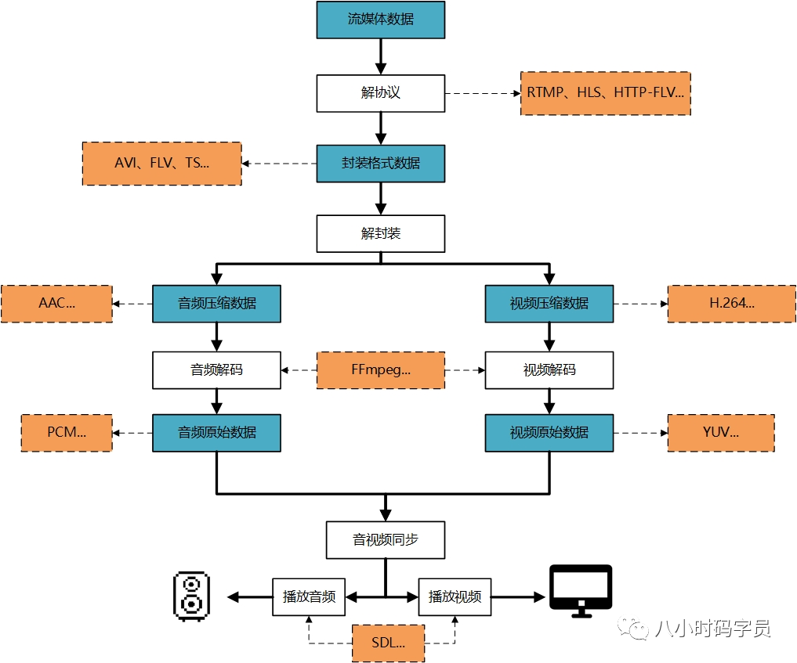
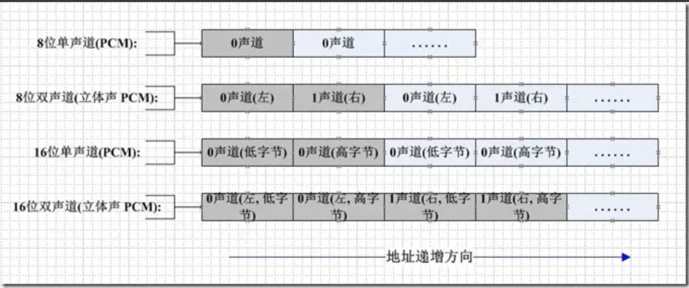
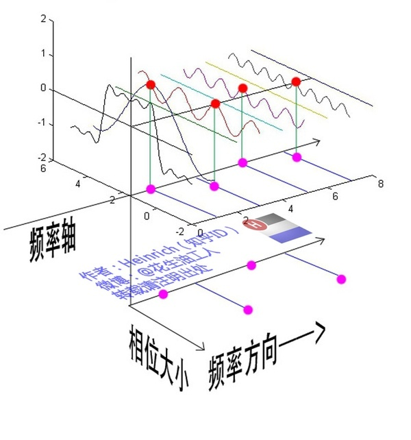
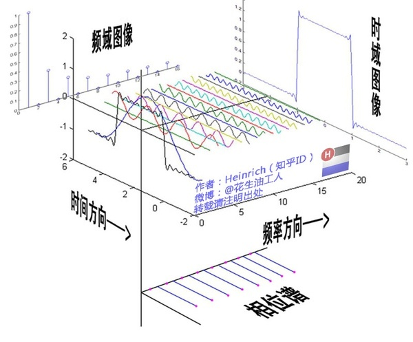

# 音频相关知识

说到音频，主要有两个概念比较重要，一个是采集到的原始音频数据（比如PCM）和压缩后的音频数据（比如AAC）。




## 基础概念

### 什么是声音？

中学物理中我们知道，声音是物体振动产生的声波。声音通过介质（空气、固体、液体）传入到人耳中，带动听小骨振动，经过一系列的神经信号传递后，被人所感知。

声音是一种波。物体振动时会使介质（如空气）产生疏密变化，从而形成疏密相见的纵波。

既然声音是波，那么我们就可以用图的形式来表示它。

给定空间中某一点，该点的空气疏密随时间的变化如下：


下图是一个正弦波，其周期为0.002s，频率为500HZ。


该声音很像视频中的**消音**处理。

**频率（音调）：声音1秒内周期性变化的次数**

人耳的听觉范围在20Hz-20kHz。 低频的声音沉闷厚重，高频的声音尖锐刺耳。 高于 20kHz的声音为超声波。

**振幅（响度）：声音的大小**

有的时候，我们用分贝（dB）形容声音大小。值得注意的是，**dB是一个比值，是一个数值，没有任何单位标注。（功率强度之比的对数的10倍）**


- **音调**：声音频率的高低叫做音调(Pitch),是声音的三个主要的主观属性,即音量(响度)、音调、音色(也称音品) 之一。表示人的听觉分辨一个声音的调子高低的程度。音调主要由声音的频率决定,同时也与声音强度有关

- **音量**：人主观上感觉声音的大小（俗称音量），由**振幅**（amplitude）和人离声源的距离决定，振幅越大响度越大，人和声源的距离越小，响度越大。（单位：分贝dB）
- **音色**：又称声音的品质，波形决定了声音的音色。声音因不同物体材料的特性而具有不同特性，音色本身是一种抽象的东西，但波形是把这个抽象直观的表现。音色不同，波形则不同。典型的音色波形有方波，锯齿波，正弦波，脉冲波等。不同的音色，通过波形，完全是可以分辨的。

波长越长  同等条件下，波长（频率）是决定音调高低的因素。


同等条件下，振幅是决定音量高低的因素。


同等条件下，波纹是决定音色因素。


### 采集与存储

**采样**，指把时间域或空间域的连续量转化成离散量的过程 。

对声音的采样常用麦克风等设备将声音信号转换成电信号，再用模/数转换器将电信号转换成一串用1和0表示的二进制数字（数字信号）。我们每秒对声音采样上万次，获得上万个按照时间顺序排列的二进制数字。于是，我们就将连续变化不断的声音转化成了计算机可储存并识别的二进制数字。该声音由84700个不同的数字组成。 其中的一段数字如下：（二进制数字已转换为十进制）

… 413, 263, 137, 15, -124, -253, -369, -463, -511, -545, -587, -632, -678, -701, -687, -659, -623, -579, -539, -473, -380, -282, -162, -35, 78, 211, 341, 430, 499, 548, 551, …

如果用图像的形式表示该音频，则图像如下：（横轴是时间，纵轴为振幅，两个图像分别代表左右声道。由于声音频率较大，所以在图像中的信号不是“正弦”，而是实心的。）


#### 采样频率

> 采样定理在1928年由美国电信工程师H.奈奎斯特首先提出来的，因此称为奈奎斯特采样定理。
>
> 1933年由苏联工程师科捷利尼科夫首次用公式严格地表述这一定理，因此在苏联文献中称为科捷利尼科夫采样定理。
>
> 1948年信息论的创始人C.E.香农对这一定理加以明确地说明并正式作为定理引用，因此在许多文献中又称为香农采样定理。

奈奎斯特采样定理解释了采样率和所测信号频率之间的关系。 阐述了采样率fs必须大于被测信号感兴趣最高频率分量的两倍。

该频率通常被称为奈奎斯特频率fN。即：奈奎斯特采样定理 fs >= 2fH

根据奈奎斯特采样定理，需要数字化的模拟信号的带宽必须被限制在采样频率fs的一半以下，否则将会产生混叠效应，信号将不能被完全恢复。这就从理论上要求一个理想的截频为fs/2的低通滤波器。实际中采用的通频带为0~fs/2的低通滤波器不可能既完全滤掉高于的fs/2的分量又不衰减接近于fs/2的有用分量。因此实际的采样结果也必然与理论上的有差别。如果采用高于fs的采样频率，如图1中为2fs，则可以很容易用模拟滤波器先滤掉高于1.5fs的分量，同时完整保留有用分量。采样后混入的界于0.5fs~1.5fs之间的分量可以很容易用数字滤波器来滤掉。这样输入模拟滤波器的设计将比抗混叠滤波器简单的多。

采样频率指录音设备在一秒钟内对声音信号的采样次数。采样频率越高，声音的还原就越真实越自然。

目前主流的采样频率有22.05KHz、44.1KHz、48KHz三种。

22.05 KHz为FM广播的声音品质，44.1KHz为理论上的CD声音品质。48KHz为人耳可辨别的最高采样频率。

直观理解：一段连续的声音如下


一段声音我们等间隔地对其采样


最终，我们真正采样到的音频如下


如下图可见，采样频率越高，我们获得的声音品质越好。


#### 量化位数

我们不可能获得所有时间下声音的强度，因此声音是等时间间隔、离散采样的。同样，采样获得的数据不可能无限的精确，如数字为63.2222222….，这无法在计算机中储存。因此，采样获得的数据同样也是离散的。

量化位数是音频文件的另一个参数。量化位数越大，声音的质量越高。常用的量化位数有8位、16位和32位。

量化位数指用几位二进制数来存储采样获得的数据。量化位数为8即指用8位二进制数来存储数据，如00010111

还是之前的例子，有一段正弦声波，假设量化位数为3，即存储的数据只有000/001/010/011/100/101/110/111这8种可能。


现在，还是等距离采样，不过采样的点只能落在最近的红线上。


此时，每个点纵坐标的取值只有二的三次方，即只有8种可能。


由下图可见，量化位数越大，声音效果越好。


另外值得注意的是，不同量化位数存储的数据不可直接比较。

如4位量化位数存储的1111，其十进制是15，8位量化位数存储的10000000，其十进制是64。不是因为64>15，所以后者对应的声音比前者大。而是应该二者分别除以其总取值范围后在比较。前者对应的声音比后者大。


#### 声道数

声道分为单声道与双声道。

单声道即为左右耳听到的声音相同。

双声道两耳听到的信息不同。相同的声音时间、采样频率和比特率的情况下，双声道文件的存储空间是单声道的两倍。但其会给人空间感，游戏和电影中常采用双声道，可达到“听声辨位”的效果。示例声音如下：


## 非编码格式

### PCM

#### 什么是PCM？

PCM（Pulse Code Modulation， 脉冲编码调制）音频数据是未经压缩的音频采样数据裸流，它是由模拟信号经过采样、量化、编码转换成的标准数字音频数据。


#### 如何理解PCM？

PCM是一种用数字表示采样模拟信号方法。主要包括**采样，量化，编码**三个主要过程。

-  先来看看模拟信号采样的过程（把时间域或空间域的连续量转化成离散量的过程 ）：


-  **采样率**：每秒钟采样的样本数。比如我们常说的44.1kHz，即每秒钟采样44100次。目前主流的采样频率有22.05KHz（为FM广播的声音品质）、44.1KHz（44.1KHz为理论上的CD声音品质）、48KHz三种（48KHz为人耳可辨别的最高采样频率）。

-  **量化**：将采样信号数据四舍五入到一个可用整数表示的过程。（位深）**量化位数**是音频文件的另一个参数。量化位数越大，声音的质量越高。常用的量化位数有8位、16位和32位。


 ◆ **编码**：将量化后的信号转换成二进制数据。


#### 描述PCM数据的6个参数

- Sample Rate : 采样频率。8kHz(电话)、44.1kHz(CD)、48kHz(DVD)。
- Sample Size : 量化位数。常见值为8-bit、16-bit。
- Number of Channels : 通道个数。常见的音频有立体声(stereo)和单声道(mono)两种类型，立体声包含左声道和右声道。另外还有环绕立体声等其它不太常用的类型。
- Sign : 表示样本数据是否是有符号位，比如用一字节表示的样本数据，有符号的话表示范围为-128 ~ 127，无符号是0 ~ 255。
- Byte Ordering : 字节序。字节序是little-endian还是big-endian。通常均为little-endian。
- Integer Or Floating Point : 整形或浮点型。大多数格式的PCM样本数据使用整形表示，而在一些对精度要求高的应用方面，使用浮点类型表示PCM样本数据。


#### 推荐的PCM数据播放工具

- ffplay, 使用示例如下：

```bash
#播放格式为f32le，单声道，采样频率48000Hz的PCM数据
ffplay -f f32le -ac 1 -ar 48000 pcm_audio
```

- [Audacity](https://links.jianshu.com/go?to=https%3A%2F%2Fwww.audacityteam.org%2F)：一款免费开源的跨平台音频处理软件。
    - Adobe Auditon。导入原始数据，打开的时候需要选择采样率、格式和字节序。


#### PCM数据格式

如果是单声道的音频文件，采样数据按时间的先后顺序依次存入（有的时候也会采用LRLRLR方式存储，只是另一个声道的数据为0），如果是双声道的话就按照LRLRLR的方式存储，存储的时候与字节序有关。big-endian模式如下图所示：




## 编码格式

将音频采样数据（**PCM** 等）压缩成音频码流，从而降低音频的数据量。 常用的音频编码方式有以下几种

| 名称 | 推出机构       | 推出时间 | 目前使用领域   |
| ---- | -------------- | -------- | -------------- |
| AAC  | MPEG           | 1997     | 各个领域（新） |
| AC-3 | Dolby Inc.     | 1992     | 电影           |
| MP3  | MPEG           | 1993     | 各个领域（旧） |
| WMA  | Microsoft Inc. | 1999     | 微软平台       |

- **MP3**

> **MP3**，英文全称 **MPEG-1 or MPEG-2 Audio Layer III**，是曾经非常流行的一种数字音频编码和有损压缩格式，它被设计来大幅降低音频数据量。它是在 **1991** 年，由位于德国埃尔朗根的研究组织 **Fraunhofer-Gesellschaft** 的一组工程师发明和标准化的。**MP3** 的普及，曾对音乐产业造成极大的冲击与影响。MP3是一种音频压缩技术，其全称是动态影像专家压缩标准音频层面3（Moving Picture Experts Group Audio Layer III），简称为MP3。压缩比4:1~10:1之间。

- **AAC**

> **AAC**，英文全称 **Advanced Audio Coding**，是由 **Fraunhofer IIS**、杜比实验室、**AT&T**、**Sony** 等公司共同开发，在 **1997** 年推出的基于 **MPEG-2** 的音频编码技术。**2000** 年，**MPEG-4** 标准出现后，**AAC** 重新集成了其特性，加入了 **SBR** 技术和 **PS** 技术，为了区别于传统的 **MPEG-2 AAC** 又称为 **MPEG-4 AAC**。 **AAC** 比 **MP3** 有更高的压缩比，同样大小的音频文件，**AAC** 的音质更高。Advanced Audio Coding， 出现于1997年，由Fraunhofer IIS、杜比实验室、AT&T、Sony、Nokia等公司共同开发。AAC压缩比通常为18：1。相比MP3，采用更高效的编码算法，音质更佳，文件更小。

- **WMA**

> **WMA**，英文全称 **Windows Media Audio**，由微软公司开发的一种数字音频压缩格式，本身包括有损和无损压缩格式。


### MP3

#### 什么是MP3？

MP3是MPEG-1 Audio Layer 3的简称，是当今比较流行的一种数字音频编码和有损压缩格式（有Layer 3，也必然有Layer1和Layer2，也就是MP1和MP2，但不在本文讨论范围之内）。MP3技术的应该可以用来大幅度的降低音频文件存储所需要的空间。它丢掉脉冲编码调制（PCM）音频数据中对人类听觉不重要得数据，从而达到了较高的压缩比（高达12：1－10：1）。简单地说，MP3在编码时先对音频文件进行频谱分析，然后用过滤器滤掉噪音电平，接着通过量化的方式将剩下的每一位打散排列，最后形成有较高压缩比的MP3文件，并使压缩后的文件在回放时也能够达到比较接近原音源的效果。

MP3的音频质量取决于它的Bitrate和Sampling frequency，以及编码器质量。MP3的典型速度介于每秒128到320kb之间。采样频率也有44.1，48和32 kHz三种频率，比较常见的是采用CD采样频率——44.1kHz。常用的编码器是LAME，它完全遵循LGPL的MP3编码器，有着良好的速度和音质。


#### 文件格式

用一个二进制查看器（比如Ultra-Edit）打开一个MP3文件，就能看到一大堆看似杂乱无序的数据。但只要用心了解就会知道，其实，这一切都是有规律可循的。

MP3文件是由帧（frame）构成，帧是MP3文件的最小组成单位。每帧都包含帧头，并可以计算帧的长度。根据帧的性质不同，文件主要分为三个部分，ID3v2标签帧，数据帧和ID3v1标签帧。并非每个MP3文件都有ID3v2，但是数据帧和ID3v1帧是必须的。ID3v2在文件头，以字符串**ID3**为标志，包含了演唱者，作曲，专辑等信息，长度不固定，扩展了ID3V1的信息量。ID3v1在文件结尾，以字符串“TAG”为标记，其长度是固定的128个字节，包含了演唱者、歌名、专辑、年份等信息。

##### ID3V2

ID3V2到现在一共有四个版本，但流行的播放软件一般只支持第三版，既ID3V2.3。每个ID3V2.3 的标签都一个标签头和若干个标签帧或一个扩展标签头组成。关于曲目的信息如标题、作者等都存放在不同的标签帧中，扩展标签头和标签帧并不是必要的，但每个标签至少要有一个标签帧。标签头和标签帧一起顺序存放在MP3 文件的首部。

###### 标签头

```c++
长度为10个字节，位于文件首部，其数据结构如下：
char Header[3]; /* 字符串 "ID3" */
char Ver;    /* 版本号ID3V2.3 就记录3 */
char Revision; /* 副版本号此版本记录为0 */
char Flag;   /* 存放标志的字节，这个版本只定义了三位，很少用到，可以忽略 */
char Size[4]; /* 标签大小，除了标签头的10 个字节的标签帧的大小 */
标签大小为四个字节，但每个字节只用低7位，最高位不使用，恒为0，其格式如下：
0xxxxxxx 0xxxxxxx 0xxxxxxx 0xxxxxxx
```

计算公式如下：

```c++
ID3V2_frame_size = (int)(Size[0] & 0x7F) << 21 
    | (int)(Size[1] & 0x7F) << 14 
    | (int)(Size[2] & 0x7F) << 7 
    | (int)(Size[3] & 0x7F) + 10;
```


###### 标签帧

每个标签帧都有一个10字节的帧头和至少一个字节的不固定长度的内容组成。它们是顺序存放在文件中，由各自特定的标签头来标记帧的开始。其帧的结构如下：

```c++
char FrameID[4];  /*用四个字符标识一个帧，说明其内容 */
char Size[4];    /* 帧内容的大小，不包括帧头，不得小于1 */
char Flags[2];   /* 存放标志，只定义了6 位，此处不再说明 */
```

**常用帧标识：**

```
TIT2：标题
TPE1：作者
TALB：专辑
TRCK：音轨，格式：N/M，N表示专辑中第几首，M为专辑中歌曲总数
TYER：年份
TCON：类型
COMM：备注，格式：“eng/0备注内容”，其中eng表示所使用的语言
帧大小为四个字节所表示的整数大小。
```


##### ID3V1

###### 标签头

```c++
char Header[3];   /* 标签头必须是"TAG"否则认为没有标签 */
char Title[30];   /* 标题 */
char Artist[30];  /* 作者 */
char Album[30];   /* 专集 */
char Year[4];    /* 出品年代 */
char Comment[28]; /* 备注 */
char reserve;    /* 保留 */
char track;;    /* 音轨 */
char Genre;     /* 类型 */
```

其实，关于最后31个字节还存在另外一个版本，就是30个字节的Comment和一个字节的Genre.

有了上述的这些信息，我们就可以自己写代码，从MP3文件中抓取信息以及修改文件名了。但是，如果真的想写一个播放软件，还是需要读它的数据帧，并进行解码。

###### 数据帧

数据帧往往有多个，至于有多少，由文件大小和帧大小来决定。每个帧都有一个四字节长的帧头，接下来可能有两个字节的CRC校验，其存在由帧头中的具体信息决定。接着就是帧的实体数据，也就是MAIN_DATA了。

**帧头结构如下：**

| 位置   | 长度（BIT） | 描述（BITS）                                                 |
| ------ | ----------- | ------------------------------------------------------------ |
| 31－19 | 12          | Frame sync(0xFFF)                                            |
| 18/17  | 2           | Layer, 00 – reserved, 01 – Layer III  10 – Layer II, 11 － Layer I |
| 16     | 1           | protection_bit, 0 意味着受CRC保护，帧头后面跟16位的CRC。     |
| 15-12  | 4           | bitrate_index, 比特率                                        |
| 11-10  | 2           | sampling_frequency,   00 – 44.1KHz, 01 – 48KHz 10 – 32 KHz, 11 – 保留 |
| 9      | 1           | padding_bit,1 意味着帧里包含padding位，仅当采样频率为44.1KHz时发生。 |
| 8      | 1           | private_bit                                                  |
| 7-6    | 2           | mode,  00－stereo,     01-joint stereo(intensity stereo and/or ms_stereo)  11- dual_channel, 11 – single_channel |
| 5-4    | 2           | mode_extension,在Layer III中表示使用了哪一种joint stereo编码方式。 Intensity_stereo  ms_stereo<br/>00      off        off<br/>01      on         off<br/>10      off        on<br/>11      on         on |
| 3      | 1           | copyright,1 表示受版权保护。                                 |
| 2      | 1           | original，0表示该bitstream是一个copy，1表示是original.       |
| 1-0    | 2           | emphasis，表示会使用哪一种de-emphasis。<br/>          00 － no emphasis,   01 – 50/15 microsec. Emphasis<br/>          10 – reserved,    11 – CCITT J.17 |

- 无论帧长是多少，每帧的播放时间都是26ms
- 数据帧大小：

FrameSize = 144 * Bitrate / SamplingRate + PaddingBit
当144 * Bitrate / SamplingRate不能被8整除，则加上相应的paddingBit. 


**MAIN_DATA:**

MP3的granule包含18 * 32个subband采样。每个数据帧含有两个granule的数据，其内容结如下：

```
- main_data_end pointer
- side info for both granules (scfsi)
- side info granule 1
- side info granule 2
- scalefactors and Huffman code data granule 1
- scalefactors and Huffman code data granule 2
```

主要数据里包含了scalefactors, Huffman encoded data和ancillary information。其内容不再详叙，可以参考MP3 SPEC－IS0 11172-3 AUDIO PART。我们一般用的都是立体声，scfsi的长度为32个字节。

这里要解释的一个概念就是位流――bitstream。我们平常接触到的数据都是整数，最小的单位就是byte后者char。虽然我们也会用一个字节里的不同位来表示不同的含义，但总的来说，我们在出来数据的时候还是把它当作一个个字节看待。但对MP3这种数据格式来说，这是行不通的。在解码时，它的数据输入就是一个个比特流。其中一个或几个比特会是你的采样数据或者信息编码。你需要从整个MAIN_DATA里提取你所需要的以BIT为单位的参数和输入信号，从而进行解码。所以我们需要一个子程序，getbit(n)，也就是从缓冲中提取所需要的位，并形成一个新的整数，作为我们的输出。

**LAME标签帧**

可是，当你真的打开一个MP3文件的时候，你会发现，很奇怪，很多时候第一个数据帧的帧头后面的32个字节居然都为0，这是为什么呢，这么奇怪的解码信息该如何解释？找到MP3 INFO TAG REV SPECIFICATION的网站，我才明白，原来第一帧并不是真正的数据帧，而是LAME编码的标志帧。

这里又要牵涉到两个概念：CBR和VBR。CBR表示比特率不变，也就是每帧的长度是一致的，它以字符串“INFO”为标记。VBR是Variable BitRate的简称，也就是每帧的比特率和帧的长度是变化的，它以字符串“Xing”为标记。同时，它还存放了MP3文件里帧的总个数，和100个字节的播放总时间分段的帧的INDEX，还有其他一些参数，这被称为Zone A，传统Xing VBR标签数据，共120个字节。

在二进制文本编辑器里我们还可看到一个字符串“LAME”，并且后面清楚地跟着版本号。这就是20个字节的Zone B初始LAME信息，表示该文件是用LAME编码技术。接下来一直到该帧结束就是Zone C－LAME标签。


### AAC

#### 什么是AAC？

AAC(Advanced Audio Coding，高级音频编码)是一种声音数据的文件压缩格式。AAC分为ADIF和ADTS两种文件格式。出现在1997年，基于MPEG-2的音频编码技术，当时被称为MPEG-2 AAC,因此把其作为MPEG-2(MP2)标准的延伸。是由Fraunhofer IIS、杜比实验室、AT&T、Sony等公司共同开发，目的是取代MP3格式，随着MPEG-4(MP4)标准在2000年的成型，则为AAC也叫M4A。


#### 和AC3编码关系

和AC3关系不大，AC3早于AAC，是由AAC的发起单位杜比实验室和日本先锋合作研制的新编码方式。AAC能输出AC-3的任何码率，胜过AC-3，压缩率更高，但技术上更加复杂。


#### AAC背景和发展

> 1997年制定了不兼容MPEG-1的音频标准MPEG-2 NBC即MPEG-2 AAC;
>
> 1999年AAC又增加了LTP和PNS工具，形成了MPEG-4 AAC V1;
>
> 2002年在MPEG-4 AAC v1增加了SBR和错误鲁棒性工具，形成了 HE-AAC;
>
> 2004年MPEG-4在HE-AAC引入了PS模块，提升降码率性能，形成了EAAC+;
>
> 对于1999年、2002年、2004年增加了SBR和PS等编码技术的统称为MPEG-4 AAC；

**备注：**上面这些SBR PS等缩写就是音频的编码算法代名词，网上比较多，感兴趣的可以进一步自行搜索。

1. SBR技术即Spectral Band Replication(频段复制)音乐的主要频谱集中在低频段，高频段幅度很小，但很重要，决定了音质。如果对整个频段编码，若是为了保护高频就会造成低频段编码过细以致文件巨大；若是保存了低频的主要成分而失去高频成分就会丧失音质。SBR把频谱切割开来，低频单独编码保存主要成分，高频单独放大编码保存音质，**统筹兼顾**了，在减少文件大小的情况下还保存了音质，完美的化解这一矛盾。

2. PS指 **parametric stereo**（参数立体声）。原来的立体声文件文件大小是一个声道的两倍。但是两个声道的声音存在某种相似性，根据香农信息熵编码定理，相关性应该被去掉才能减小文件大小。所以PS技术存储了一个声道的全部信息，然后，花很少的字节用参数描述另一个声道和它不同的地方。 


#### AAC编码技术参数

> 采样率范围：8KHz-96KHz 范围比较广，就是一秒在模拟信号上进行多少次采样；
>
> 码率：8kbps-576kbps，支持范围比较宽，在压缩比和质量上都能考虑到；
>
> 声道：最多支持48个主声道，16个低频声道，声音细节更丰富，音乐场景也用的多；
>
> 采样精度：就是一个采样点需要在计算机表示占用的字节数，一般用2字节16bit表示；


#### AAC编码的主要规格

根据不同的编码技术，AAC的编码分为九种规格，这和H264的编码规格大同小异。

1. MPEG-2 AAC LC低复杂度规格（Low Complexity）编码方式比较简单，没有增益控制，但是提高了编码效率，在中等码率的编码效率和音质方面，都能找到平衡点。
3. MPEG-2 AAC SSR 可变采样率规格（Scaleable Sample Rate）
5. MPEG-4 AAC Main 主规格--包含了除增益控制之外的全部功能，音质最好
7. MPEG-4 AAC LTP 长时期预测规格（Long Term Prediction）
8. MPEG-4 AAC LD 低延迟预测规格（Low Delay）
9. MPEG-4 AAC HE 高效率规格（High Efficency）--这种规格适合用于低码率编码，有Nero-ACC编码器支持，是一种成熟的商用编码器。

目前使用最多的就是LC和HE（适合降低码率），**流行的Nero AAC编码程序支持LC、HE、HEv2三种规格的，而且编码后的AAC音频，规格都显示LC。**其中HE就是在AAC(LC)编码技术上增加SBR技术，HEv2就是AAC（LC）上技术上不仅仅增加了SBR技术，同时也增加了PS技术。

所以一般的商业音频编码器只支持部分编码规格，这也是我们选择编码器的重要考虑因素之一，因为不同的编码规格支持的音频采样率，码率都不一样，背后采用的编码技术和算法复杂度也不一样。


#### AAC编码方式特点

1. AAC高压缩比的音频编码方式，比G7xx、MP3、AC3系列的压缩比都高，并且质量和CD差不多，但是和比较新的Opus还是差点，不过Opus目前还未充分普及；
2. AAC也采用了变换编码算法，采用了更高的滤波器组，这是压缩高的原因；
3. AAC为了提高压缩比，还采用了噪声重整，反向自适应预测，联合立体声和量化霍夫曼编码算法等新技术；
4. AAC支持了更多的采样率和比特率，支持了1-48个音轨和多达15个低频音轨，具有多种语言兼容能力；
5. AAC支持了更宽的声音频率范围，从8KHz-96KHz,远宽于MP3的16KHz-48KHz范围；
6. AAC特殊的算法可以保有声音频率甚高和甚低频率。声音细节更丰富更清晰更接近原声；
7. AAC采用了优化算法，导致解码端简单，降低了解码端的处理复杂度； 


#### AAC的封装格式


#### AAC封装类型

1. ADIF:Audio Data Interchange Format音频数据交换格式，这种格式一般应用在将音频通过写文件方式存储在磁盘里，不能进行随机访问，不允许在文件中间开始进行解码。只有拿到整个文件时才能开始进行渲染播放，这种暂时还没用到，不是这篇文章的重点。

    这种格式的特征是可以确定的找到这个音频数据的开始，不需进行在音频数据流中间开始的解码，即它的解码必须在明确定义的开始处进行。故这种格式常用在磁盘文件中。

    ADIF Header头信息如下：

    

2. ADTS:Audio Data Transport Stream 音频数据传输流。这种格式的特征是用同步字节进行将AAC音频截断，然后可以允许客户端在任何地方进行解码播放，适合网络传输场景。这种格式的特征是它是一个有同步字的比特流，解码可以在这个流中任何位置开始。这也是本文介绍的封装格式重点。


#### ADTS的数据结构

**adts_sequence**

**adts_frame + adts_frame + ...... + adts_frame**

**adts_fixed_header + adts_variable_header + error_check + raw_data_block + error_check**

ADTS header 的固定头和可变头信息：

固定头意思就是一旦音频文件形成，所有帧的信息头字段意义都是一样的，但是可变头说的是每个帧这里面字段都有不一样的地方，不要理解为可有可无的意思。


ADTS帧头各个字段和含义：

| 序号 | 域                               | 长度bits | 说明                                                         | 解释                                                         |
| ---- | -------------------------------- | -------- | ------------------------------------------------------------ | ------------------------------------------------------------ |
| 1    | Syncword                         | 12       | all bits must be 1                                           | 总是0xFFF,代表一个ADTS帧的开始，作为分界符，用于同步每帧起始位置。 |
| 2    | ID即MPEG version                 | 1        | 0 for MPEG-4, 1 for MPEG-2                                   | 一般用0，因为都是属于MPEG的规范。                            |
| 3    | Layer                            | 2        | always 0                                                     | 总是00                                                       |
| 4    | Protection Absent                | 1        | set to 1 if there is no CRC and 0 if there is CRC            | 这里代表是否有CRC检验字段，1代表没有，0代表有。              |
| 5    | Profile                          | 2        | the MPEG-4 Audio Object Type minus 1                         | 代表使用哪个级别和规范的AAC，其中01代表Low Complexity(LC),其中profile等于Audio Object Type的值减1，其中所有Audio Object Type值在下面所示。 |
| 6    | Sampling Frequency Index         | 4        | MPEG-4 Sampling Frequency Index (15 is forbidden)            | 采样率下标，由于AAC的采样率范围是8KHz-96KHz，所以具体用那个，这个字段决定。 |
| 7    | Private Bit                      | 1        | set to 0 when encoding, ignore when decoding                 | 一般默认0即可                                                |
| 8    | Channel Configuration            | 3        | MPEG-4 Channel Configuration (in the case of 0, the channel configuration is sent via an inband PCE) | 通道配置即声道数，一般2表示立体声双声道。具体取值范围参考下表。 |
| 9    | Originality copy                 | 1        | set to 0 when encoding, ignore when decoding                 | 一般默认0即可                                                |
| 10   | Home                             | 1        | set to 0 when encoding, ignore when decoding                 | 一般默认0即可                                                |
| 11   | Copyrighted identification bit   | 1        | set to 0 when encoding, ignore when decoding                 | 一般默认0即可                                                |
| 12   | Copyrighted identification Start | 1        | set to 0 when encoding, ignore when decoding                 | 一般默认0即可                                                |
| 13   | Aac Frame Length                 | 13       | this value must include 7 or 9 bytes of header length: FrameLength = (ProtectionAbsent == 1 ? 7 : 9) + size(AACFrame) | 一个ADTS帧的长度包括ADTS头和AAC原始流。用AAC原始流长度+7或者9。当proection_ansent = 0 则+9proection_ansent = 1 则+7 |
| 14   | ADTS Buffer Fullness             | 11       | buffer fullness                                              | 0x7FF 说明是码率可变的码流。0x000代表是固定码率的码流。      |
| 15   | Number of AAC Frames             | 2        | number of AAC frames (RDBs) in ADTS frame minus 1, for maximum compatibility always use 1 AAC frame per ADTS frame | ADTS帧中有number_of_raw_data_blocks_in_frame + 1个AAC原始帧。所以说number_of_raw_data_blocks_in_frame == 0 表示说ADTS帧中有一个AAC数据块。(一个AAC原始帧包含一段时间内1024个采样及相关数据) |
| 16   | CRC                              | 16       | CRC if protection absent is 0                                | 校验字段，为可选字段。                                       |

ADTS各个字段的取值范围：

1. Profile 取值：

| Object Type ID | Aduio Object Type | 备注   |
| -------------- | ----------------- | ------ |
| 1              | AAC Main          |        |
| 2              | AAC LC            | 最常用 |
| 3              | AAC LTR           |        |
| 4              | SBR               |        |
| 5              | AAC scalable      |        |

2. Sampling Frequency Index采样率取值

| Sampling frequency index | value        | 备注                                                         |
| ------------------------ | ------------ | ------------------------------------------------------------ |
| 0x0 即0000               | 96000        | DVD-Audio、一些 LPCM DVD 音轨、Blu-ray Disc（蓝光盘）音轨、和 HD-DVD （高清晰度 DVD）音轨所用所用采样率 |
| 0x1 即0001               | 88000        |                                                              |
| 0x2 即0010               | 64000        |                                                              |
| 0x03即0011               | 48000        | miniDV、数字电视、DVD、DAT、电影和专业音频所用的数字声音所用采样率 |
| 0x04即0100               | 44100        | 音频 CD, 也常用于 MPEG-1 音频（VCD, SVCD, MP3）所用采样率    |
| 0x05即0101               | 32000        |                                                              |
| 0x06即0110               | 24000        |                                                              |
| 0x07即0111               | 22000        |                                                              |
| 0x08即1000               | 16000        |                                                              |
| 0x09即1001               | 12000        |                                                              |
| 0x0a即1010               | 11025        |                                                              |
| 0x0b即1011               | 8000         | 电话所用采样率, 对于人的说话已经足够                         |
| 0x0c即1100               | 7350         |                                                              |
| 0x0d即1101               | reserver     |                                                              |
| 0x0e即1110               | reserve      |                                                              |
| 0x0f即1111               | escape value |                                                              |

3. Channel Configuration通道数取值

| value | number of channels | Audio syntactic list in order received                       | tips                                             |
| ----- | ------------------ | ------------------------------------------------------------ | ------------------------------------------------ |
| 0     | -                  | -                                                            | 关于这些字段看下面raw_data_block基本码流组件说明 |
| 1     | 1                  | single_channel_element                                       | 1                                                |
| 2     | 2                  | channel_pair_element()                                       | 2                                                |
| 3     | 3                  | single_channel_element()channel_pair_element()               | 1+2                                              |
| 4     | 4                  | single_channel_element()channel_pair_element()single_channel_element() | 1+2+1                                            |
| 5     | 5                  | single_channel_element()channel_pair_element() channel_pair_element() | 1+2+2                                            |
| 6     | 5+1                | single_channel_element()channel_pair_element()channel_pair_element()lfe_channel_element() | 1+2+2+1                                          |
| 7     | 7+1                | single_channel_element()channel_pair_element()channel_pair_element()channel_pair_element() lfe_channel_element() | 1+2+2+2+1                                        |
| 8-15  | -                  | -                                                            | 保留                                             |

 ADTS的raw_data_block基本码流组件，头部有3位标志位id_syn_ele,指示六种不同类型的元素：

| id_syn_ele  | 数据流                     | 含义                                                         | 注释                             |
| ----------- | -------------------------- | ------------------------------------------------------------ | -------------------------------- |
| ID_SCE(0x0) | single_channel_element()   | 单通道元素基本上只由一个ICS组成。一个原始数据块最可能由16个SCE组成。 | 核心算法区                       |
| ID_CPE(0x1) | channel_pair_element()     | 由两个可能共享边信息的ICS和一些联合立体声编码信息组成。一个原始数据块最多可能由16个SCE组成。 | 核心算法区                       |
| ID_CCE(0x2) | coupling_channel_element() | 藕合通道元素。代表一个块的多通道联合立体声信息或者多语种程序的对话信息。 | 核心算法区                       |
| ID_LFE(0x3) | lfe_channel_element()      | 低频元素。包含了一个加强低采样频率的通道。                   | 核心算法区                       |
| ID_DSE(0x4) | data_stream_element()      | 数据流元素，包含了一些并不属于音频的附加信息。               | 扩展流或者用户数据，非核心算法区 |
| ID_PCE(0x5) | program_config_element()   | 程序配置元素。包含了声道的配置信息。它可能出现在ADIF 头部信息中。 | 扩展流或者用户数据，非核心算法区 |
| ID_FIL(0x6) | fill_element()             | 填充元素。包含了一些扩展信息。如SBR，动态范围控制信息等。    | 扩展流或者用户数据，非核心算法区 |


## 音频合成原理

波是连续性的，两个波又可以互相叠加形成新的波，波可以合成，也可以分解。


### 波的合成与分解

- 合成


- 分解


### 时域与频域

- **时域**：从我们出生，我们看到的世界都以时间贯穿，股票的走势、人的身高、汽车的轨迹都会随着时间发生改变。这种以时间作为参照来观察动态世界的方法我们称其为时域

- **频域**：而我们也想当然的认为，世间万物都在随着时间不停的改变，并且永远不会静止下来。但如果我告诉你，用另一种方法来观察世界的话，你会发现**世界是永恒不变的**，你会不会觉得我疯了？我没有疯，这个静止的世界就叫做频域。

**先举一个公式上并非很恰当，但意义上再贴切不过的例子：**

在你的理解中，一段音乐是什么呢？


这是我们对音乐最普遍的理解，一个随着时间变化的震动。但我相信对于乐器小能手们来说，音乐更直观的理解是这样的：


是的，其实这一段写到这里已经可以结束了。上图是音乐在时域的样子，而下图则是音乐在频域的样子。所以频域这一概念对大家都从不陌生，只是从来没意识到而已。现在我们可以回过头来重新看看一开始那句痴人说梦般的话：世界是永恒的。将以上两图简化：

**时域**：


 **频域**：


在时域，我们观察到钢琴的琴弦一会上一会下的摆动，就如同一支股票的走势；而在频域，只有那一个永恒的音符。所以你眼中看似落叶纷飞变化无常的世界，实际只是躺在上帝怀中一份早已谱好的乐章。而贯穿时域与频域的方法之一，就是传中说的傅里叶分析。傅里叶分析可分为傅里叶级数（Fourier Serie）和傅里叶变换(Fourier Transformation)，我们从简单的开始谈起。


### 傅里叶级数（Fourier Series）

**频谱**

还是举个例子，并且有图有真相才好理解。如果我说我能用前面说的正弦曲线波叠加出一个带 90 度角的矩形波来，你会相信吗？你不会，就像当年的我一样。但是看看下图：


> 第一幅图是一个郁闷的正弦波 cos（x）
>
> 第二幅图是 2 个卖萌的正弦波的叠加 cos (x) +a.cos (3x)
>
> 第三幅图是 4 个发春的正弦波的叠加
>
> 第四幅图是 10 个便秘的正弦波的叠加

随着正弦波数量逐渐的增长，他们最终会叠加成一个标准的矩形，大家从中体会到了什么道理？（只要努力，弯的都能掰直！）

随着叠加的递增，所有正弦波中上升的部分逐渐让原本缓慢增加的曲线不断变陡，而所有正弦波中下降的部分又抵消了上升到最高处时继续上升的部分使其变为水平线。一个矩形就这么叠加而成了。但是要多少个正弦波叠加起来才能形成一个标准 90 度角的矩形波呢？不幸的告诉大家，答案是无穷多个。

不仅仅是矩形，你能想到的任何波形都是可以如此方法用正弦波叠加起来的。这是没有接触过傅里叶分析的人在直觉上的第一个难点，但是一旦接受了这样的设定，游戏就开始有意思起来了。

还是上图的正弦波累加成矩形波，我们换一个角度来看看：


在这几幅图中，最前面黑色的线就是所有正弦波叠加而成的总和，也就是越来越接近矩形波的那个图形。而后面依不同颜色排列而成的正弦波就是组合为矩形波的各个分量。这些正弦波按照频率从低到高从前向后排列开来，而每一个波的振幅都是不同的。一定有细心的读者发现了，每两个正弦波之间都还有一条直线，那并不是分割线，而是振幅为 0 的正弦波！也就是说，为了组成特殊的曲线，有些正弦波成分是不需要的。这里，不同频率的正弦波我们成为频率分量。

**好了，关键的地方来了！！**

如果我们把第一个频率最低的频率分量看作1，我们就有了构建频域的最基本单元。

接下来，让我们回到初中，回忆一下已经死去的八戒，啊不，已经死去的老师是怎么定义正弦波的吧。


正弦波就是一个圆周运动在一条直线上的投影。所以频域的基本单元也可以理解为一个始终在旋转的圆


介绍完了频域的基本组成单元，我们就可以看一看一个矩形波，在频域里的另一个模样了：


这是什么奇怪的东西？

这就是矩形波在频域的样子，是不是完全认不出来了？教科书一般就给到这里然后留给了读者无穷的遐想，以及无穷的吐槽，其实教科书只要补一张图就足够了：频域图像，也就是俗称的频谱，


再清楚一点：


可以发现，在频谱中，偶数项的振幅都是0，也就对应了图中的彩色直线。振幅为 0 的正弦波。


老实说，在我学傅里叶变换时，维基的这个图还没有出现，那时我就想到了这种表达方法，而且，后面还会加入维基没有表示出来的另一个谱——相位谱。

但是在讲相位谱之前，我们先回顾一下刚刚的这个例子究竟意味着什么。记得前面说过的那句“世界是静止的”吗？估计好多人对这句话都已经吐槽半天了。想象一下，世界上每一个看似混乱的表象，实际都是一条时间轴上不规则的曲线，但实际这些曲线都是由这些无穷无尽的正弦波组成。我们看似不规律的事情反而是规律的正弦波在时域上的投影，而正弦波又是一个旋转的圆在直线上的投影。那么你的脑海中会产生一个什么画面呢？

我们眼中的世界就像皮影戏的大幕布，幕布的后面有无数的齿轮，大齿轮带动小齿轮，小齿轮再带动更小的。在最外面的小齿轮上有一个小人——那就是我们自己。我们只看到这个小人毫无规律的在幕布前表演，却无法预测他下一步会去哪。而幕布后面的齿轮却永远一直那样不停的旋转，永不停歇。这样说来有些宿命论的感觉。说实话，这种对人生的描绘是我一个朋友在我们都是高中生的时候感叹的，当时想想似懂非懂，直到有一天我学到了傅里叶级数……


**相位谱**

傅里叶分析究竟是干什么用的？这段相对比较枯燥，已经知道了的同学可以直接跳到下一个分割线。先说一个最直接的用途。无论听广播还是看电视，我们一定对一个词不陌生——频道。频道频道，就是频率的通道，不同的频道就是将不同的频率作为一个通道来进行信息传输。下面大家尝试一件事：

先在纸上画一个sin(x)，不一定标准，意思差不多就行。不是很难吧。好，接下去画一个sin(3x)+sin(5x的图形。别说标准不标准了，曲线什么时候上升什么时候下降你都不一定画的对吧？好，画不出来不要紧，我把sin(3x+sin(5x)的曲线给你，但是前提是你不知道这个曲线的方程式，现在需要你把sin(5x)给我从图里拿出去，看看剩下的是什么。这基本是不可能做到的。

但是在频域呢？则简单的很，无非就是几条竖线而已。

所以很多在时域看似不可能做到的数学操作，在频域相反很容易。这就是需要傅里叶变换的地方。尤其是从某条曲线中去除一些特定的频率成分，这在工程上称为滤波，是信号处理最重要的概念之一，只有在频域才能轻松的做到。

再说一个更重要，但是稍微复杂一点的用途——求解微分方程。（这段有点难度，看不懂的可以直接跳过这段）微分方程的重要性不用我过多介绍了。各行各业都用的到。但是求解微分方程却是一件相当麻烦的事情。因为除了要计算加减乘除，还要计算微分积分。而傅里叶变换则可以让微分和积分在频域中变为乘法和除法，大学数学瞬间变小学算术有没有。

傅里叶分析当然还有其他更重要的用途，我们随着讲随着提。

下面我们继续说相位谱：

通过时域到频域的变换，我们得到了一个从侧面看的频谱，但是这个频谱并没有包含时域中全部的信息。因为频谱只代表每一个对应的正弦波的振幅是多少，而没有提到相位。基础的正弦波A.sin(wt+θ)中，振幅，频率，相位缺一不可，不同相位决定了波的位置，所以对于频域分析，仅仅有频谱（振幅谱）是不够的，我们还需要一个相位谱。那么这个相位谱在哪呢？我们看下图，这次为了避免图片太混论，我们用7个波叠加的图。



鉴于正弦波是周期的，我们需要设定一个用来标记正弦波位置的东西。在图中就是那些小红点。小红点是距离频率轴最近的波峰，而这个波峰所处的位置离频率轴有多远呢？为了看的更清楚，我们将红色的点投影到下平面，投影点我们用粉色点来表示。当然，这些粉色的点只标注了波峰距离频率轴的距离，并不是相位。


这里需要纠正一个概念：时间差并不是相位差。如果将全部周期看作2Pi或者360度的话，相位差则是时间差在一个周期中所占的比例。我们将时间差除周期再乘2Pi，就得到了相位差。

在完整的立体图中，我们将投影得到的时间差依次除以所在频率的周期，就得到了最下面的相位谱。所以，频谱是从侧面看，相位谱是从下面看。下次偷看女生裙底被发现的话，可以告诉她：“对不起，我只是想看看你的相位谱。”

注意到，相位谱中的相位除了0，就是Pi。因为cos（t+Pi）=-cos（t），所以实际上相位为Pi的波只是上下翻转了而已。对于周期方波的傅里叶级数，这样的相位谱已经是很简单的了。另外值得注意的是，由于cos（t+2Pi）=cos（t），所以相位差是周期的，pi和3pi，5pi，7pi都是相同的相位。人为定义相位谱的值域为(-pi，pi]，所以图中的相位差均为Pi。

最后来一张大集合：




### [傅里叶变换（Fourier Tranformation）](https://zhuanlan.zhihu.com/p/19763358)

从数学的角度，提供一个形象有趣的解释。理解傅里叶变换的钥匙是理解基♂，它能让你重新认识世界。


**什么是基？**

假设一个科研所有四个所长（一正三副），四个所长各司其职，把整个科研所的事物管理得井井有条。这四个所长，少一个，单位的工作无法顺利展开，多一个碍手碍脚事倍功半，他们四人一道就组成了科研所的一个"基"。    一个单位的基可能不是唯一的，四个人换换位置工作也能展开，调走一个人再换一个人来顶替，单位亦可以正常运转，但是4这个数是不能变化的（数学语言：空间的维数固定不变）。 总结：一组基，就是足够能描述、表达某类事物的最少的一小撮元素们。


**基只有一种形式吗？**

我们把科研所的日常事务换成感情，把四个所长换成语言字典重新来叙述。    假设你爱上了一个人，需要向她表达感情。这时就需要一套表达感情的工具——语言。如果使用汉语，你可以说"我爱你"，如果使用英文，你可以说"I love you"。汉语的所有词汇构成了一个集合，英语的所有词汇也构成了一个集合，它们都可以描述感情、感觉、事物和知识，它们是两套不同的描述系统，分别有自己的基。总结：描述事物的基可以有很多套。


**如何构造一组基？**

汉语的词汇量很大，有很多重复意义的词，比如我爱你就可以重新表述为："俺爱你"，"我爱侬"，"我想和你困觉"等等。我们把汉语词汇中所有同意的词只保留一个（数学语言：使线性无关），留下来的词汇量较少的词典就是汉语的一个基，里面的每一个词被称作基函数。它的特点是：所有汉语能描述的思想都可以用从这个较小的词汇本中挑出的一些词汇（基函数）经过精心安排（加权相加）来描述，并且只有一种描述方式（数学语言：若基固定，则对应系数/坐标确定），因为我们已经去掉了所有冗余的、近似的词汇，因此不存在一个事物在一个基下有两种不同表示法存在。总结：一套基中的元素很多，足够描述事物，只要从中挑出一些你需要的，按某种方式组合在一起即可，一套基中的元素很少，以至于这种描述事物的方法是唯一的。


**不同基之间有什么联系？**

给定两个不同的语言，给出两个不同语言的小字典（两组基），我们都可以分别用唯一的方式表达同一思想（函数、点），这两种表示法之间可以相互转换（数学语言：坐标变换）。"I love you"和"我爱你"可以相互转化。总结：给定一个基，我们就可以用这组基表达事物，也可以用它来翻译用其他基描述的事物，不同基下的表示可以相互转换。


**什么是傅里叶变换？**

大家还记得三角函数sin和cos吗，就是那种波浪形状的函数，一个波浪的的宽度可以是不同的，既可以像跳大绳一样宽，也可以像电炉丝一样窄（数学语言：频率不同）。**把这些三角函数放到一起组成一个字典，就恰好是连续函数的一组基：任何一个连续函数，都可以唯一表示成一群三角函数相叠加。然而每个三角函数的分量有轻有重，相加的时候有的要拉高点，有的要压低点，有的干脆不用（数学语言：加权系数不同）。到底是哪些三角函数呢，各个三角函数的分量如何呢？找到它们的过程，被称为傅里叶变换。**举几个例子：下面两个图，左上角是某个函数（信号）的样子，它等于1000个震荡的三角函数相加，中间一列从下往上是这1000个三角函数中第0、1、2、3个，以及中间6、30、160、800个相加的样子，注意好几个三角函数加在一起就不再像是三角函数了。右边一列从下往上是把这些三角函数叠加在一起，1000个加在一起和原函数完全一样，但是前40个三角函数函数加在一起和原函数已经很相似了。从这几个例子可以看出，把一系列震荡的三角函数按照傅里叶系数（权值）进行缩放再加起来，大概40个三角函数加到一起，就和原来的函数长得差不多了，无论原来的那个函数长的有多么奇特。因此我们说：蚂蚁也能撼大树，三角函数多了加到一起，多奇怪的连续函数我长的都能和你是一个样。


**总结：给你一个函数，找到它的傅里叶变换，就是找到一堆系数，每一个系数对应一个不同频率的三角函数，这些三角函数分别按各自的系数改变振幅(数学语言：确定坐标)，然后叠加在一起，恰好就与原来那个函数相等。因此，四个处长是一组基，能维持一个单位的运转，处理各种问题；一套简化的汉语词典是一组基，什么样的情感它都能找到唯一的表达语句；一堆三角函数是一组基，什么样的连续函数都可以用一大堆三角函数叠加获得，找到这种表示的过程叫做傅里叶变换。**


**傅里叶变换有什么用？**

摆弄一系列三角函数，让这个多点那个少点，有一个酷炫的名字，叫“频域处理”，    你去了美国，不知道白宫怎么走，你问翻译：白宫怎么走？翻译跑到街上问美国人：Where is the White House? 这叫傅里叶变换。美国路人说："go straight and turn right"。这叫频域处理。翻译听完给你说：直走，右拐就到了。这叫逆傅里叶变换。总结：傅里叶变换的作用，就是把一个函数或者信号在三角函数基下转化为一堆系数，摆弄这些系数、实现一定功能有时比直接摆弄原信号方便，最后再做个逆傅里叶变换，信号就得到了某种处理。
