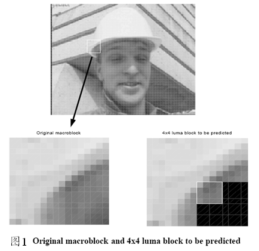
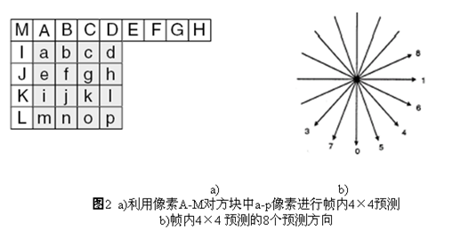
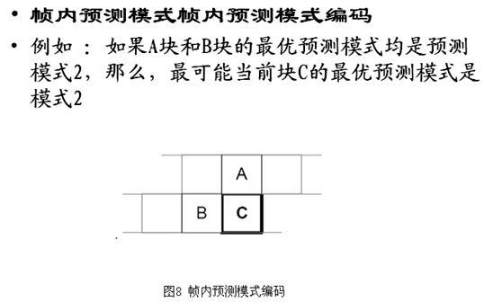
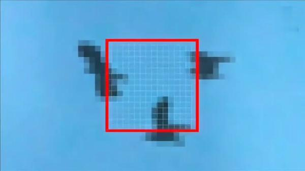
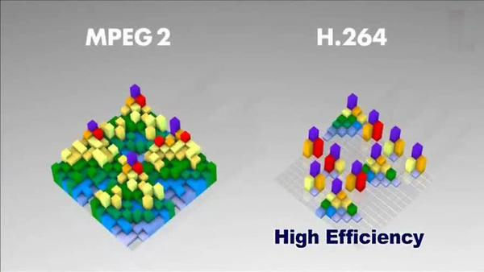
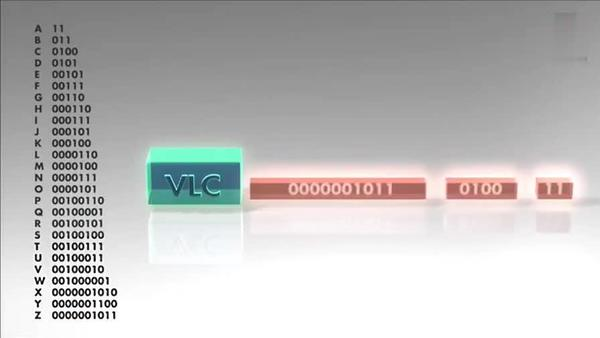
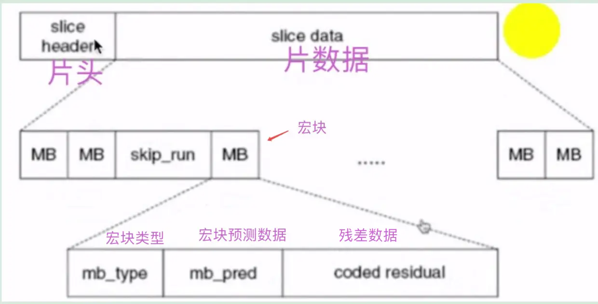
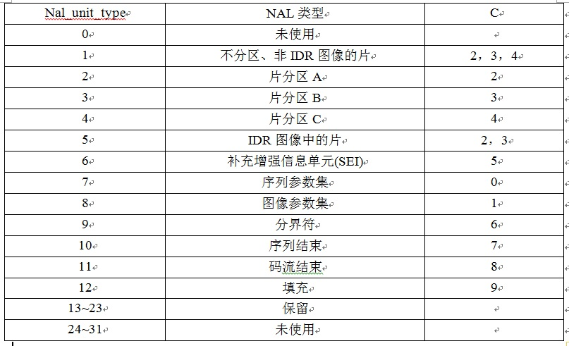
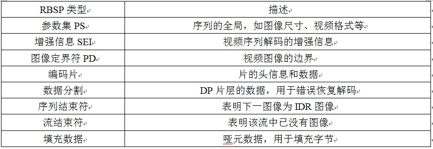

# 视频相关知识

视频是由音频、字幕、图像等组合起来，形成的连续的画面，这里主要介绍的视频主要是图像的处理


## 基础概念

### 帧(Frame)

简单的理解帧就是为视频或者动画中的每一张画面，而视频和动画特效就是由无数张画面组合而成，每一张画面都是一帧。


### 帧数(Frames)

帧数其实就是为帧生成数量的简称，可以解释为静止画面的数量


### [帧率(Frame Rate)](https://links.jianshu.com/go?to=https%3A%2F%2Fzh.wikipedia.org%2Fwiki%2F%E5%B8%A7%E7%8E%87)

帧率(Frame rate) = 帧数(Frames)/时间(Time)，单位为帧每秒(f/s, frames per second, fps)。

- FPS（每秒钟要多少帧画面)

- Gop（表示多少秒一个I帧）

```
帧率不要超过24

如果限定一个码率，比如800kbps，那么帧率越高，编码器就必须加大对单帧画面的压缩比，也就是通过降低画质来承载足够多的帧数。如果视频源来自摄像头，24FPS已经是肉眼极限，所以一般20帧的FPS就已经可以达到很好的用户体验了。

有些玩过3D游戏的朋友可能会说，游戏的帧率越高越流畅。这里要注意一定不要混淆场景：游戏追求高帧率的目的是为了尽可能让3D模型渲染出来的运动效果更加接近真实运动轨迹，所以帧率越高越好。 但对摄像头而言，它要采集的目标是真实世界的物体，真实世界本来就没有刷新率的说法，所以这个理论不适用。
```


### 刷新率（Hertz）

屏幕每秒画面被刷新的次数，分为垂直刷新率和水平刷新率，一般我们提到的都是指垂直刷新率，以赫兹(Hz)为单位，刷新率越高，图像就越稳定，图像显示就越自然清晰。

目前， 大多数显示器根据其设定按 30Hz、 60Hz、 120Hz 或者 144Hz 的频率进行刷新。 而其中最常见的刷新频率是 60 Hz。 这样做是为了继承以前电视机刷新频率为 60Hz 的设定。


### 帧率关键值（Frame Per Second）

- 10~12 FPS：由于人类眼睛的特殊生理结构，如果所看画面之帧率高于每秒约10至12帧的时候，就会认为是连贯的，此现象称之为视觉暂留。
- 24 FPS：一般电影的拍摄及播放帧数是每秒24帧。
- 60 FPS：这个帧率对人眼识别来说已经具备较高的平滑度。在做页面性能优化时，常用60FPS作为一个基准，所以需要尽量让每一帧的渲染控制在16ms内，这样才能达到一秒60帧的流畅度。
- 85 FPS：人类大脑处理视频的极限，人眼无法分辨更高频率的差异。


### 分辨率（Resolution）

视频、图片的画面大小或尺寸。

单位英寸中所包含的像素点数

VGA：Video Graphics Array（视频图像分辨率）

```
如果限定一个码率，比如800kbps，那么分辨率越高就会让编码器越 “为难" ，可以想象，它必须拆东墙补西墙，通过减少色彩信息或者引入马赛克这种“鱼目混珠”的手段来承载足够多的像素点。所以，同样的是2G的一个电影文件，1080p画质的版本可能不如720p画质的版本看起来更清晰。

如果你想显示一段在线视频或者任意的数据流比如视频或者OpenGL 场景，你可以用android中的TextureView做到。
```


### [码率/比特率](https://links.jianshu.com/go?to=https%3A%2F%2Fzh.wikipedia.org%2Fwiki%2F%E6%AF%94%E7%89%B9%E7%8E%87)（Bitrate）

单位时间播放连续的媒体如压缩后的音频或视频的比特数量。常用单位“比特每秒”，缩写是“bit/s”。比特率越高，带宽消耗得越多。

编码器每秒编出的数据大小，单位是kbps，比如800kbps代表编码器每秒产生800kb（或100KB）的数据。

```
注：码率不是越大越好？
如果不做码率大小上的限制，
那么分辨率越高，画质越细腻；
帧率越高，视频也越流畅，
但相应的码率也会很大，因为每秒钟需要用更多的数据来承载较高的清晰度和流畅度。这对云服务厂商而言这是好事（收入跟流量呈正比），但对您可能意味着更多的费用开支。
```


### 帧率、分辨率、清晰度的关系

- **帧率**

    影响画面流畅度，与画面流畅度成正比，帧率越大，画面越流畅；帧率越小，画面越有跳动感。

    如果码率为变量，则帧率也会影响体积，帧率越高，每秒钟经过的画面越多，需要的码率也越高，体积也越大。

    帧率就是在1秒钟时间里传输的图片的帧数，也可以理解为图形处理器每秒钟能够刷新几次。

- **分辨率**

    影响图像大小，与图像大小成正比：

    分辨率越高，图像越大；

    分辨率越低，图像越小。

- **清晰度**

    在码率一定的情况下，分辨率与清晰度成反比关系：

    分辨率越高，图像越不清晰，分辨率越低，图像越清晰。

    在分辨率一定的情况下，码率与清晰度成正比关系，码率越高，图像越清晰；码率越低，图像越不清晰。

```
注：
码率如果为10Mb/s，代表1秒钟有10M bit的视频数据，对于YUV422格式的1080P视频而言，一帧图像是 1920x1080x2x8/1024/1024 = 31.64Mbit，1秒钟30帧图像的话，则有949.2Mb/s，可见其数据量之大，不压缩根本无法网上传播，所以一定要经过视频压缩处理，不要以为1080P的视频就一定是高清的，清晰度还跟视频码率密切相关，对于1080P的视频而言，蓝光视频的码率是20Mb/s，一般下载的视频码率大都是10Mb/s，一些IPCamera/无人机的码率是2～8Mb/s，而很多视频网站的码率甚至低于5M/s，其实有时还不如高码率的720P清晰。

好的画质是分辨率、帧率和码率三者之间的平衡：
```


### IPB帧

- I帧：帧内编码帧(intra picture)，采用帧内压缩去掉空间冗余信息。表示关键帧，采用类似JPEG压缩的DCT(Discrete Cosine Transform，离散余弦变换)压缩技术，可达1/6压缩比而无明显压缩痕迹；
- P帧：前向预测编码帧(predictive-frame)，通过将图像序列中前面已经编码帧的时间冗余信息来压缩传输数据量的编码图像。参考前面的I帧或者P帧。它可能造成解码错误的扩散；
- B帧：双向预测内插编码帧(bi-directional interpolated prediction frame)，既考虑源图像序列前面的已编码帧，又顾及源图像序列后面的已编码帧之间的冗余信息，来压缩传输数据量的编码图像，也称为双向编码帧。参考前面一个的I帧或者P帧及其后面的一个P帧。B帧压缩率高，但解码耗费CPU；


### PTS和DTS

- DTS(Decoding Time Stamp)是标识读入内存中bit流在什么时候开始送入解码器中进行解码。也就是解码顺序的时间戳。
- PTS(Presentation Time Stamp)用于度量解码后的视频帧什么时候被显示出来。在没有B帧的情况下，DTS和PTS的输出顺序是一样的，一旦存在B帧，PTS和DTS则会不同。也就是显示顺序的时间戳。


### GOP

即Group of picture(图像组)，指两个I帧之间的距离，Reference(参考周期)指两个P帧之间的距离。


一个I帧所占用的字节数大于一个P帧，一个P帧所占用的字节数大于一个B帧。所以在码率不变的前提下，GOP值越大，P、B帧的数量会越多，平均每个I、P、B帧所占用的字节数就越多，也就更容易获取较好的图像质量；Reference越大，B帧的数量越多，同理也更容易获得较好的图像质量。

简而言之：

- 字节大小：I > P > B
- 解码顺序：I -> P -> B


## 非编码格式

### RGB

RGB色彩模式使用[RGB模型](https://baike.baidu.com/item/RGB模型/7558707)为图像中每一个像素的[RGB](https://baike.baidu.com/item/RGB/342517)分量分配一个0~255范围内的强度值。例如：纯红色R值为255，G值为0，B值为0；灰色的R、G、B三个值相等（除了0和255）；白色的R、G、B都为255；黑色的R、G、B都为0。RGB图像只使用三种颜色，就可以使它们按照不同的比例混合，在屏幕上重现16777216种颜色。

在 RGB 模式下，每种 RGB 成分都可使用从 0（黑色）到 255（白色）的值。 例如，亮红色使用 R 值 246、G 值 20 和 B 值 50。 当所有三种成分值相等时，产生灰色阴影。 当所有成分的值均为 255 时，结果是纯白色；当该值为 0 时，结果是纯黑色。


### [YUV](https://vidwonders.com/yuv)

YUV的发明是由于彩色电视与黑白电视的过渡时期。黑白视频只有Y（Luma，Luminance）视频，也就是灰阶值。到了彩色电视规格的制定，是以YUV/YIQ的格式来处理彩色电视图像，把UV视作表示彩度的C（Chrominance或Chroma），如果忽略C信号，那么剩下的Y（Luma）信号就跟之前的黑白电视频号相同，这样一来便解决彩色电视机与黑白电视机的兼容问题。YUV最大的优点在于只需占用极少的带宽，因为人眼对亮度敏感，对色度不敏感，因此减少部分UV的数据量，但人眼感知不到。

YUV也称为YCbCr，对于每个分量如下：

- Y：Luminance, 亮度，也就是灰度值。除了表示亮度信号外，还含有较多的绿色通道量。
- U：Cb，蓝色通道与亮度的差值。
- V：Cr，红色通道与亮度的差值。

如下图，可以看到3个分量的效果差值。


#### 数据格式

YUV有两种分类方式，即“空间-间”和“空间-内”。“空间-间”的划分方式主要体现在Y、U、V的比例不同；“空间-内”的划分方式主要体现在Y、U、V的比例一定，存储格式不同。


#### 数据划分

##### 空间-间

YUV按照“空间-间”的划分方式，分为YUV444、YUV422、YUV420，如下所示，假设图像为1920*1080：


##### 空间-内

YUV按照（空间-内）的划分方式，主要分为packet、planar、semi-planar三种：

- packet：打包格式，即先存储一个yuv，再存储下一个yuv；

- planar：平面格式，即先存储y平面，再存储u平面，再存储v平面；

- semi-planar：先存储y平面，再存储uv平面；

- YUV422各种存储格式如下：


- YUV420各种存储格式如下：


针对上图中的NV12、NV21、NV16、NV61说明：

- NV：NV系列都属于semi-plane系列，“12”、“16”代表先U后V，“21”、“61”代表先V后U

- 12、16：代表一个像素占的位数


#### YUV和RGB转换公式

RGB：即red，green，blue三色存储空间，因音视频主要用的是YUV的色彩空间，感兴趣的小伙伴可以拓展下RGB相关知识，本文不再详述。介绍下RGB和YUV的转换公式：


- RGB 转 YUV：

    Y = 0.299R + 0.587G + 0.114B

    U= -0.147R - 0.289G + 0.436B

    V = 0.615R - 0.515G - 0.100B

- YUV 转 RGB：

    R = Y + 1.14V

    G = Y - 0.39U - 0.58V

    B = Y + 2.03U


#### YUV大小计算

- RGB24: 一张4x4像素的RGB图像大小为4x4x3=48字节
- YUV444: 一张4x4像素的YUV444图像大小为4x4x3=48字节，跟RGB一样大，Y、U、V三个分量的大小都是4x4=16字节
- YUV422: 一张4x4像素的YUV422图像大小为4x4x2=32字节，Y分量为全采样，即4x4=16字节，U分量和V分量只有Y分量的一半，即U分量为4x4/2=8字节，V分量也是4x4/2=8字节
- YUV420: 一张4x4像素的YUV420图像大小为4x4x（3/2）=24字节，Y分量为全采样，即4x4=16字节，U分量和V分量只有Y分量的四分之一，即U分量和V分量的大小均为4x4/4=4字节

### HSV

**色调H**: 用角度度量，取值范围为0°～360°，从红色开始按逆时针方向计算，红色为0°，绿色为120°,蓝色为240°。它们的补色是：黄色为60°，青色为180°, 品红为300°；

**饱和度S**: 饱和度S表示颜色接近光谱色的程度。一种颜色，可以看成是某种光谱色与白色混合的结果。其中光谱色所占的比例愈大，颜色接近光谱色的程度就愈高，颜色的饱和度也就愈高。饱和度高，颜色则深而艳。光谱色的白光成分为0，饱和度达到最高。通常取值范围为0%～100%，值越大，颜色越饱和。

**明度V**: 明度表示颜色明亮的程度，对于光源色，明度值与发光体的光亮度有关；对于物体色，此值和物体的透射比或反射比有关。通常取值范围为0%（黑）到100%（白）。


RGB和CMY颜色模型都是面向硬件的，而HSV（Hue Saturation Value）颜色模型是面向用户的。
HSV模型的三维表示从RGB立方体演化而来。设想从RGB沿立方体对角线的白色顶点向黑色顶点观察，就可以看到立方体的六边形外形。六边形边界表示色彩，水平轴表示纯度，明度沿垂直轴测量。

HSV在做颜色检测方面比较常用，可以参考文章[HSV颜色检测](https://www.jianshu.com/p/33af63a63a12)。


## 编码格式

 将视频像素数据（**RGB，YUV** 等）压缩成视频码流，从而降低视频的数据量。

| 名称              | 推出机构       | 推出时间 | 目前使用领域 |
| ----------------- | -------------- | -------- | ------------ |
| **HEVC（H.265）** | **MPEG/ITU-T** | 2013     | 研发中       |
| **H.264**         | **MPEG/ITU-T** | 2003     | 各个领域     |
| **MPEG4**         | **MPEG**       | 2001     | 不温不火     |
| **MPEG2**         | **MPEG**       | 1994     | 数字电视     |
| **VP9**           | Google         | 2013     | 研发中       |
| **VP8**           | Google         | 2008     | 不普及       |
| **VC-1**          | Microsoft Inc. | 2006     | 微软平台     |

[MPEG](https://links.jianshu.com/go?to=https%3A%2F%2Fzh.wikipedia.org%2Fwiki%2FMPEG)：(Moving Picture Experts Group, ISO旗下的组织)

MPEG是Moving Picture Experts Group的简称。这个名字本来的含义是指一个研究视频和音频编码标准的“动态图像专家组”组织，成立于1988年，致力开发视频、音频的压缩编码技术。

| 版本               | 用途                               |
| ------------------ | ---------------------------------- |
| MPEG - 1           | VCD                                |
| MPEG - 2           | DVD、数字有线电视信号              |
| MPEG - 4(第二部分) | 视频电话、网络传输、广播和媒体存储 |

[H.26X](https://links.jianshu.com/go?to=https%3A%2F%2Fzh.wikipedia.org%2Fwiki%2FITU-T_VCEG)：ITU-T VCEG(Visual Coding Experts Group，国际电联旗下的标准化组织)制定

| 版本  | 用于                                                         |
| ----- | ------------------------------------------------------------ |
| H.261 | 老的视频会议和视频电话产品                                   |
| H.262 | DVD、数字有线电视信号(与MPEG共同制定，与MPEG-2完全一致)      |
| H.263 | 视频会议、视频电话和网络视频                                 |
| H.264 | 高精度视频的录制、压缩和发布格式(与MPEG-4第十部分完全一致)，当前主流 |
| H.265 | H.264的两倍之压缩率，可支持4K分辨率甚至到超高画质电视，最高分辨率可达到8192×4320（8K分辨率） |

H.264：当前主流的编码格式是H.264，这是由ITU-T VCEG和MPEG共同制定的标准，MPEG - 4第十部分内容也是H.264。


### [H264](https://baike.baidu.com/item/H.264/1022230?fromtitle=H264&fromid=7338504&fr=aladdin)

H.264是[国际标准化组织](https://baike.baidu.com/item/国际标准化组织)（[ISO](https://baike.baidu.com/item/ISO)）和[国际电信联盟](https://baike.baidu.com/item/国际电信联盟/502493)（ITU）共同提出的继MPEG4之后的[新一代](https://baike.baidu.com/item/新一代)数字视频[压缩格式](https://baike.baidu.com/item/压缩格式)。H.264是ITU-T以H.26x系列为名称命名的[视频编解码技术](https://baike.baidu.com/item/视频编解码技术)标准之一。H.264是ITU-T的VCEG（视频编码专家组）和ISO/IEC的MPEG（活动图像编码专家组）的联合视频组（JVT：joint video team）开发的一个数字视频编码标准。该标准最早来自于ITU-T的称之为H.26L的项目的开发。H.26L这个名称虽然不太常见，但是一直被使用着。H.264是ITU-T以H.26x系列为名称命名的标准之一，AVC是ISO/IEC MPEG一方的称呼。


**发展历程如下**


**编码流程如下**


**编码控制如下**


#### 优势及特点

**优势：**

1．低码率（Low Bit Rate）：和MPEG2和MPEG4 ASP等压缩技术相比，在同等图像质量下，采用H.264技术压缩后的数据量只有MPEG2的1/8，MPEG4的1/3。

2．高质量的图像：H.264能提供连续、流畅的高质量图像（DVD质量）。

3．容错能力强：H.264提供了解决在不稳定网络环境下容易发生的丢包等错误的必要工具。

4．网络适应性强：H.264提供了网络抽象层（Network Abstraction Layer），使得H.264的文件能容易地在不同网络上传输（例如互联网，CDMA，GPRS，WCDMA，CDMA2000等）。

H.264最大的优势是具有很高的[数据压缩](https://baike.baidu.com/item/数据压缩)比率，在同等图像质量的条件下，H.264的压缩比是MPEG-2的2倍以上，是MPEG-4的1.5～2倍。举个例子，原始文件的大小如果为88GB，采用MPEG-2压缩标准压缩后变成3.5GB，压缩比为25∶1，而采用H.264压缩标准压缩后变为879MB，从88GB到879MB，H.264的压缩比达到惊人的102∶1。低码率（Low Bit Rate）对H.264的高的压缩比起到了重要的作用，和MPEG-2和MPEG-4 ASP等压缩技术相比，H.264压缩技术将大大节省用户的下载时间和数据流量收费。尤其值得一提的是，H.264在具有高压缩比的同时还拥有高质量流畅的图像，正因为如此，经过H.264压缩的视频数据，在[网络传输](https://baike.baidu.com/item/网络传输)过程中所需要的带宽更少，也更加经济。

**特点：**

1．更高的编码效率：同H.263等标准的比特率效率相比，能够平均节省大于50%的码率。

2．高质量的视频画面：H.264能够在低码率情况下提供高质量的视频图像，在较低带宽上提供高质量的图像传输是H.264的应用亮点。

3．提高网络适应能力：H.264可以工作在实时通信应用（如视频会议）低延时模式下，也可以工作在没有延时的视频存储或视频流服务器中。

4．采用混合编码结构：同H.263相同，H.264也使用采用DCT[变换编码](https://baike.baidu.com/item/变换编码)加DPCM的差分编码的混合编码结构，还增加了如多模式[运动估计](https://baike.baidu.com/item/运动估计)、帧内预测、多帧预测、基于内容的[变长编码](https://baike.baidu.com/item/变长编码)、4x4二维整数变换等新的编码方式，提高了编码效率。

5．H.264的编码选项较少：在H.263中编码时往往需要设置相当多选项，增加了编码的难度，而H.264做到了力求简洁的“回归基本”，降低了编码时复杂度。

6．H.264可以应用在不同场合：H.264可以根据不同的环境使用不同的传输和播放速率，并且提供了丰富的错误处理工具，可以很好的控制或消除丢包和误码。

7．错误恢复功能：H.264提供了解决[网络传输](https://baike.baidu.com/item/网络传输)包丢失的问题的工具，适用于在高[误码率](https://baike.baidu.com/item/误码率)传输的无线网络中传输视频数据。

8．较高的复杂度：264性能的改进是以增加复杂性为代价而获得的。据估计，H.264编码的计算复杂度大约相当于H.263的3倍，解码复杂度大约相当于H.263的2倍。


#### 数据编码

##### 帧内预测

帧内编码用来缩减图像的空间冗余。为了提高H.264帧内编码的效率，在给定帧中充分利用相邻宏块的空间相关性，相邻的宏块通常含有相似的属性。因此，在对一给定宏块编码时，首先可以根据周围的宏块预测（典型的是根据左上角宏块、左边宏块和上面宏块，因为此宏块已经被编码处理），然后对预测值与实际值的差值进行编码，这样，相对于直接对该帧编码而言，可以大大减小码率。

###### 4×4亮度预测模式

如图4×4亮度块的上方和左方像素A～M为已编码和重构像素，用作编解码器中的预测参考像素。a～p为待预测像素，利用A～M值和9种模式实现。其中模式2(DC预测)根据A～M中已编码像素预测，而其余模式只有在所需预测像素全部提供才能使用。





箭头表明了每种模式预测方向，对模式3～8，预测像素由A～M加权平均而得，d=round(B/4+C/2+D/4)。


| 模式                | 描 述                                |
| :------------------ | :----------------------------------- |
| 模式0（垂直）       | 由A、B、C、D 垂直推出相应像素值      |
| 模式1（水平）       | 由I、J、K、L 水平推出相应像素值      |
| 模式2（DC）         | 由A~D 及I~L 平均值推出所有像素值     |
| 模式3（下左对角线） | 由45°方向像素内插得出相应像素值      |
| 模式4（下右对角线） | 由45°方向像素内插得出相应像素值      |
| 模式5（右垂直）     | 由26.6°方向像素值内插得出相应像素值  |
| 模式6（下水平）     | 由26.6°方向像素值内插得出相应像素值  |
| 模式7（左垂直）     | 由26.6° 方向像素值内插得出相应像素值 |
| 模式8（上水平）     | 由26.6° 方向像素值内插得出相应像素值 |


###### 16×16亮度预测模式


| 模式          | 描 述                                                        |
| :------------ | :----------------------------------------------------------- |
| 模式0（垂直） | 由上边像素推出相应像素值                                     |
| 模式1（水平） | 由左边像素推出相应像素值                                     |
| 模式2（DC）   | 由上边和左边像素平均值推出相应像素值                         |
| 模式3（平面） | 利用线形“plane”函数及左、上像素推出相应像素值，适用于亮度变化平缓区域 |


###### 8×8亮度预测模式

每个帧内编码宏块的8×8色度成分由已编码左上方色度像素预测而得，两种色度成分常用同一种预测模式。

4种预测模式类似于帧内16×16预测的4种预测模式，只是模式编号不同。其中DC（模式0）、水平（模式1）、垂直（模式2）、平面（模式3）。



对于当前块C, 编解码器按照如下方法计算

```
probableprediction mode ＝ min{prediction mode of A, predictionmodes of B}
当A (或者 B）的预测模式不可用时，
prediction mode of A＝ 2.
```

例如： A 和 B块的预测模式分别为 3 和1

```
most probable mode for block C =1
```

编码器为每个4x4 块发送一个标记 flag，解码器按照如下方式解码

```
Ifflag==1, prediction mode=most_probable_mode
Ifflag==0
	If rem_intra4×4_pred_mode< most_probable_mode
		prediction mode=rem_intra4×4_pred_mode
	else
		prediction mode=rem_intra4×4_pred_mode+1 
```

这样表示9种预测模式只需要8个值 (0 to 7)


##### 帧间预测

帧间预测编码利用连续帧中的时间冗余来进行运动估计和补偿。H.264的运动补偿支持以往的视频编码标准中的大部分关键特性，而且灵活地添加了更多的功能，除了支持P帧、B帧外，H.264还支持一种新的流间传送帧——SP帧，码流中包含SP帧后，能在有类似内容但有不同码率的码流之间快速切换，同时支持随机接入和快速回放模式。


###### 划分宏块

宏块是视频信息的主要承载者，因为它包含着每一个像素的亮度和色度信息。视频解码最主要的工作则是提供高效的方式从码流中获得宏块中的像素阵列。
组成部分：一个宏块由一个16×16亮度像素和附加的一个8×8 Cb和一个 8×8 Cr 彩色像素块组成。每个图象中，若干宏块被排列成片的形式。

我们先来看看宏块的结构图：


宏块中包含了宏块类型、预测类型、Coded Block Pattern、Quantization Parameter、像素的亮度和色度数据集等等信息。


###### 划分子块

H264对比较平坦的图像使用 16X16 大小的宏块。但为了更高的压缩率，还可以在 16X16 的宏块上更划分出更小的子块。子块的大小可以是 8X16､ 16X8､ 8X8､ 4X8､ 8X4､ 4X4非常的灵活。



上幅图中，红框内的 16X16 宏块中大部分是蓝色背景，而三只鹰的部分图像被划在了该宏块内，为了更好的处理三只鹰的部分图像，H264就在 16X16 的宏块内又划分出了多个子块。


这样再经过帧内压缩，可以得到更高效的数据。下图是分别使用mpeg-2和H264对上面宏块进行压缩后的结果。其中左半部分为MPEG-2子块划分后压缩的结果，右半部分为H264的子块划压缩后的结果，可以看出H264的划分方法更具优势。



 宏块划分好后，就可以对H264编码器缓存中的所有图片进行分组了。


###### 帧分组

对于视频数据主要有两类数据冗余，一类是时间上的数据冗余，另一类是空间上的数据冗余。其中时间上的数据冗余是最大的。下面我们就先来说说视频数据时间上的冗余问题。

为什么说时间上的冗余是最大的呢？假设摄像头每秒抓取30帧，这30帧的数据大部分情况下都是相关联的。也有可能不止30帧的的数据，可能几十帧，上百帧的数据都是关联特别密切的。

对于这些关联特别密切的帧，其实我们只需要保存一帧的数据，其它帧都可以通过这一帧再按某种规则预测出来，所以说视频数据在时间上的冗余是最多的。

为了达到相关帧通过预测的方法来压缩数据，就需要将视频帧进行分组。那么如何判定某些帧关系密切，可以划为一组呢？我们来看一下例子，下面是捕获的一组运动的台球的视频帧，台球从右上角滚到了左下角。


没有运动补偿的时候  120fps     60fps   60帧电影  视频画面是没有提升

H264编码器会按顺序，每次取出两幅相邻的帧进行宏块比较，计算两帧的相似度。如下图：


通过宏块扫描与宏块搜索可以发现这两个帧的关联度是非常高的。进而发现这一组帧的关联度都是非常高的。因此，上面这几帧就可以划分为一组。其算法是：**在相邻几幅图像画面中，一般有差别的像素只有10%以内的点,亮度差值变化不超过2%，而色度差值的变化只有1%以内，我们认为这样的图可以分到一组。**

在这样一组帧中，经过编码后，我们只保留第一帖的完整数据，其它帧都通过参考上一帧计算出来。我们称第一帧为**IDR／I帧**，其它帧我们称为**P／B帧**，这样编码后的数据帧组我们称为**GOP**。


###### 运动估计与补偿

在H.263中采用的是半像素精度的运动估计，而在H.264中可以采用1/4或者1/8像素精度的运动估值。在要求相同精度的情况下，H.264使用1/4或者1/8像素精度的[运动估计](https://baike.baidu.com/item/运动估计)后的残差要比H.263采用半像素精度运动估计后的残差来得小。这样在相同精度下，H.264在帧间编码中所需的码率更小。

在H264编码器中将帧分组后，就要计算帧组内物体的运动矢量了。还以上面运动的台球视频帧为例，我们来看一下它是如何计算运动矢量的。

有7种形状的运动补偿可供选用，这7种块是：INTER16x16，INTER16x8，INTER8x16，INTER8x8，INTER8x4，INTER4x8，INTER4x4。根据运动补偿采用的块尺寸的不同，宏块的编码模式分为四种，前三种模式分别按照一个16x16块、两个16x8块和两个8x16块来进行运动补偿；最后一种模式记作P8x8，在P8x8模式下，一个宏块被分为4个8x8的子块，而每一个子块又有4种可能的子模式，分别按照一个8x8块、两个8x4块、两个4x8块及四个4x4块进行运动补偿，如图所示，第一行是宏块四种模式，第二行是子块四种模式。


块大小的选择是否合理对于压缩效果的好坏有很大的影响，通常来说，对于变化缓慢的部分采用较大分块效果比较好，对于包含较多细节的部分则应该采用较小的分块方式。

**1/4像素精度运动估计**

帧内编码宏块的每一分块都是由参考帧中相同大小的区域预测得到。这两个区域之间的偏移量即运动矢量。由于图像的运动不可能总是整像素的。因此引入了亚像素运动矢量。对亮度分量，运动矢量的分辨率为1/4像素。由于参考帧中本身不可能存在亚像素采样点，因此需要利用其临近像素内插产生亚像素采样点。亚像素采样点的内插产生过程，如图所示


半像素内插值分别由运动于水平和垂直方向的一维6阶滤波器产生。1/4像素值由整数像素和半像素点求均值取得。
例如：

```
b=round（（E-5F+20G+20H-5I+J）/32） a=round（（G+b）/2） e=round（（b+h）/2）
```

由于亮度分量中的1/4像素精度运动矢量将在色度分量中产生1/8像素精度。因此，采用线性内插法产生1/8像素采样点。

```
a=round（（[（8-dx）.（8-dy）A+dx.（8-dy）B+（8-dx）.dyC+dx.dyD]/64）
```

H264编码器首先按顺序从缓冲区头部取出两帧视频数据，然后进行宏块扫描。当发现其中一幅图片中有物体时，就在另一幅图的邻近位置（搜索窗口中）进行搜索。如果此时在另一幅图中找到该物体，那么就可以计算出物体的运动矢量了。下面这幅图就是搜索后的台球移动的位置。 


通过上图中台球位置相差，就可以计算出台球运行的方向和距离。H264依次把每一帧中球移动的距离和方向都记录下来就成了下面的样子。


运动矢量计算出来后，将相同部分（也就是绿色部分）减去，就得到了补偿数据。我们最终只需要将补偿数据进行压缩保存，以后在解码时就可以恢复原图了。压缩补偿后的数据只需要记录很少的一点数据。如下所示：


我们把运动矢量与补偿称为**帧间压缩技术**，它解决的是视频帧在时间上的数据冗余。除了帧间压缩，帧内也要进行数据压缩，帧内数据压缩解决的是空间上的数据冗余。


###### 多帧预测

H.264提供可选的多帧预测功能，在帧间编码时，可选5个不同的[参考帧](https://baike.baidu.com/item/参考帧)，提供了更好的纠错性能，这样更可以改善视频图像质量。这一特性主要应用于以下场合：周期性的运动、平移运动、在两个不同的场景之间来回变换摄像机的镜头。


###### 去块滤波器

H.264定义了自适应去除块效应的滤波器，这可以处理预测环路中的水平和垂直块边缘，大大减少了方块效应。


##### 整数变换

###### 离散余弦变换(Discrete Cosine Transform， DCT)

H.264仍然采用对残差信号进行变换在量化后进行熵编码的模式来压缩空间冗余信息。使用了类似于4x4离散余弦变换DCT的整数变换而不是象MPEG4那样采用8x8DCT的浮点数变换。最终使用那种变换方式还用根据残余数据类型的不同来选择，帧内编码宏块的亮度DC系数（仅对16x16预测模式有效）采用4x4的矩阵，色度DC系数采用2x2的矩阵，对于其他的都采用4X4的块来变换。

使用以整数为基础的空间变换可以提高计算速度（只使用加法和位移运算），但是使用整数变换要以不失精确度为前提；整数变换的反变换过程中不会出现较大的误差，并且缩放矩阵的乘法集成到了量化中，降低了乘法的总次数。


###### 4×4亮度分量的直流系数变换

如果宏块被编码为16×16帧内模式，则每个4×4残差块首先用前面叙述的变换进行变换，然后对于每个4×4的变换后的直流（DC）系数进行4×4的二次变换，采用Hadamard变换。
正变换为：


其中A是变换核矩阵a=1/2


###### 2×2色度块的DC系数变换

每个宏块内的4个4×4色度块经过变换后，每个块的DC系数构成了一个2×2的块WD，对其进行2×2的Hadamard变换。

正变换的公式为：


反变换公式为：


如图所示，展示了宏块中的变换块及其传送顺序。编号为-1的块在采用Intra16x16模式编码时0-15号4x4子块经整数DCT变换后的DC系数在经4x4的哈达变换的结果。块16、17是色度块的DC系数进行2x2哈达码变换的结果。其余的24块则进行4x4整数变换。


可以将残差数据做整数离散余弦变换，去掉数据的相关性，进一步压缩数据。如下图所示，左侧为原数据的宏块，右侧为计算出的残差数据的宏块。


将残差数据宏块数字化后如下图所示：


将残差数据宏块进行 DCT 转换。


去掉相关联的数据后，我们可以看出数据被进一步压缩了。


做完 DCT 后，还不够，还要进行 CABAC 进行无损压缩。


##### 量化

H.264中可选52种不同的量化步长，这与H.263中有31个量化步长很相似，但是在H.264中，步长是以12.5%的复合率递进的，而不是一个固定常数。

在H.264中，变换系数的读出方式也有两种：之字形(Zigzag)扫描和双扫描，如图6所示。大多数情况下使用简单的之字形扫描；双扫描仅用于使用较小量化级的块内，有助于提高编码效率。图6 变换系数的读出方式


##### [熵编码](https://baike.baidu.com/item/熵编码)

视频编码处理的最后一步就是熵编码，在H.264中采用了两种不同的熵编码方法：通用可变长编码（UVLC）和基于[文本](https://baike.baidu.com/item/文本)的自适应二进制算术编码（CABAC）。


###### UVLC

在H.263等标准中，根据要编码的[数据类型](https://baike.baidu.com/item/数据类型)如变换系数、运动矢量等，采用不同的VLC码表。H.264中的UVLC码表提供了一个简单的方法，不管符号表述什么类型的数据，都使用统一变[字长](https://baike.baidu.com/item/字长)[编码表](https://baike.baidu.com/item/编码表)。其优点是简单；缺点是单一的码表是从概率统计分布模型得出的，没有考虑编码符号间的相关性，在中高码率时效果不是很好。

MPEG-2中使用的VLC就是这种算法，我们以 A-Z 作为例子，A属于高频数据，Z属于低频数据。看看它是如何做的。




###### CABAC

H.264中还提供了可选的CABAC方法。算术编码使编码和解码两边都能使用所有句法元素(变换系数、运动矢量)的概率模型。为了提高算术编码的效率，通过内容建模的过程，使基本概率模型能适应随视频帧而改变的统计特性。内容建模提供了编码符号的条件概率估计，利用合适的内容模型，存在于符号间的相关性可以通过选择要编码符号邻近的已编码符号的相应概率模型来去除，不同的句法元素通常保持不同的模型

CABAC属于无损压缩技术，无损压缩技术大家最熟悉的可能就是哈夫曼编码了，给高频的词一个短码，给低频词一个长码从而达到数据压缩的目的。

CABAC是基于内容的自适应二进制算术编码，当参数entropy_coding_mode设置为1时，一个算术系统被用来编码和解码H.264的语法元素。

H.264采用两种方法进行熵编码：CAVLC编码和CABAC编码算法。采用基于上下文的自适应二进制算术编码算法（CABAC），能够充分利用上下文信息和算术编码的优点，使得编码后的平均码长更逼近图像的信息熵，达到最佳的编码效率。采用CABAC算法进行编码，可以提高大约10％的编码率

具体编码步骤：

**二值化:   **CABAC使用二进制算术编码，所以要将数据先转换为二进制数据，这些原始数据包括变换系数和运动矢量等。转换后二进制数据为可变长编码的数据，并且还要将这些数据进行算术编码。

**内容模式选择:  ** 内容模式是针对二进制数据进行统计的概率模型，这个模式根据之前编码的一些数据符号的统计特性从一些可选模式中选出。内容模式存储了每一位“1”或“0”的概率。

**算术编码：**算术编码器根据选择的内容模式对每一位进行编码。

**概率校正：**被选择的内容模式根据实际被编码的值进行校正，例如，如果数据比特流中有数值“1”，就将“1”的概率统计值加1。

CABAC也是给高频数据短码，给低频数据长码。同时还会根据上下文相关性进行压缩，这种方式又比VLC高效很多。其效果如下：


现在将 A-Z 换成视频帧，它就成了下面的样子。


从上面这张图中明显可以看出采用 CACBA 的无损压缩方案要比 VLC 高效的多。


#### 数据组装

我们了解了什么是宏快，宏快作为压缩视频的最小的一部分，需要被组织，然后在网络之间做相互传输。

如果单纯的用**宏快**来发送数据是**杂乱无章**的，就好像在没有**集装箱**出现之前，货物总是随意被堆放到船上。

上货（编码），下货是非常痛苦的。 当集装箱出现之后，一切都发生了改变，传输效率大大增高。

集装箱可以理解成**H264编码标准**，他制定了相互传输的格式，将宏快有组织，有结构，有顺序的形成一系列的码流。这种码流既可通过 InputStream网络流的数据进行传输，也可以封装成一个文件进行保存

**H264: H264/AVC是广泛采用的一种编码方式。**主要作用是为了传输，


##### 码流组成

**组成H264码流的结构中 包含以下几部分 ，从大到小排序依次是** 

> **H264视频序列，图像，片组，片，NALU，宏块 ，像素。** 
>
> 类似 地球 国家 城市  镇 村落


##### 编码分层


- **NAL层:（Network Abstraction Layer，视频数据网络抽象层）**负责以网络所要求的恰当的方式对数据进行打包和传送，使用网络的分段格式来封装数据，包括组帧、逻辑信道的信令、定时信息的利用或序列结束信号等，它的作用是H264只要在网络上传输，在传输的过程每个包以太网是1500字节，而H264的帧往往会大于1500字节，所以要进行拆包，将一个帧拆成多个包进行传输，所有的拆包或者组包都是通过NAL层去处理的。
- **VCL层:（Video Coding Layer,视频数据编码层）**对视频原始数据进行压缩,负责高效的视频内容表示，H264编码/压缩的核心，主要负责将视频数据编码/压缩，再切分。
- [NALU](./06.NALU语法解析.md)（ NALU header + NALU payload）：H.264 原始码流(又称为裸流)，是由一个接一个的 NALU 组成的，而它的功能分为两层:视频编码层(VCL, Video Coding Layer)和网络提取层(NAL, Network Abstraction Layer)。
    VCL 数据即编码处理的输出，它表示被压缩编码后的视频数据 序列。在 VCL 数据传输或存储之前，这些编码的 VCL 数据，先被映射或封装进 NAL 单元(以下简称 NALU，Nal Unit) 中。每个 NALU 包括一个原始字节序列负荷(RBSP, Raw Byte Sequence Payload)、一组对应于视频编码的 NALU 头部信息。RBSP 的基本结构是:在原始编码数据的后面填加了结尾 比特。一个 bit“1”若干比特“0”，以便字节对齐。

H.264 的编码视频序列包括一系列的NAL 单元，每个NAL 单元包含一个RBSP。一个原始的H.264由**N个NALU单元组成**、 NALU 单元常由 [StartCode] [NALU Header] [NALU Payload] 三部分组成，其中 Start Code 用于标示这是一个NALU 单元的开始，必须是"00 00 00 01" 或"00 00 01"。	


##### 码流切片

片的主要作用是用作宏块（Macroblock）的载体（ps：下面会介绍到宏块的概念）。片之所以被创造出来，主要目的是为限制误码的扩散和传输。

**如何限制误码的扩散和传输？**
每个片（slice）都应该是互相独立被传输的，某片的预测（片（slice）内预测和片（slice）间预测）不能以其它片中的宏块（Macroblock）为参考图像。

那么片（slice）的具体结构，我们用一张图来直观说明吧：


我们可以理解为一 张/帧 图片可以包含一个或多个分片(Slice)，而每一个分片(Slice)包含整数个宏块(Macroblock)，即每片（slice）至少一个 宏块(Macroblock)，最多时每片包函整个图像的宏块。

上图结构中，我们不难看出，每个分片也包含着头和数据两部分：
 1、分片头中包含着分片类型、分片中的宏块类型、分片帧的数量、分片属于那个图像以及对应的帧的设置和参数等信息。
 2、分片数据中则是宏块，这里就是我们要找的存储像素数据的地方。

**切片（slice）类型跟宏块类型的关系**

对于切片（slice）来讲，分为以下几种类型：

**英文**

- 0  P-slice. Consists of P-macroblocks (each macro block is predicted using one reference frame) and / or I-macroblocks.
- 1   B-slice. Consists of B-macroblocks (each macroblock is predicted using one or two reference frames) and / or I-macroblocks.
- 2   I-slice. Contains only I-macroblocks. Each macroblock is predicted from previously coded blocks of the same slice.
- 3   SP-slice. Consists of P and / or I-macroblocks and lets you switch between encoded streams.
- 4   SI-slice. It consists of a special type of SI-macroblocks and lets you switch between encoded streams.

**中文**

- I片：只包 I宏块，I 宏块利用从当前片中已解码的像素作为参考进行帧内预测(不能取其它片中的已解码像素作为参考进行帧内预测)。
- P片：可包 P和I宏块，P 宏块利用前面已编码图象作为参考图象进行帧内预测，一个帧内编码的宏块可进一步作宏块的分割:即 16×16、16×8、8×16 或 8×8 亮度像素块(以及附带的彩色像素);如果选了 8×8 的子宏块，则可再分成各种子宏块的分割，其尺寸为 8×8、8×4、4×8 或 4×4 亮度像素块(以及附带的彩色像素)。
- B片：可包 B和I宏块，B 宏块则利用双向的参考图象(当前和 来的已编码图象帧)进行帧内预测。
- SP片(切换P)：用于不同编码流之间的切换，包含 P 和/或 I 宏块
- SI片：扩展档次中必须具有的切换，它包 了一种特殊类型的编码宏块，叫做 SI 宏块，SI 也是扩展档次中的必备功能。


##### 码流结构

- H.264 = start_code + NALU（start_code：00000001 or 000001）


- 每个NAL前有一个起始码 0x00 00 01（或者0x00 00 00 01），解码器检测每个起始码，作为一个NAL的起始标识，当检测到下一个起始码时，当前NAL结束。

- 同时H.264规定，当检测到0x000000时，也可以表征当前NAL的结束。那么NAL中数据出现0x000001或0x000000时怎么办？H.264引入了防止竞争机制，如果编码器检测到NAL数据存在0x000001或0x000000时，编码器会在最后个字节前插入一个新的字节0x03，这样：

> 0x000000 -> 0x00000300
>
> 0x000001-> 0x00000301
>
> 0x000002 -> 0x00000302
>
> 0x000003 -> 0x00000303



**切片头**：包含了一组片的信息，比如片的数量，顺序等等 


起始码：如果NALU对应的Slice为一帧的开始，则用4字节表示，即0x00000001；

否则用3字节表示，0x000001。 NAL Header：forbidden_bit，nal_reference_bit（优先级），nal_unit_type（类型）。 脱壳操作：为了使NALU主体不包括起始码，在编码时每遇到两个字节（连续）的0，就插入一字节0x03，以和起始码相区别。解码时，则将相应的0x03删除掉。

**NAL头的数据结构体**


- F（forbidden_zero_bit）：1 位，初始为0。当网络识别此单元存在比特错误时，可将其设为 1，以便接收方丢掉该单元

- NRI（nal_ref_idc）：2 位，用来指示该NALU 的重要性等级。值越大，表示当前NALU越重要。具体大于0 时取何值，没有明确规定

- Type（nal_unit_type）：5 位，指出NALU的类型，如下所示：



H.264解码 **NAL头信息**的nal_referrence_idc（NRI）用于在重建过程中标记一个NAL单元的重要性，

1. 值为0表示这个NAL单元没有用预测，因此可以被解码器抛弃而不会有错误扩散；
2. 值高于0表示NAL单元要用于无漂移重构，且值越高，对此NAL单元丢失的影响越大。
3. NAL头信息的隐藏比特位，在H.264编码器中默认为0，当网络识别到单元中存在比特错误时，可将其置为1。隐藏比特位主要用于适应不同种类的网络环境（比如有线无线相结合的环境）。     


NAL单元解码的流程为：首先从NAL单元中提取出RBSP语法结构，然后按照如图4所示的流程处理RBSP语法结构。输入的是NAL单元，输出结果是经过解码的当前图像的样值点。 NAL单元中分别包含了序列参数集和图像参数集。图像参数集和序列参数集在其他NAL单元传输过程中作为参考使用，在这些数据NAL单元的片头中，通过语法元素pic_parameter_set_id设置它们所使用的图像参数集编号；而相应的每个图像参数集中，通过语法元素seq_paramter_set_id设置他们使用的序列参数集编号。

几个例子：


##### 码流传输

**H264是一种码流**  类似与一种不见头，也不见尾的一条**河流**。如何从和流中取到自己想要的**数据**呢，

在H264的标准中有这样的一个封装格式叫做"Annex-B"的字节流格式。 它是H264编码的主要字节流格式。

几乎市面上的编码器是以这种格式进行输出的。**起始码0x 00 00 00 01 或者 0x 00 00 01** 作为**分隔符**。 

两个 0x 00 00 00 01之间的字节数据 是表示一个NAL Unit


每个NAL单元包含**一个RBSP**，

每个单元都按独立的NAL单元传送。单元的信息头（一个字节）定义了RBSP单元的类型，NAL单元的其余部分为RBSP数据。





### H265

理论上H.265比H.264效率提高30-50%(尤其是在更高的分辨率情形下)，但真的只是这么简单吗？
