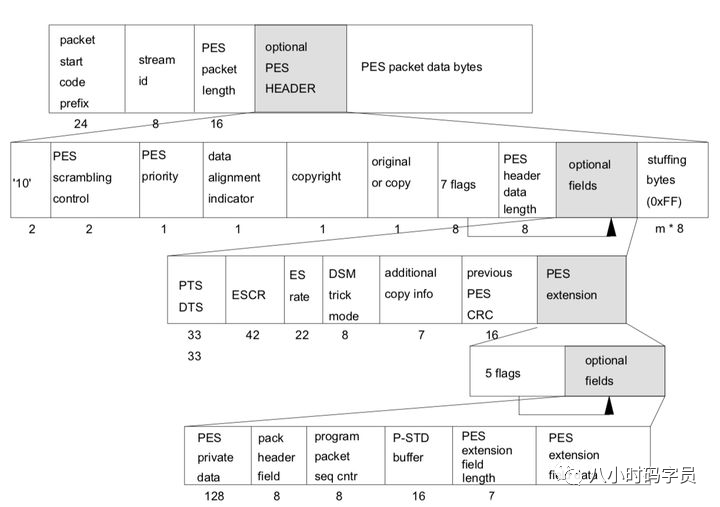

# 视频封装格式

封装格式（也叫容器），就是将已经编码压缩好的视频轨和音频轨按照一定的格式放到一个文件中，也就是说仅仅是一个外壳，或者大家把它当成一个放视频轨和音频轨的文件夹也可以。说得通俗点，视频轨相当于饭，而音频轨相当于菜，封装格式就是一个碗，或者一个锅，用来盛放饭菜的容器。 下面是几种常用的 **视频文件后缀类型** 与其相对应的 **封装格式**。


| 视频文件格式                            | 视频封装格式                         |
| --------------------------------------- | ------------------------------------ |
| **.avi**                                | AVI（Audio Video Interleaved）       |
| **.wmv、.asf**                          | WMV（Windows Media Video）           |
| **.mpg、.mpeg、.vob、.dat、.3gp、.mp4** | MPEG（Moving Picture Experts Group） |
| **.mkv**                                | Matroska                             |
| **.rm、.rmvb**                          | Real Video                           |
| **.mov**                                | QuickTime File Format                |
| **.flv**                                | Flash Video                          |

| 格式 |                   全名                    |                        开发商                         | 初版年限 |                             特点                             |
| :--: | :---------------------------------------: | :---------------------------------------------------: | :------: | :----------------------------------------------------------: |
| MP4  |                    MP4                    | Moving Picture Experts Group，即 MPEG(动态图像专家组) |   1998   |                  常用有损压缩格式，通用性强                  |
| AVI  | Audio Video Interleaved(音频视频交错格式) |                         微软                          |   1992   |                        体积大算法简单                        |
| MOV  |            QuickTime 影片格式             |                         Apple                         |   1991   |         苹果专属格式对很多其他的播放器支持不是很友好         |
| WMV  |            Windows Media Video            |                         微软                          |   2003   |             微软的专业视频格式，兼容性并不是很好             |
| FLV  |        Adobe Flash 网络流媒体格式         |                         Adobe                         |   2002   |                   被淘汰的早期网络视频格式                   |
| MKV  |            Matroska 多媒体容器            |                     Matroska.org                      |   2002   | 最有包容性的视频格式，能容纳无限量、多种不同类型编码的视频、音频及字幕流 |
| WebM |                   WebM                    |                        Google                         |   2010   | 谷歌推出的 HTML5 标准的网络视频标准,以MKV容器格式为基础开发  |
| RMVB |                   RMVB                    |                     Real Networks                     |   1997   | 根据不同的网络传输速率，而制定出不同的压缩比率，从而实现在低速率的网络上进行影像数据实时传送和播放，具有体积小，画质不错的优点。已过时。 |

更多参考 [维基百科视频文件格式](https://links.jianshu.com/go?to=https%3A%2F%2Fzh.wikipedia.org%2Fwiki%2F%E8%A7%86%E9%A2%91%E6%96%87%E4%BB%B6%E6%A0%BC%E5%BC%8F)。

前面的文章已经介绍过图像、音频、字幕相关知识，将图像、音频、字幕封装在一起，就形成了我们常见的视频。本篇文章主要介绍下FLV（后文中将介绍TS和MP4）视频封装格式。


## FLV

### FLV的封装格式

FLV（Flash Video），Adobe公司设计开发的一种流行的流媒体格式，由于其视频文件体积轻巧、封装简单等特点，使其很适合在互联网上进行应用。除了播放视频，在直播时也可以使用。采用FLV格式封装的文件后缀为.flv，格式如下（FLV = FLV Header + Body）：


### FLV Header

Header 部分记录了FLV的类型、版本、流信息、Header 长度等。一般整个Header占用9个字节，大于9个字节则表示头部信息在这基础之上还存在扩展数据。FLV Header 的信息排布如下所示：


### FLV Body

Body 是由一个个Tag组成的，每个Tag下面有一块4个字节的空间，用来记录这个Tag 的长度。这个后置的PreviousTagSize用于逆向读取处理，表示的是前面的Tag的大小。FLV Body 的信息排布如下：


### FLV Tag

每个Tag 也是由两部分组成的：Tag Header 和 Tag Data。Tag Header 存放了当前Tag的类型，数据长度、时间戳、时间戳扩展、StreamsID等信息，然后再接着数据区Tag Data。Tag的排布如下：


### Tag Data

Tag Data分成 Audio，Video，Script 三种。


#### Audio Tag Data

音频的Tag Data又分为 AudioTagHeader 和 Data 数据区，其排布结构如下图所示：


#### Video Tag Data

Video Tag 由一个字节的VideoTagHeader 和 Video数据区部分组成


Video数据区部分格式不确定。对于H264/AVC编码部分，Video数据区排布如下:


#### Script Tag Data


## TS

接上文，本篇介绍下TS的封装格式。

### 什么是TS?

TS（Transport Stream，传输流），一种常见的视频封装格式，是基于MPEG-2的封装格式（所以也叫MPEG-TS），后缀为.ts。


### TS的分层结构

TS文件分为三层，如下所示（可以倒序看更好理解）：

- TS层（Transport Stream）：在PES层基础上加入了数据流识别信息和传输信息。

- PES层（Packet Elemental Stream）：在ES层基础上加入时间戳（PTS/DTS）等信息。

- ES层（Elementary Stream）：压缩编码后的音视频数据。


### TS层

- **ts包大小固定为188字节**，ts层分为三个部分：ts header、adaptation field、payload。

- ts header固定4个字节；

- adaptation field可能存在也可能不存在，主要作用是给不足188字节的数据做填充。

- payload是 PES 数据，或者PAT，PMT等。

- ts Header + adaptation field 格式如下：


#### TS Header

- TS Header格式如下：


- pid 决定了负载内容的类型，主要包括：PAT表，PMT表，视频流，音频流。常用的PID值：

| 表   | **PAT** | CAT    | TSDT   | EIT,ST | RST,ST | TDT,TOT,ST |
| ---- | ------- | ------ | ------ | ------ | ------ | ---------- |
| PID  | 0x0000  | 0x0001 | 0x0002 | 0x0012 | 0x0013 | 0x0014     |


#### TS调整字段


#### PAT表结构（指明PMT表的PID值）

```c
typedef struct TS_PAT {
    unsigned table_id                 :8  //固定位0x00，表示该表是PAT
    unsigned section_syntax_indicator :1  //段语法标志，固定为1
    unsigned zero                     :1  //固定为0
    unsigned reserved_1               :2  //第一个保留位
    unsigned section_length           :12 //表示这个字节之后有用的字节数，包括CRC_32
    unsigned transport_stream_id      :16 //传输流的ID，区别于一个网络中其他多路复用的流
    unsigned reserved_2               :2  //第二个保留位
    unsigned version_number           :5  //表示PAT的版本号
    unsigned current_next_indicator   :1  //表示发送的PAT是当前有效还是下一个有效，为1时代表当前有效
    unsigned section_number           :8  //如果PAT分段传输，那么此值每次递增1
    unsigned last_section_number      :8  //最后一个分段的号码
    for (int i=0;i<N;i++) {
        unsigned Program_number       :16 //节目号
        unsigned Reversed_3           :3  //保留位
        if (Program_number == 0)
            Network_id                :13 //网络信息表（NIT）的PID
        else
            Program_MAP_PID           :13 //节目映射表的PID，每个节目都有一个
    }
    unsigned CRC_32                   :32 //CRC32校检码
} TS_PAT
```


#### PMT表（指明音视频流的PID值）

```c
typedef struct TS_program_map_section {
    unsigned Table_id                    :8  //标志PSI分段的内容，对于PMT，此值为0x02
    unsigned Section_syntax_indicator    :1  //置为1
    unsigned '0'                         :1
    unsigned Reserved                    :2  //保留位
    unsigned Section_length              :12 //指明了自此到最后CRC_32的字节数
    unsigned Program_number              :16 //指出该节目的节目号，与PAT表对应
    unsigned Reserved                    :2  //保留位
    unsigned Version_number              :5  //取值0-31，代表当前PMT的版本号
    unsigned Current_next_indicator      :1  //代表当前PMT是否有效
    unsigned Section_number              :8  //给出了当前所处段的数目
    unsigned Last_section_number         :8  //给出了最后一个分段，即分段的最大数目
    unsigned Reserved                    :3  //保留位
    unsigned PCR_PID                     :13 //指示TS包的PCR值，该TS包含有PCR字段
    unsigned Reserved                    :4  //保留位
    unsigned Program_info_length         :12 //该字段描述跟随其后对节目信息描述的字节数
    for (int i = 0; i < N; i++)
        Descriptr()
    for (int i = 0; i < N; i++) {
        unsigned Stream_type             :8  //0x00：保留， 0x01：MPEG1视频，0x02：MPEG2视频，0x03:MPEG1音频，0x04：MPEG2音频，0x05：私有字段，0x06：含有私有数据的PES包 ......
        unsigned Reserved                :3  //保留
        unsigned Elementary_PID          :13 //指示TS包的PID，这些TS包含有相同的PID
        unsigned Reserved                :4  //保留
        unsigned ES_info_length          :12 //指示跟随其后描述相关节目元素的字节数
        for (int j = 0; j < N2; j++)
            Descriptr()
    }
    unsigned CRC_32                      :32 //循环校检位
}
```


#### 补充说明

- 打包ts流时PAT和PMT表是没有调整字段的，不够的长度直接补0xff即可。

- 视频流和音频流都需要加adaptation field，通常加在一个帧的第一个ts包和最后一个ts包里，中间的ts包不加。


### PES 层

- PES（Packetized Elementary Stream，打包的ES），在 ES 层的基础上加入了时间戳（PTS/TDS）等信息。

- ES数据包比较大，加入PES头时需将ES进行分割，只在第一个分割的ES上加PES头，如下图所示


- PES packet length — 指示PES 包中跟随该字段最后字节的字节数。0 值指示PES 包长度既未指示也未限定并且仅在这样的PES 包中才被允许，该PES 包的有效载荷由来自传输流包中所包含的视频基本流的字节组成。

- PES结构如下：




- PES 关键字段说明


### ES 层

- ES（Elementary Stream，基本码流），就是音视频编码数据流，比如视频H.264，音频AAC。

- 一个 ES 流中只包含一种类型的数据（视频，或音频，或字幕）。


### easyice

easyice下载链接：https://www.easyice.cn/archives/85


## MP4

接上文，本篇介绍下MP4的封装格式。

MP4是一套用于音频、视频信息的压缩编码标准，由国际标准化组织（ISO）和国际电工委员会（IEC）下属的“动态图像专家组”（Moving Picture Experts Group，即MPEG）制定，第一版在1998年10月通过，第二版在1999年12月通过。MPEG-4格式的主要用途在于网上流、光盘、语音发送（视频电话），以及电视广播。

-  MP4由许多box组成，每个box包含不同的信息，这些box以树形结构的方式组成，box 当中可以包含 box 如下所示：


### box

mp4文件由若干个box组成。下面是box结构的一个示意图：


- box 由 header 和 body 组成，header 指明 box 的 size 和 type。size 是包含 box header 的整个 box 的大小。

- box type，通常是4个ASCII码的字符如“ftyp”、“moov”等，这些 box type都是已经预定义好的，表示固定的含义。如果是“uuid”，表示该box为用户自定义扩展类型，如果 box type 是未定义的，应该将其忽略。

- 如果 header 中的 size 为1，则表示 box 长度需要更多的bits位来描述，在后面会有一个 8自己 位的 largesize 用来描述 box 的长度。如果 size 为0，表示该 box 为文件的最后一个box，文件结尾（同样只存在于“mdat”类型的box中）。

- box 分为两种，Box 和 Fullbox。FullBox 是 Box 的扩展，Header 中增加了version 和 flags字段。

- box 定义如下：

```c++
aligned(8) class Box (unsigned int(32) boxtype,
    optional unsigned int(8)[16] extended_type) {
    unsigned int(32) size;
    unsigned int(32) type = boxtype;
    if (size==1) {
        unsigned int(64) largesize;
    } else if (size==0) {
    // box extends to end of file
    }
    if (boxtype==‘uuid’) {
        unsigned int(8)[16] usertype = extended_type;
    }
}
```

- FullBox 定义如下：

```c++
aligned(8) class FullBox(unsigned int(32) boxtype, unsigned int(8) v, bit(24) f)
extends Box(boxtype) {
    unsigned int(8) version = v;
    bit(24) flags = f;
}
```


### ISO/ICE 14496-12


### MP4分析工具

- mp4box.js：https://gpac.github.io/mp4box.js
- bento4：http://www.bento4.com
- mp4info：https://www.greenxf.com/soft/179781.html
- qtauomviewer：https://api.256file.com/download/378144_qtatomviewer.exe