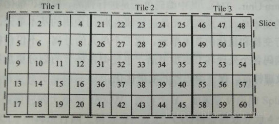

# H265编码详解

理论上H.265比H.264效率提高30-50%(尤其是在更高的分辨率情形下)，但真的只是这么简单吗？

## 简单介绍 

H.265重新利用了H.264中定义的很多概念。两者都是基于块的视频编码技术，所以它们有着相同的根源，和相近的编码方式，包括：

1. 以宏块来细分图片，并最终以块来细分。
2. 使用帧内压缩技术减少空间冗余。
3. 使用帧间压缩技术减少时间冗余（运动估计和补偿）。
4. 使用转换和量化来进行残留数据压缩（求矩阵的秩）。
5. 使用熵编码减少残留和运动矢量传输和信号发送中的最后冗余。

事实上，视频编解码从MPEG-1诞生至今都没有根本性改进，H.265也只是H.264在一些关键性能上的更强进化以及简单化。

当你考虑“只是在普通互联网上传输4K内容，还是要实现最好的图像质量”之时，就要先理清**更多的压缩**和**更好的压缩**这两个概念。如果只是更多的压缩，4K和超高清不一定要保证比今天的1080p或HD做到更好的图片质量。更好的压缩则意味着更聪明的压缩，面对同样的原始素材，更好的压缩会以更好的方式，在不牺牲质量的情况下令数据量减少。更多的压缩很容易，而更好的压缩需要更多的思考和更好的技术，通过更智能的算法来处理图像，在维持质量的同时保持更低的比特率，这正是H.265所要做的。

如何实现更好的压缩，举例来讲，我们通常会发现在很多的图像素材里，如视像会议或者电影的很多场景中，每一帧上的大部分内容并没有改变太多，视像会议中一般只有讲话者的头在动(甚至只有嘴唇在动)，而背景一般是不动的，在这种情况下，我们的做法不是对每一帧的每一个像素编码，而是对最初的帧编码，然后仅对发生改变的部分进行编码。

H.265正从以下几个方面向着“更好的压缩”迈进。

## 图像分区

H.265将图像划分为“树编码单元（coding tree blocks, CTU）”，而不是像H.264那样的16×16的宏块。根据不同的编码设置，树编码块的尺寸可以被设置为64×64或有限的32×32或16×16。很多研究都展示出更大的树编码块可以提供更高的压缩效率（同样也需要更高的编码速度）。每个树编码块可以被递归分割，利用四叉树结构，分割为32×32、16×16、8×8的子区域，下图就是一个64×64树编码块的分区示例。每个图像进一步被区分为特殊的树编码块组，称之为切割（Slices）和拼贴（Tiles）。编码树单元是H.264的基本编码单位，如同H.264的宏块。编码树单元可向下分区编码单元（Coding Unit，CU）、预测单元（Prediction Unit，PU）及转换单元（Transform Unit，TU）。

每个编码树单元内包含1个亮度与2个色度编码树块，以及记录额外信息的语法元素。一般来说影片大多是以YUV 4:2:0色彩采样进行压缩，因此以16 x 16的编码树单元为例，其中会包含1个16 x 16的亮度编码树区块，以及2个8 x 8的色度编码树区块。

编码单元是H.265基本的预测单元。通常，较小的编码单元被用在细节区域（例如边界等），而较大的编码单元被用在可预测的平面区域。

## 转换尺寸

每个编码单元可以四叉树的方式递归分割为转换单元。与H.264主要以4×4转换，偶尔以8×8转换所不同的是，H.265有若干种转换尺寸：32×32、16×16、8×8和4×4。从数学的角度来看，更大的转换单元可以更好地编码静态信号，而更小的转换单元可以更好地编码更小的“脉冲”信号。

## 预测单元

在转换和量化之前，首先是预测阶段（包括帧内预测和帧间预测）。

一个编码单元可以使用以下八种预测模式中的一种进行预测。 

即使一个编码单元包含一个、两个或四个预测单元，也可以使用专门的帧间或帧内预测技术对其进行预测，此外内编码的编码单元只能使用2N×2N或N×N的平方划分。间编码的编码单元可以使用平方和非对称的方式划分。

**帧内预测：**HEVC有35个不同的帧内预测模式（包括9个AVC里已有的），包括DC模式、平面（Planar）模式和33个方向的模式。帧内预测可以遵循变换单元的分割树，所以预测模式可以应用于4×4、8×8、16×16和32×32的变换单元。

**帧间预测：**针对运动向量预测，H.265有两个参考表：L0和L1。每一个都拥有16个参照项，但是唯一图片的最大数量是8。H.265运动估计要比H.264更加复杂。它使用列表索引，有两个主要的预测模式：合并和高级运动向量（Merge and Advanced MV.）。

在编码的过程，预测单元是进行预测的基本单元，变换单元是进行变换和量化的基本单元。这三个单元的分离，使得变换、预测和编码各个处理环节更加灵活，

## 去块化

与H.264在4×4块上实现去块化所不同的是，HEVC的只能在8×8网格上实现去块。这就能允许去块的并行处理（没有滤波器重叠）。首先去块的是画面里的所有垂直边缘，紧接着是所有水平边缘。与H.264采用一样的滤波器。

## 采样点自适应偏移

去块之后还有第二个可选的滤波器，叫做采样点自适应偏移。它类似于去块滤波器，应用在预测循环里，结果存储在参考帧列表里。这个滤波器的目标是修订错误预测、编码漂移等，并应用自适应进行偏移。

## 并行处理

由于HEVC的解码要比AVC复杂很多，所以一些技术已经允许实现并行解码。最重要的为拼贴和波前（Tiles and Wavefront）。图像被分成树编码单元的矩形网格（Tiles）。当前芯片架构已经从单核性能逐渐往多核并行方向发展，因此为了适应并行化程度非常高的芯片实现， H.265 引入了很多并行运算的优化思路。

总而言之，HEVC将传统基于块的视频编码模式推向更高的效率水平，总结一下就是：

- 可变量的尺寸转换（从4×4 到32×32）
- 四叉树结构的预测区域（从64×64到4×4）
- 基于候选清单的运动向量预测。
- 多种帧内预测模式。
- 更精准的运动补偿滤波器。
- 优化的去块、采样点自适应偏移滤波器等。

## 关键编码特征比较 

与之前从H.261到H.264的其他标准相比，H.265的显著改善不仅表现在帧间压缩领域，还表现在帧内压缩方面。由于可变量的尺寸转换，H.265在块压缩方面有很大的改善，但是增加压缩效率的同时也带来了一些新挑战。

视频编码是一个复杂的问题，对于内容的依赖性很高。众所周知，有静态背景的和高亮的低动态场景可以比高动态、黑场的图片进行更多的压缩。所以对于像H.264这样的现代化编解码器来说首要解决的是最困难的场景/情境。例如，有细节的关键帧、高动态的“勾（crisp）”图像、黑暗区域的慢动态、噪声/纹理等。

H.265在帧内编码方面效率更高，所以细节区域可以被编码得更好，在平滑区域和渐变区域也是如此。与H.264相比，H.265的运动估计和压缩更有效，而且在伪影出现前可以在更低的比特率上操作。好消息是，H.265产生的伪影更加“平滑”，质量的降低也非常协调，即便对非常激进的分辨率/比特率编码时，也观感良好。

然而，正如硬币的两面，当处理黑暗区域的慢动态和噪声/纹理两种问题时，H.265的优势也会变成弱势。黑暗区域和噪声/纹理要求更精确的高频保留和更小的色阶变化。这通常被称之为编码的心理优化。

由于H.264使用小的转换，可以轻松将量化误差变成特征/细节，虽然与原始内容不同，但是感觉上“近似”。接近原生频率范围的误差生成可以通过小的边界转换来阻止，因此也更加可控。而更大转换的H.265要使用这种方式则会更加复杂。

H.265编码视频的存储依然是个问题，即使蓝光光盘协会正在寻求一个能够在蓝光光盘上存储4K视频的解决方案。只有至少达到100GB容量的光碟才能存储H.264编码的蓝光4K电影。而另一方面，即使H.265编码和芯片部件已经准备就绪，但是仍然缺少支持4K内容的存储和重放解决方案，并且能够兼容现有的蓝光标准。这也是H.265发展中的一个主要挑战。

当你考虑“只是在普通互联网上传输4K内容，还是要实现最好的图像质量”之时，就要先厘清“更多的压缩”和“更好的压缩”这两个概念。如果只是更多的压缩，4K和超高清不一定要保证比今天的1080p或HD做到更好的图片质量。更好的压缩则意味着更聪明的压缩，面对同样的原始素材，更好的压缩会以更好的方式，在不牺牲质量的情况下令数据量减少。更多的压缩很容易，而更好的压缩需要更多的思考和更好的技术，通过更智能的算法来处理图像，在维持质量的同时保持更低的比特率，这正是H.265所要做的。

如何实现更好的压缩，举例来讲，我们通常会发现在很多的图像素材里，如视像会议或者电影的很多场景中，每一帧上的大部分内容并没有改变太多，视像会议中一般只有讲话者的头在动(甚至只有嘴唇在动)，而背景一般是不动的，在这种情况下，我们的做法不是对每一帧的每一个像素编码，而是对最初的帧编码，然后仅对发生改变的部分进行编码。

在H.265大步向前的同时，谷歌VP8的继任者VP9也已推出，同样在VP8的基础上号称编码效率提高50%，支持8K内容。VP9是一个开源和免费的规格，是WebM架构的一部分。谷歌已经在Chrome浏览器和YouTube中整合支持VP9。

与H.265在表面上类似，它同样可以抓取64×64个超级块。但265不同的是，它不一定是平方形式的，所以它可以以64×32或4×8的块来采样，实现更大的效益。但另一方面，它只有10个预测模式来重建它们。

两者都很大程度上简化了现有这些格式，尽管实现了相近的文件尺寸，有初步的报告认为，H.265有更高的图像质量，而VP9对于流媒体来说更加可靠。H.265更大的预测模型实现了边缘可视化，而VP9实施更严格的编码规则，似乎可以让流媒体更加连贯和可靠。

H.265与VP9的比较有一点类似于HDMI与DisplayPort的比较。后者以版权免费的方式去争取一席空间，但是前者的无处不在的应用意味着它会有更广泛的行业支持。这也是之前H.264轻松打败VP8的原因。

与此同时，第三个压缩格式也在规划之中，Xiph.Org基金会开发了“Daala”，虽然它还比较遥远，但是Xiph称其将是性能超越H.265和VP9的新一代规格。

高像素数量导致需要更复杂的编解码器来最小化带宽需求。持续连接PC或TV，平滑处理4K信号的最小码流是20Mbit/s，例如Netflix要求用户的互联网连接至少提供持续的25Mbit/s带宽量。20到25Mbit/s代表带宽的巨大改善，原生的、非压缩的4K视频需要在60Mbit/s的带宽上才会有好的表现。

对于大多数的行业应用来说，H.265就是解决这一问题的答案之一，但是也要付出一定代价：显著增加的算法复杂性据说需要10倍目前2K部署所用H.264编解码器的计算能力来支撑，而提供这种能力所需的硅也远非一个简单的商品条目。

很多制造商希望在上游芯片和IC技术供应商的努力之下，解决成本和功能不平衡的问题，让H.265快速取代H264。就目前来看，H.265在广电领域已经有比较好的发展，但是否也会成为专业应用领域的主流规范还存有疑问。因为安防监控领域等专业领域不仅受制于上述挑战，而且还要看终端用户。对于项目化的专业用户和需要监控的一般消费者而言，平安城市、交通检测和银行监控这类专业用户需要更加稳定和可靠的系统。他们中大多数已经在使用现有的技术，对于是否采用H.265还心存犹豫，这就需要更长的验证周期。

另一方面，中小企业和家庭、商店用户等消费者需要低安装成本，因此更加倾向于采用新技术。基于这个原因，H.265可能首先在中小企业应用中获得成功，并在消费者市场获得认可。如果H.265标准快速成熟，其压缩效率比H.264提升50%，它就能够节省20%的投资，保证更高的性能和更替的网络和系统建设成本。

### CTU(coding tree unit)

编码树单元，LCU,对于YUV=420格式的彩色视频：一个CTU由一个CTB of the luma samples 、2个CTBs of the choma samples和相关的语法元素组成。Luma CTB是一个2^N  x 2^N的像素区域，而相应的Choma CTB是2^(N-1) x 2^(N-1)的像素区域，N的值在编码器中确定，并在SPS(sequence parameter set)中传输。N可选4，5，6，表示CTU的大小可取16、32、64。

CTU相当于H.264中的MarcoBlock划分图片的概念，是在编码过程中的独立编码单位，然后可以递归划分成CU。 

### CU(coding unit)

编码单元, 每一个CTU，可以进一步均匀划分成4个square CUs，一个CU又可以递归按四叉树结构划分成4个小的CUs。对于YUV=420的彩色视频：一个CU由一个CB of the luma samples、2个CBs of the choma samples和相关的语法元素。一个Luma CB是2^N x 2^N（此处的N与CTU中的N大小不同）的像素区域，而相应的choma CB是2^(N-1) x 2^(N-1)的像素区域，N的值同样在编码器中确定，并在SPS中传输。

编码时，在CTU level，通过传输split_cu_flags标志指明CTU是否进一步划分成四个CU。类似地，对于一个CU，也通过一个split_cu_flags标志指明是否进一步划分成子CU。CU通过split_cu_flags标志指示进行递归的划分，直到split_cu_flags==0或者达到最小的CU尺寸（mininum CU size），对于达到最小尺寸的CU，不需要传输split_cu_flags标志，CU的最小尺寸参数（通过CTU深度确定）在编码器中确定，并在SPS中进行传输。

所以CU的大小范围是：minunum size CU ~CTU，一般情况设置CTU为64，最小CU为8（通过CTU深度确定），所以此时CU大小可取8、16、32、64。一个CTU进行编码时，是按照深度优先的顺序进行CU编码，类似于z-scan，如下图：右边表示CTU的递归四叉树划分，左边表示CTU中CU的编码顺序。


视频序列的分辨率（长和宽参数）也会在SPS中传输，要求长宽必须是mininum CU size的整数倍，但是可以不是 CTU size的整数倍。对于长宽不是CTU size整数倍的情况，图像边界处的CTU被认为已经分割成和图像边界重合（the  CTUs at the borders are inferred to be split until the boundaries of the resulting blocks coincide with the picture boundary），对于这种边界处默认的分割，不需要传输split_cu_flags标志。  

CU块是进行决策帧间、帧内、Skip/Merge模式的基本单元。 

### PU(prediction unit)

预测单元在CU level决定prediction mode，并将一个CU的prediction mode传输在bitstream中。而PU是是进行预测的基本单元，有一个PB of the luma、2个PB of the choma和相应的语法元素组成。 

如果一个CU的prediction mode是intra prediction（帧内预测）：

**对于luma CU：**有35个可选的帧内预测方向（Plannar(0)、DC(1)和方向预测(2~34)），对于mininum size的luma CB，可以平均划分成4个方形的subblocks，对于每个subblock进行独立的帧内预测，有独立的intra prediction mode。也就是说对于帧内预测的CU，可以进行2Nx2N和NxN两种PU划分模式，且NxN模式只有对mininum size CB可以使用。

一个帧内luma PU块，预测模式确定之后，需要对预测模式进行编码。HEVC中在进行帧内预测模式编码时，先为每个intra PU确定3个最可能模式（确定策略后面介绍），假设为S=｛M1，M2，M3｝。然后通过判断luma PU的帧内预测模式是否在S中，如果在S中，则需要2bit编码预测模式在S中的索引，否则需要5bit编码预测模式在另外32种模式中的索引。

对于luma PU，确定最可能3个预测模式是根据当前PU左边和上边的预测模式，假设左边和上边的预测模式分别是A和B，如果左边或上边PU不是帧内预测模式或是PCM模式，则A或B为DC；另外，如果上边PU块不在当前CTU内，那么B也为DC。确定好A和B之后：

> ​    当A=B时，如果A，B都大于2，即A和B都不是Planar或DC，那么：
>
> ​    M1=A；
>
> ​    M2=2+（（A-2-1+32）%32）
>
> ​    M3=2+（（A-2+1）%32）
>
> ​    当A=B时，如果A，B至少有一个小于2，即A或B是Planar或DC，那么：
>
> ​    M1=Planar，M2=DC，M3=26（竖直方向预测）
>
> ​    当A！=B时，M1=A，M2=B，对于M3按照下面规则决定：
>
> ​    如果A和B都不是Planar，那么M3=Planar；
>
> ​    如果A和B都不是DC，那么M3=DC；
>
> ​    否则，说明｛A，B｝=｛Planar，DC｝，那么M3=26。
>

**对于choma luma：**有5个可选的帧内预测方向（Planar/0、DC/1、Vertical/26、Horizontal/10和luma PU的预测方向）。对于预测模式的编码，通过0表示luma PU的预测方向，100、111、101和110分别表示Planar/0、DC/1、Vertical/26和Horizontal/10。

另外，在进行帧内预测时，如果CU是mininum size CU，且将CU划分成4个PU时，那么要保证TU小于等于PU，如下图：表示一个8x8的CU块分成4个PU，那么必须分成四个4x4的TU块，至于每个TU是否进一步划分成更小的TU不作限定，只根据正常TU划分的条件判断。这是为了提高intra预测的精确度。图a表示如果CU不化成4个TU，那么intra预测的距离就会较远。图b则表示了将CU划分成4个TU，这时候预测右边的小PU时，左边的PU已经预测完成，并进行了变换和重建，可以保证预测距离更近。


如果一个CU的prediction mode是inter prediction（帧间预测）：

对于inter PU，luma PB和choma PBs拥有相同的PU划分模式和motion parameters（包括运动估计方向数目(1/2)，参考帧索引，和对每个运动估计方向的运动矢量MV）。HEVC中有8中PU划分模式(2Nx2N、NxN、2个SMP和4个AMP)，如下图所示：


对于NxN模式，只有mininum size CU可以使用，且8x8CU不能使用。

对于AMP模式，只有32x32和16x16的CU可以使用，8x8和64x64的CU不能使用，所以inter PU的最小尺寸为8x4和4x8，这是因为TU最小尺寸为4x4，进行变换的最小单元也是4x4。另外，HEVC可以在SPS中通过一个syntax禁用AMP。

从H.262到HEVC过程中，PU的可选大小变化如下图：


如果一个CU的prediction mode是Skip：

那么PU的划分模式只能是2N x 2N。

PS：对于4x8和8x4，HEVC规定只能用单向预测，不能用双向预测。

在HM1中，实际可以通过inter_4x4_enabled_flag（在SPS中）指示是否使用4x4的PU。

### TU(transform unit)

变换单元, 对于是进行变量的单元，一个CU可以递归按照四叉树结构划分成TUs，CU作为四叉树的root，如下图表示一个CU划分成TUs的结构：


CU划分成TUs中，TU的大小范围取决于max TU size、min TU size和max TU depth三个参数决定，这三个参数在SPS level进行传输。max TU size为5表示最大TU是32x32，min TU size为2表示最小TU是4x4。max depth为3表示CU划分成TU最多划分成3层（如上图10、11、12、13就在第3层）。对于intra predition，要确保PU大于等于TU（即TU不跨多个intra PU），而inter predition没有相应的限制。

另外，对于一个CU，最多有一个trasform tree syntax，所以一个CU的luma CB 和choma CBs拥有相同的TU划分。但是除了对于8x8的luma CB划分成4x4的TB时，4x4的choma CBs不会划分成2x2的TB。

在进一步看代码前，先了解一下图像划分方式：

HEVC中，一帧图像分为多个slice，每个slice进行独立编解码。每个slice分为多个树形编码单元CTU，


Fig. 灵活的块结构示意图

一个CTU分为一个亮度CTB和两个色度CTB，CTB大小有16、32、64（CTU同）。进一步再划分为CU编码单元、PU预测单元、TU变换单元，使得编码、预测、变换分离，处理的时候更灵活。它们的关系时，CTU以四叉树方式划分为CU，CU最大为64x64，最小为8x8，CU以四叉树方式划分为TU、PU，TU最大为32x32，最小为8x8，其中PU与TU无确定关系，允许TU跨越多个PU，但在帧内预测中一个PU可对应多个TU，一个TU至多对应一个PU。另外，HM中数据最小处理单元为4x4，而不是每次处理一个像素。


CTU与CU的关系如图:CTU中CU的划分


CU的大小在代码中用划分深度（下一篇代码中可见）来表示，PU与TU的划分均基于CU。（Visio还没装上，这图抄网上的也不规范）

扫描方式：

前辈HEVC_CJL提到了帧内预测的扫描方式，感谢前辈，原文链接：http://blog.csdn.net/hevc_cjl/article/details/8183144

HEVC对像素有两种扫描方式：光栅扫描和Z扫描。指对像素的读取顺序，两种组织顺序如下：


如图，左边为Z扫描，右边为光栅扫描。HEVC中为方便两种扫描方式数据转换，定义了转换数组g_auiRasterToZscan, g_auiZscanToRaster, g_auiRasterToX, g_auiRasterToY，即将上图中数据放到另一个组中对应的位置。转换数组如下：

 

  

由上一篇的代码就能知道，HM处理数据按4x4块，如果不理解，去翻一下fillReferenceSample代码中参考像素不全部可用时的处理。

# 码流分析


最近了解了一下H265的码流结构，对比H264的码流结构做了一些分析，简单记录一下，对输入的内容做个输出，防止忘记

## 准备工作

### H265视频文件

稍后需要对H265视频文件进行分析，所以直接下载live555官网中提供的h265视频文件：http://www.live555.com/liveMedia/public/265/

### 参考文档

H264码流结构文档直接参考海思中的说明：《H.264 PC解码库软件开发指南.pdf》

H265码流结构文档参考：《T-REC-H.265-201504-I!!PDF-E.pdf》

### 参考博文

h265 Nalu类型判断及 sps 数据解析https://blog.csdn.net/machh/article/details/72190321

HEVC码流解析https://blog.csdn.net/CrystalShaw/article/details/80624804

H.265/HEVC学习笔记之二：码流分析https://blog.csdn.net/c250456789/article/details/62427968

## 码流分析

关于SPS/PPS/IDR/P/B等概念这里就不再详细说明。H264和H265的每一个NALU前缀码也是一样的，即“0x00 00 00 01”或者 “0x00 00 01”。

H265相比较于H264，多了一些概念，例如VPS，目前对这个参数还在了解中，详细了解可以参考博文：
HEVC编码结构：序列参数集SPS、图像参数集PPS、视频参数集VPS
https://blog.csdn.net/lin453701006/article/details/52797104

## NALU type

### H264

在H264中，每一个前缀码后面跟随的第一个字节即为NALU的语法元素，主要有三部分组成：

- forbidden_bit(1bit)，
- nal_reference_bit(2bits)（优先级），
- nal_unit_type(5bits)（类型）

所以，在H264中，我们如果需要获取NALU的类型，则可以通过以下方式进行解析：

```
nalu_type = first_byte_in_nal & 0x1F
```

nalu_type如下所示：


### H265

而在H265中，每一个前缀码后面跟随的前两个字节为NALU的语法元素，主要有四部分组成：

```
forbidden_zero_bit(1):nal_unit_type(6):nuh_layer_id(6):nuh_temporal_id_plus1(3)
```

在文档中定义如下：


可以看到，NALU的语法元素由H264的一个字节变为两个字节，而nal_unit_type则为NALU的类型，因此我们可以通过以下获取NALU的类型：

```
int type = (code & 0x7E)>>1;
```

type的定义值如下：


上图，即为H265的NALU的TYPE,这里可以将上面的type简单的理解为如下我们需要的类型：

> **VPS=32**
>
> **SPS=33** 
>
> **PPS=34** 
>
> **IDR=19**
>
> **P=1**
>
> **B=0**

#### VPS

> VPS主要用于传输视频分级信息，有利于兼容标准在可分级视频编码或多视点视频的扩展。
>
> 用于解释编码过的视频序列的整体结构，包括时域子层依赖关系等。HEVC中加入该结构的主要目的是兼容标准在系统的多子层方面的扩展，处理比如未来的可分级或者多视点视频使用原先的解码器进行解码但是其所需的信息可能会被解码器忽略的问题。
>
> 对于给定视频序列的某一个子层，无论其SPS相不相同，都共享一个VPS。其主要包含的信息有：多个子层或操作点共享的语法元素；档次和级别等会话关键信息；其他不属于SPS的操作点特定信息。
>
> 编码生成的码流中，第一个NAL单元携带的就是VPS信息

#### SPS

> 包含一个CVS中所有编码图像的共享编码参数。
>
> 一段HEVC码流可能包含一个或者多个编码视频序列，每个视频序列由一个随机接入点开始，即IDR/BLA/CRA。序列参数集SPS包含该视频序列中所有slice需要的信息。
>
> SPS的内容大致可以分为几个部分：
>
> 1. 自引ID；
> 2. 解码相关信息，如档次级别、分辨率、子层数等；
> 3. 某档次中的功能开关标识及该功能的参数；
> 4. 对结构和变换系数编码灵活性的限制信息；
> 5. 时域可分级信息；
> 6. VUI。

#### PPS

> 包含一幅图像所用的公共参数，即一幅图像中所有片段SS（Slice Segment）引用同一个PPS。
>
> PPS包含每一帧可能不同的设置信息，其内容同H.264中的大致类似，
>
> 主要包括：
>
> 1. 自引信息
> 2. 初始图像控制信息，如初始QP等
> 3. 分块信息。
>
> 在解码开始的时候，所有的PPS全部是非活动状态，而且在解码的任意时刻，最多只能有一个PPS处于激活状态。当某部分码流引用了某个PPS的时候，这个PPS便被激活，称为活动PPS，一直到另一个PPS被激活。
>
> 参数集包含了相应的编码图像的信息。SPS包含的是针对一连续编码视频序列的参数（标识符seq_parameter_set_id、帧数及POC的约束、参考帧数目、解码图像尺寸和帧场编码模式选择标识等等）。PPS对应的是一个序列中某一幅图像或者某几幅图像 ，其参数如标识符pic_parameter_set_id、可选的seq_parameter_set_id、熵编码模式选择标识、片组数目、初始量化参数和去方块滤波系数调整标识等等。
>
> 通常，SPS 和PPS 在片的头信息和数据解码前传送至解码器。每个片的头信息对应一个 pic_parameter_set_id，PPS被其激活后一直有效到下一个PPS被激活；类似的，每个PPS对应一个 seq_parameter_set_id，SPS被其激活以后将一直有效到下一个SPS被激活。 参数集机制将一些重要的、改变少的序列参数和图像参数与编码片分离，并在编码片之前传送 至解码端，或者通过其他机制传输。
>
> 扩展知识点：档次（Profile）、层（Tier）和级别（Level）
>
> - 档次: 主要规定编码器可采用哪些编码工具或算法。
> - 级别: 指根据解码端的负载和存储空间情况对关键参数（最大采样率、最大图像尺寸、分辨率、最小压缩比、最大比特率、解码缓冲区DPB大小等）加以限制。
>
> 考虑到应用可根据最大的码率和CPB大小来区分，因此有些级别定义了两个层Tier：主层和高层，主层用于大多数应用，而高层用于那些最严苛的应用。

## 实例分析

如下，为下载的视频文件surfing.265的头部信息


如上我们看到了四个NALU包，每个NALU的头部信息为：

```
① 00 00 00 01 40 01  ---> (0x40 & 0x7E)>>1 = 32 ---> VPS
② 00 00 00 01 42 01  ---> (0x42 & 0x7E)>>1 = 33 ---> SPS
③ 00 00 00 01 44 01  ---> (0x44 & 0x7E)>>1 = 34 ---> PPS
④ 00 00 00 01 26 01  ---> (0x26 & 0x7E)>>1 = 19 ---> IDR
```

通过以上头结构也可以看到，NALU的与语法元素中，forbidden_zero_bit通常为0，nuh_layer_id通常为0，nuh_temporal_id_plus1通常为1。

### 名词

> CTU: 编码树单元
>
> CU: 编码单元
>
> PU: 以CU为根，对CU进行划分,一个预测单元PU包含一个亮度预测块PB和两个色度预测块PB.
>
> TU: 以CU为根，变换单元TU是在CU的基础上划分的，跟PU没有关系，采用四叉树划分方式，具体划分有率失真代价决定，下图给出了某个CU划分成TU的结构。

### 基础结构

HEVC Encoder整体框架：


CU是用作帧间和帧内编码的基础模块，它的特点是方块，它的大小从8×8到最小64×64，LCU是64x64，可以使用递归分割的四分树的方法来得到，大的CU适用于图像中比较平滑部分，而小的部分则适用于边缘和纹理较丰富的区域。CU采用四叉树的分割方式，具体的分割过程通过两个变量来标记：分割深度(Depth)和分割标记符(Split_flag)。

在设置CTU大小为64X64的情况下，一个亮度CB最大为64X64即一个CTB直接作为一个CB，最小为8X8，则色度CB最大为32X32，最小为4X4。每个CU包含着与之相关联的预测单元(PU)和我变换单元(TU).

**Z扫描顺序：**


PU是预测的最基本的单元，是从CU中分割出来的，HEVC中对于skip模式、帧内模式和帧间模式。
帧内预测有2种划分模式，只有在CU尺寸为8x8时，才能用PART_NxN。
帧间有8种划分模式，PU可以使方形也可以使矩形，**但是其分割不是递归的**，与CU的分割还是有区别的。尺寸最大为64×64到最小4×4。 

**PU分割模式**


TU也是采用四叉树划分，以CU为根，TU可以大于PU，但是却不可以大于CU的大小。
在帧内编码过程中，TU 的尺寸严格小于 PU 的尺寸；
在帧间编码过程中，TU 的尺寸不一定小于PU 的尺寸，但一定小于其对应 CU 的尺寸。


Slice可以包含一个独立的Slice Segment（SS）和多个非独立的SS，一个Slice中的SS可以互相依赖，但不能依赖其它Slice。图中，虚线是SS分隔线，实线是Slice分隔线。

**Slice**


Tile是一个矩形块，Slice是一个条带。
Tile、Slice需要满足以下两个条件之一：

1. 任一Slice中的所有CTU属于同一个Tile：条件一


1. 任一Tile中的所有CTU属于同一个Slice：条件二



 

### 帧内预测

帧内预测模式共35个（h264有9个），包括Planar，DC，33个方向模式：

| 模式编号 | 模式名称         |
| :------- | :--------------- |
| 0        | Planar模式       |
| 1        | DC模式           |
| 2~34     | 33种角度预测模式 |


除了Intra_Angular预测外，HEVC还和H.264/MPEG-4 AVC一样，支持Intra_Planar, Intra_DC预测模式；

- Intra_DC 使用参考像素的均值进行预测；

- Intra_Planar 使用四个角的参考像素得到的两个线性预测的均值;

划分模式：帧内只能使用PART_2Nx2N、PART_NxN两种。

### 帧间预测

Skipped模式：无MV差异和残差信息的帧间预测模式

针对运动向量预测，H.265有两个参考表：L0和L1。每一个都拥有16个参照项，但是唯一图片的最大数量是8。H.265运动估计要比H.264更加复杂。它使用列表索引，有两个主要的预测模式：合并和高级运动向量（Merge and Advanced MV.）。

#### 1. 运动估计准则

最小均方误差（Mean Square Error,MSE）
最小平均绝对误差（Mean Absolute Difference,MAD）
最大匹配像素数（Matching-Pixel Count,MPC）
绝对误差和(Sum Of Absolute Difference,SAD)
最小变换域绝对误差和(Sum Of Absolute Transformed Difference,SATD)

一般用SAD或者SATD。SAD不含乘除法，且便于硬件实现，因而使用最广泛。实际中，在SAD基础上还进行了别的运算来保证失真率。

#### 2. 搜索算法

- dia 菱形
- hex (default) 六边形
- umh 可变半径六边形搜索(非对称十字六边形网络搜索)
- star 星型
- full 全搜索

全搜索： 所有可能的位置都计算两个块的匹配误差，相当于原块在搜索窗口内一个像素一个像素点的移动匹配
菱形搜索： 在x265中实际是十字搜索，仅对菱形对角线十字上的块进行搜索
HM的则是全搜索和TZSearch以及对TZSearch的优化的搜索。

#### 3. MV预测

HEVC在预测方面提出了两种新的技术–Merge && AMVP (Advanced Motion Vector Prediction)都使用了空域和时域MV预测的思想，通过建立候选MV列表，选取性能最优的一个作为当前PU的预测MV，二者的区别：

- Merge可以看成一种编码模式，在该模式下，当前PU的MV直接由空域或时域上临近的PU预测得到，**不存在MVD**；而AMVP可以看成一种MV预测技术，编码器只需要对实际MV与预测MV的差值进行编码，**因此是存在MVD的**。
- 二者候选MV列表长度不同，构建候选MV列表的方式也有所区别

**Merge**
当前块的运动信息可以通过相邻块的PUs运动信息推导出来，只需要传输合并索引，合并标记，不需要传输运动信息。

**空间合并候选**：从5个不同位置候选中选择4个合并候选 


图中便是5个PU，但是标准规定最多四个，则列表按照A1–>B1–>B0–>A0–>(B2)的顺序建立，B2为替补，即当其他有一个或者多个不存在时，需要使用B2的运动信息。

**时间合并候选**：从2个候选中选择1个合并候选
从C3、H中选择一个：


**AMVP**
构造一个时空PUs的运动矢量候选列表，当前PU遍历候选列表，通过SAD选择最优预测运动矢量。

空间运动矢量候选：从5个位置中左侧、上侧分别选1个共2个候选

而AMVP的选择顺序,左侧为A0–>A1–>scaled A0–>scaledA1，其中scaled A0表示将A0的MV进行比例伸缩。
上方为B0–>B1–B2–>(scaled B0–>scaled B1–>scaled B2)。

然而，x265并不在乎标准，我们要的就是速度，所以在x265的代码中，只能看到它使用AMVP且对应的变量是

| 图中的代号 | x265中代码变量中包含 |
| :--------- | :------------------- |
| B2         | ABOVE_LEFT           |
| B1         | ABOVE                |
| B0         | ABOVE_RIGHT          |
| A1         | LEFT                 |
| A0         | BELLOW_LEFT          |

且对左侧和上侧分别if-else，选出两个。

时间运动矢量候选：从2个不同位置候选中选择1个候选

C0（右下） represents the bottom right neighbor and C1（中心） represents the center block.


时间运动矢量候选 

**Skip vs Merge:**


**分数像素内插：**
用于产生非整数采样位置像素值的预测样本。

### 量化变换

### 其它

**熵编码**
目前HEVC规定只使用CABAC算术编码。

**去块效应滤波器**
消除反量化和反变换后由于预测误差产生的块效应，即块边缘处的像素值跳变。


块适应产生

**自适应样点补偿**
通过对重建图像进行分类，对每一类图像像素值进行加减1，从而达到减少失真，提高压缩率，减少码流的作用。

目前自适应样点补偿分为带状补偿，边缘补偿：

1. 带状补偿，按像素值强度划分为不同的等级，一共32个等级，按像素值排序，位于中间的16个等级进行补偿，将补偿信息写进码流，其余16个等级不进行补偿，减少码流。
2. 边缘补偿，选择不同的模板，确定当前像素类型，如局部最大，局部最小，或者图像边缘。

**Wavefront Parallel Processing (WPP)**
WPP的并行技术是以一行LCU块为单位进行的，但是不完全截断LCU行之间的关系，如下图，Thread1的第二个块的CABAC状态保存下来，用于Thread2的起始CABAC状态，依次类推进行并行编码或解码，因此行与行之间存在很大的依赖关系。通常该方法的压缩性高于tiles。

## 总结

### H.264与H.265的主要差异

H.265仍然采用混合编解码，编解码结构域H.264基本一致，

主要的不同在于：

- 编码块划分结构：采用CU (CodingUnit)、PU(PredictionUnit)和TU(TransformUnit)的递归结构。
- 基本细节：各功能块的内部细节有很多差异
- 并行工具：增加了Tile以及WPP等并行工具集以提高编码速度
- 滤波器：在去块滤波之后增加了SAO（sample adaptive offset）滤波模块

 

### 压缩性能比较

PSNR计算方式


H.265/HEVC HM-9.0 和H.264 JM-18.4 的BD-rate 比较：

-  AllIntra case:   22%


-  RandomAccess case:   34%


-  LowDelay case:  37%


### 各模块技术差异汇总


 

### 块划分结构

在H.265中，将宏块的大小从H.264的16×16扩展到了64×64，以便于高分辨率视频的压缩。

同时，采用了更加灵活的编码结构来提高编码效率，

包括编码单元（CodingUnit）、预测单元（PredictUnit）和变换单元（TransformUnit）。

如下图所示:


其中:

编码单元类似于H.264/AVC中的宏块的概念，用于编码的过程。

预测单元是进行预测的基本单元，

变换单元是进行变换和量化的基本单元。

这三个单元的分离，使得变换、预测和编码各个处理环节更加灵活，

也有利于各环节的划分更加符合视频图像的纹理特征，

有利于各个单元更优化的完成各自的功能。


RQT是一种自适应的变换技术，这种思想是对H.264/AVC中ABT（AdaptiveBlock-size Transform）技术的延伸和扩展。

对于帧间编码来说，它允许变换块的大小根据运动补偿块的大小进行自适应的调整；

对于帧内编码来说，它允许变换块的大小根据帧内预测残差的特性进行自适应的调整。

大块的变换相对于小块的变换，一方面能够提供更好的能量集中效果，并能在量化后保存更多的图像细节，但是另一方面在量化后却会带来更多的振铃效应。

因此，根据当前块信号的特性，自适应的选择变换块大小，如下图所示，可以得到能量集中、细节保留程度以及图像的振铃效应三者最优的折中。


 

### 帧内预测模式

本质上H.265是在H.264的预测方向基础上增加了更多的预测方向

H.265：所有尺寸的CU块，亮度有35种预测方向，色度有5种预测方向

H.264：亮度 4x4块9个方向，8x8块9个方向，16x16块4种方向，色度4种方向


H.264的帧内预测方向:


H.265的帧内预测方向： 

### 帧间预测

本质上H.265是在H.264基础上增加插值的抽头系数个数，改变抽头系数值以及增加运动矢量预测值的候选个数，以达到减少预测残差的目的。

H.265与H.264一样插值精度都是亮度到1/4，色度到1/8精度，但插值滤波器抽头长度和系数不同.

H.265的增加了运动矢量预测值候选的个数，而H.264预测值只有一个


H.265的空域候选项：


H.265时域共同位置候选项

### 去块滤波

本质上H.265的去块滤波与H.264的去块滤波及流程是一致的，做了如下最显著的改变：

- 滤波边界： H.264最小到4x4边界滤波；而H.265适应最新的CU、PU和TU划分结构的滤波边缘，最小滤波边界为8x8，


- 滤波顺序：H264先宏块内采用垂直边界，再当前宏块内水平边界；而H.265先整帧的垂直边界，再整帧的水平边界


 ALF在编解码环路内，位于Deblock和SAO之后，

用于恢复重建图像以达到重建图像与原始图像之间的均方差（MSE）最小。

ALF的系数是在帧级计算和传输的，可以整帧应用ALF，

也可以对于基于块或基于量化树（quadtree）的部分区域进行ALF，

如果是基于部分区域的ALF，还必须传递指示区域信息的附加信息。

 

### 采样点自适应偏移（Sample AdaptiveOffset）滤波

SAO(sample adaptive offset)滤波其实就是对去块滤波后的重建像素按照不同的模板进行分类，并对每一种分类像素进行补偿, 分类模板分为BO(Band offset)和EO(Edge offset)。


BO分类：


EO分类模块：

SAO在编解码环路内，位于Deblock之后，通过对重建图像的分类，对每一类图像像素值加减一个偏移，达到减少失真的目的，从而提高压缩率，减少码流。

采用SAO后，平均可以减少2%~6%的码流,而编码器和解码器的性能消耗仅仅增加了约2%。

### Tile划分

Tile： 将图像分割为矩形区域。

其主要目的是增强并行处理性能。

每个tile区域相当于一幅子图像，可独立的以LCU块为单位进行编解码。

一个Tile块为基本的并行单元，每个Tile为一个子码流


### WPP

WPP:  全称为wavefront parallel process，以LCU行为基本的编码单位。

以一行LCU块为基本的并行单元，每一行LCU为一个子码流


### Dependentslice

Dependent slice：该技术可以理解为对原先Slice NALU的数据划分，使其可以适合更加灵活的打包方式。

Slice 和dependent slice 的示意图如下


### 其他相关技术

- Transform_skip模式：transform_skip_flag，该模式不进行变换，但是要进行量化，该模式对文本桌面视频有较好效果
- 内部比特深度增加：为了保证中间预测、变换以及量化过程中的内部比特精度，以达到更好的压缩性能
