# NALU语法解析

- NALU：H264编码数据存储或传输的基本单元，一般H264码流最开始的两个NALU是SPS和PPS，第三个NALU是IDR。SPS、PPS、SEI这三种NALU不属于帧的范畴。
- SPS(Sequence Parameter Sets)：序列参数集，作用于一系列连续的编码图像。
- PPS(Picture Parameter Set)：图像参数集，作用于编码视频序列中一个或多个独立的图像。
- SEI(Supplemental enhancement information)：附加增强信息，包含了视频画面定时等信息，一般放在主编码图像数据之前，在某些应用中，它可以被省略掉。
- IDR(Instantaneous Decoding Refresh)：即时解码刷新。
- HRD(Hypothetical Reference Decoder)：假想码流调度器。

上面这些知识我还是了解的。但还是思考了半晌，不知道从哪讲起？它们之间的关系又该怎么讲？

**一帧图片跟 NALU 的关联 ：**

> 究竟 NALU 是怎么由一帧图片变化而来的呀，H.264究竟为什么这么神奇？

一帧图片经过 H.264 编码器之后，就被编码为一个或多个片（slice），而装载着这些片（slice）的载体，就是 NALU 了，我们可以来看看 NALU 跟片的关系（slice）。

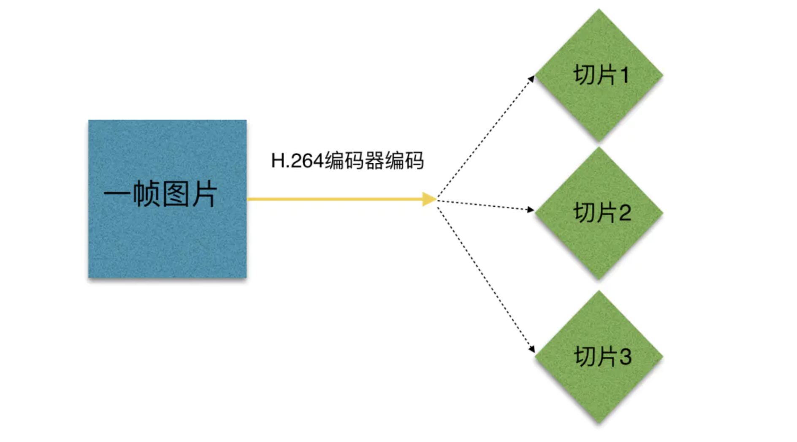

图片编码后

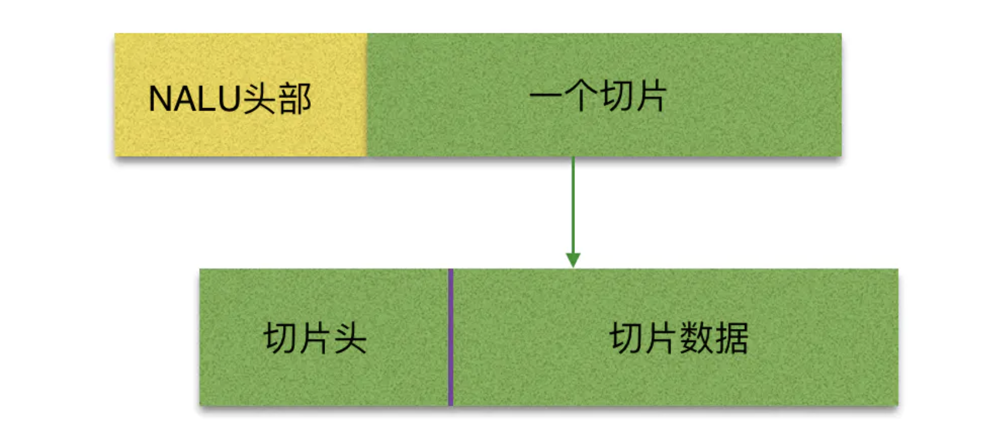

小伙伴们要明白，片（slice）的概念不同与帧（frame），帧（frame）是用作描述一张图片的，一帧（frame）对应一张图片，而片（slice），是 H.264 中提出的新概念，是通过编码图片后切分通过高效的方式整合出来的概念，一张图片至少有一个或多个片（slice）。

上图中可以看出，片（slice）都是又 NALU 装载并进行网络传输的，但是这并不代表 NALU 内就一定是切片，这是充分不必要条件，因为 NALU 还有可能装载着其他用作描述视频的信息。


##  NALU语法结构 

在H.264/AVC视频编码标准中，整个系统框架被分为了两个层面：视频编码层面（VCL）和网络抽象层面（NAL）。其中，前者负责有效表示视频数据的内容，**而后者则负责格式化数据并提供头信息，以保证数据适合各种信道和存储介质上的传输。**因此我们平时的每帧数据就是一个NAL单元（SPS与PPS除外）。在实际的H264数据帧中，往往帧前面带有00 00 00 01 或 00 00 01分隔符，一般来说编码器编出的首帧数据为PPS与SPS，接着为I帧……

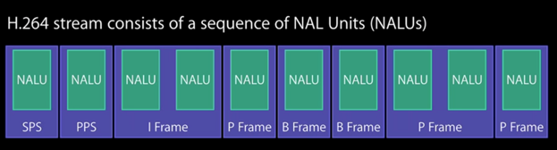

 使用 UltraEdit 查看一个 h.264 文件信息

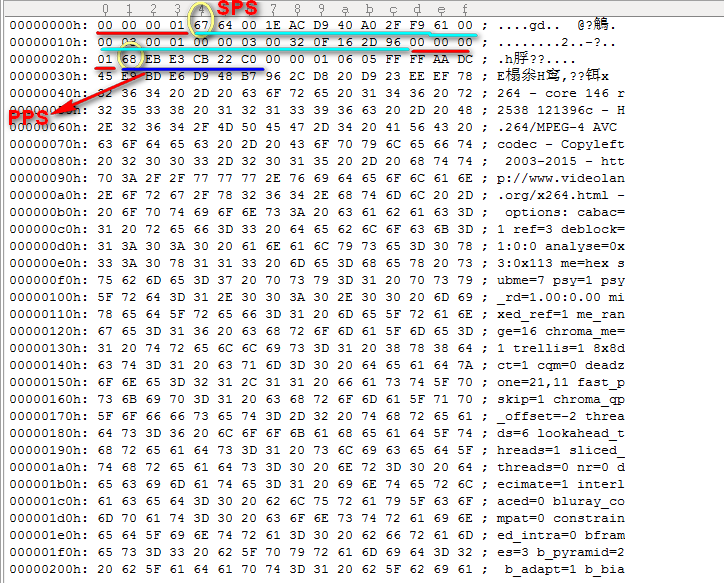

其中 SPS、PPS 文章开始也讲了。

**SPS(Sequence Parameter Sets)：**序列参数集，作用于一系列连续的编码图像。

**PPS(Picture Parameter Set)：**图像参数集，作用于编码视频序列中一个或多个独立的图像。

如上图，在H264码流中，都是以"0x00 0x00 0x01"或者"0x00 0x00 0x00 0x01"为开始码的，找到开始码之后，使用开始码之后的第一个字节的低 5 位判断是否为 7(sps)或者 8(pps), 及 data[4] & 0x1f == 7 || data[4] & 0x1f == 8。然后对获取的 nal 去掉开始码之后进行base64 编码，得到的信息就可以用于 sdp。 sps和pps需要用逗号分隔开来。

上图中，00 00 00 01是一个nalu的起始标志。后面的第一个字节，0x67，是nalu的类型，type &0x1f==0x7表示这个nalu是sps，type &0x1f==0x8表示是pps。

**接下来我们来讲解一下NALU语法结构：**

H264基本码流由一些列的NALU组成。原始的NALU单元组成：

[start code] + [NALU header] + [NALU payload]；

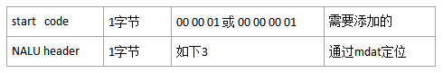

H264基本码流结构分两层：视频编码层VCL和网络适配层NAL，这样使信号处理和网路传输分离

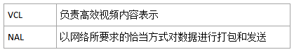

 

H.264码流在网络中传输时实际是以NALU的形式进行传输的.

每个`NALU`由**一个字节**的`Header`和`RBSP`组成.

NAL Header 的组成为：

**forbidden_zero_bit(1bit) + nal_ref_idc(2bit) + nal_unit_type(5bit)**

 

- forbidden_zero_bit： 


禁止位，初始为0，当网络发现NAL单元有比特错误时可设置该比特为1，以便接收方纠错或丢掉该单元。

- nal_ref_idc：          

nal重要性指示，标志该NAL单元的重要性，值越大，越重要，解码器在解码处理不过来的时候，可以丢掉重要性为0的NALU。

- nal_unit_type：NALU类型取值如下表所示：


句法表中的 C 字段表示该句法元素的分类，这是为片区服务。

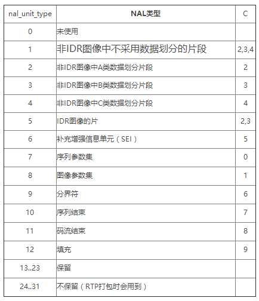

不过上面这张图，我实在没有找到出处啊。但是我在 x264 里看到了这个。

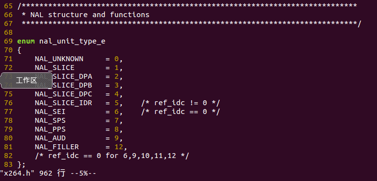

其中需要关注的是 SEI、SPS、PPS。我在 LIVE555 里又看到这个。

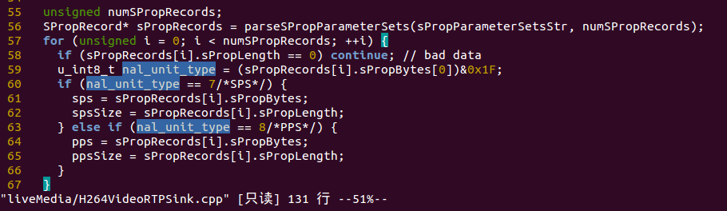

这不就是上面我们讲到的，nalu的类型 type &0x1f==0x7表示这个nalu是sps，type &0x1f==0x8表示是pps。

**接下来我们来举个例子，来讲解下：**

**该视频下载：[H.264 示例视频和工具](http://pan.baidu.com/s/1slmc6Mp)**

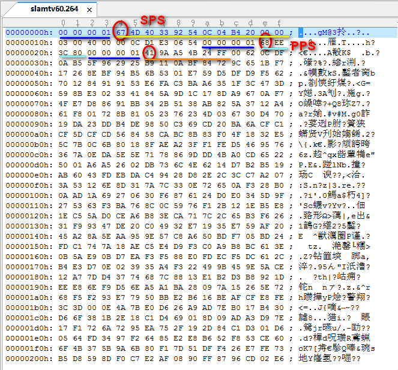

00 00 00 01 为起始符，67 即 nal_unit_type。

0x67的二进制是 0110 0111

则 forbidden_zero_bit(1bit) = 0；

nal_ref_idc(2bit) = 3；

nal_unit_type(5bit) = 7；即 SPS 类型。

**然后看另一部分 RBSP** 

这里提一下 SODB 和 RBSP 关系

SODB(String Of Data Bits)：最原始的编码数据RBSP, 长度不一定是8的倍数，此时需要对齐.　
RBSP： 在SODB的后面填加了结尾比特（RBSP trailing bits 一个bit“1”）若干比特“0”,以便字节对齐。

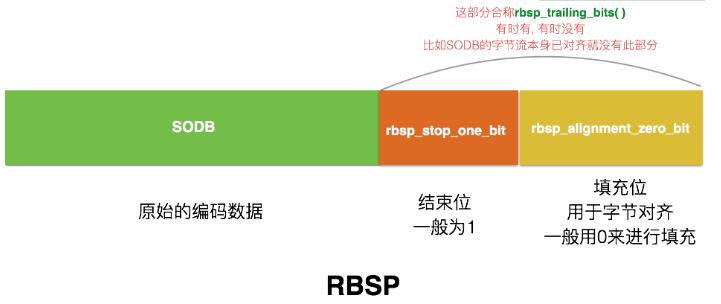

我们知道码流是由一个个的NAL Unit组成的，NALU是由NALU头和RBSP数据组成，而RBSP可能是SPS，PPS，Slice或SEI，目前我们这里SEI不会出现，而且SPS位于第一个NALU，PPS位于第二个NALU，其他就是Slice(严谨点区分的话可以把IDR等等再分出来)了。

而上面这个h.264文件，相当于包含两个 NALU吧，第一个是SPS，第二个是PPS。

我们先看第一个NALU（SPS）的 RBSP (10个字节)

```
67 4D 40 33 92 54 0C 04 B4 20
```

转换成二进制：

```
0110 0111  
0100 1101  
0100 0000  
0011 0011  
1001 0010  
0101 0100  
0000 1100
0000 0100  
1011 0100  
0010 0000
```

**先看NALU头，解析结果如下：**

```
forbidden_zero_bit = 0 // 0  u(1)
nal_ref_idc = 3 // 11  u(2)
nal_unit_type = 7 // 00111  u(5)
这就对了，看看 NAL_SPS = 7;
```

**接下来进入 RBSP，先讲SPS的**

还记得视频编码数据工具 Elecard Stream Eye

**参看：[FFmpeg再学习 -- 视音频基础知识](http://blog.csdn.net/qq_29350001/article/details/74912348)**

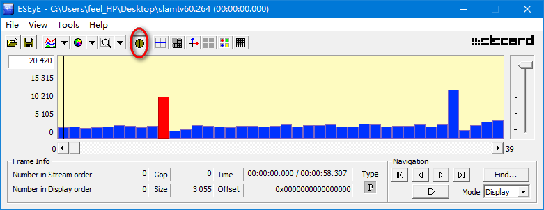

点击 show\hide info 可查看 File 和 Headers （重点）

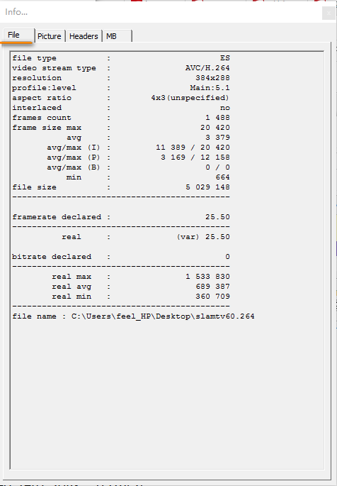

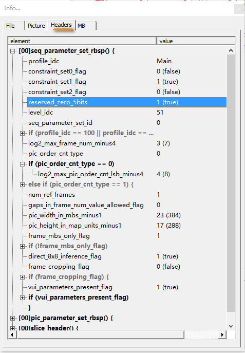

这里在推荐一款软件 **下载：[视频分析工具H264Visa](http://download.csdn.net/download/u013354805/9311383)**

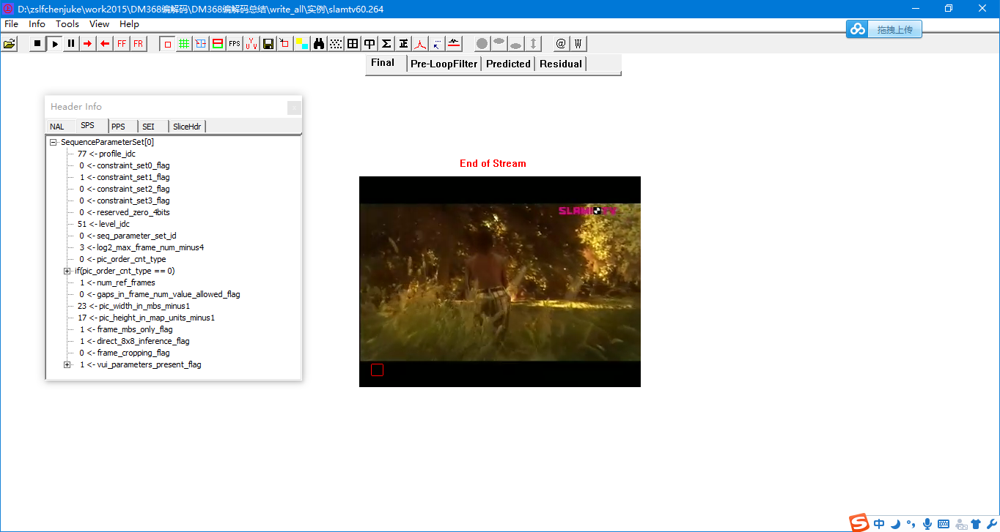

 

我们就是根据上图里的内容来进行分析。 **参看：[H264 各profiles用途和特点](http://blog.csdn.net/lixiaowei16/article/details/22370217)**

```
profile_idc = 77 // 0100 1101 u(8) 

constraint_set0_flag = 0 //0  u(1)

constraint_set1_flag = 1 //1  u(1)

constraint_set1_flag = 0 //0  u(1)

reserved_zero_5bits = 1 //1  u(5)

level_idc = 51 //0011 0011 u(8)
```

对于 seq_parameter_set_id，我们看到它是ue(v)，这是一种指数哥伦布编码

**扩展：**

**参看：[指数哥伦布码](http://blog.csdn.net/starperfection/article/details/46545783)**

指数哥伦布编码是一种在编码技术中经常用到的编码，其是无损编码，在HEVC中以及之前的编码技术H.264/AVC中，由于其可以由编码直接解得码字的变长码，所以广受欢迎。HM源码中的SPS/PPS和每个片的头部分都是用哥伦布编码进行编码。
**对于一个需要编码的数 x，按照以下的几步进行编码： 

按照二进制形式写下 x+1， 

根据写下的数字，计算出当前数值的位数，然后在该数的前面加上当前数值位数减一后得到的数值个数的零。**

例如：编码“3” 

1. 该数加一后（即4）的二进制为100， 
2. 当前数值的位数是三位，3减去1后得到2，所以在“100”的前方加上两个零，得“00100”即为3的哥伦布码。

下面列出1-8的哥伦布码： 

```
0=> 1=> 1 
1=> 10=> 010 
2=> 11=> 011 
3=> 100=> 00100 
4=> 101=> 00101 
5=> 110=> 00110 
6=> 111=> 00111 
7=> 1000=> 0001000 
8=> 1001=> 0001001
```

 

**哥伦布码扩展到负数范围**
每一个负数进行编码的时候，将其映射到其绝对值的两倍。即-4映射为8进行编码；正数的映射为其两倍减一进行编码，即4映射为7进行编码。 
例如： 

```
0 => 0 => 1 => 1 
1 => 1 => 10 => 010 
=>1 => 2 => 11 => 011 
2 => 3 => 100 => 00100 
=>2 => 4 => 101 => 00101 
3 => 5 => 110 => 00110 
=>3 => 6 => 111 => 00111 
4 => 7 => 1000 => 0001000 
=>4 => 8 => 1001 => 0001001
```

**K阶指数哥伦布码**
为了用更少的比特表示更大的数值，可以使用多阶指数哥伦布编码（代价是相比起之前的0阶哥伦布码来书，小的数值可能需要更多的比特去表示） 
进行K阶哥伦布编码的步骤是 

1. 确定进行编码的阶数K 
2. 将原数映射到” X + (2^k) -1” （即如果在3阶条件下编码4，则其将被映射到4+2^3-1=11） 
3. 将上一步骤得到的数值进行0阶编码得到0阶哥伦布码（11->0001100） 
4. 去掉码的前部分k个前导零（0001100->1100） 
5. 在进行解码的时候，从bit stream中寻找第一个非零比特值，然后把之前遇到的零的个数存在leadingzerobit参数中，即可根据该参数去被编码值了。

上面讲到的只是 ue(v)，但是还有其他的像是 se(v)，又是什么?

**参看：[H264的句法和语义(二)](http://blog.csdn.net/u013354805/article/details/51700935)**

H264定义了如下几种描述子：

| ae(v)     | 基于上下文自适应的二进制算术熵编码；           |
| --------- | ---------------------------------------------- |
| b(8)      | 读进连续的8个比特；                            |
| ce(v)     | 基于上下文自适应的可变长熵编码；               |
| f(n)      | 读进连续的n个比特；                            |
| i(n)/i(v) | 读进连续的若干比特，并把他们解释为有符号整数； |
| me(v)     | 映射指数Golomb熵编码；                         |
| se(v)     | 有符号指数Golomb熵编码；                       |
| te(v)     | 截断指数Golomb熵编码；                         |
| u(n)/u(v) | 读进连续的若干比特，并将它们解释为无符号整数； |
| ue(v)     | 无符号指数Golomb熵编码。                       |

我们看到，描述子都在括号中带有一个参数，这个参数表示需要提取的比特数。

当参数是n时，表明调用这个描述子的时候回指明n的值，也即该句法元素是定长编码。

当参数是v时，对应的句法元素是变成编码，这时有两种情况：

i(v)和u(v)两个描述子的v由以前的句法元素指定，也就是说在前面会有句法元素指定当前句法元素的比特长度；陈列这两个描述子外，其他描述子都是熵编码，他们的解码算术本身能够确定当前句法元素的比特长度。

```
seq_parameter_set_id = 0 // 1  ue(v)

log2_max_frame_num_minus4 = 3 //00100 ue(v)

pic_order_cnt_type = 0 //1 ue(v)

log2_max_pic_order_cnt_lsb_minus4 = 4 //00101 ue(v)

num_ref_frames = 1//010 ue(v) 

gaps_in_frame_num_value_allowed_flag = 0 //0

pic_width_in_mbs_minus1 = 23 // 000011000 ue(v)   (23+1)*16 = 384

pic_height_in_map_units_minus1 = 17 //000010010 ue(v)  (17+1)*16 = 288  

frame_mbs_only_flag = 1 //1

direct_8x8_inference_flag = 1 //1

frame_cropping_flag = 0 //0

vui_parameters_present_flag = 1 //1

```

以上分析部分和视频分析工具 header info SPS 比较发现结果是一致的。 

**SPS部分讲完了，然后再看 PPS**

00 00 00 01 68 EE 3C 80 

首先起始符 00 00 00 01

然后 68 即 nal_unit_type。

0x68的二进制是 0110 1000

则 forbidden_zero_bit(1bit) = 0；

nal_ref_idc(2bit) = 3；

nal_unit_type(5bit) = 8；即 PPS 类型。

 

**然后再看 RBSP 部分**

用视频分析工具得出的结果如下图：

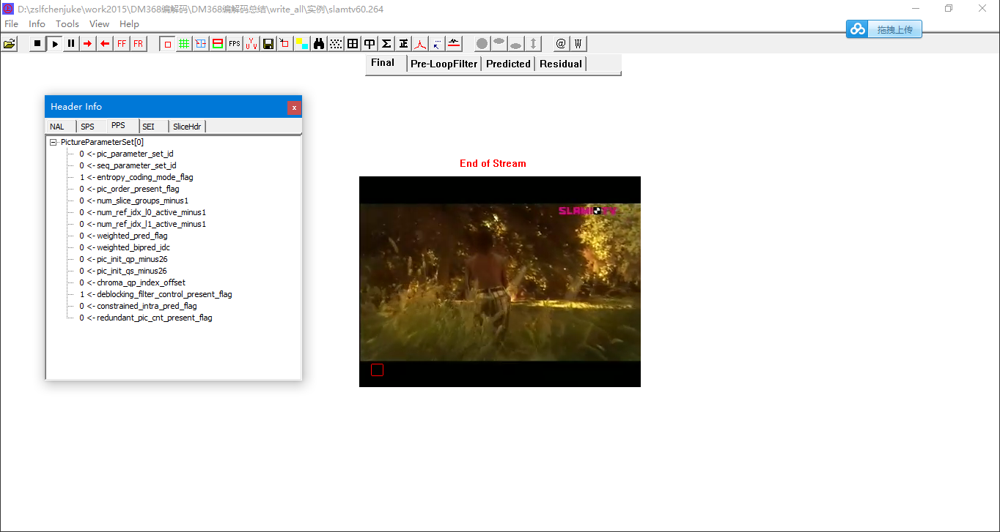

将 EE 3C 80 

转换成二进制：

```
1110 1110
0011 1100
1000 0000
```

```
pic_parameter_set_id = 0 //1 ue(v)
seq_parameter_set_id = 0 //1 ue(v)
entropy_coding_mode_flag = 1 //1
pic_order_present_flag = 0 //0
num_slice_groups_minus1 = 0 //1  ue(v)
num_ref_idx_l0_default_active_minus1 = 0 //1  ue(v)
num_ref_idx_l1_default_active_minus1 = 0 //1  ue(v)
weighted_pred_flag = 0 //0
weighted_bipred_idc = 0 //00
pic_init_qp_minus26 = 0 //1 ue(v)
pic_init_qs_minus26 = 0 //1 ue(v)
chroma_qp_index_offset = 0 //1 ue(v)
deblocking_filter_control_present_flag = 1 //1
constrained_intra_pred_flag = 0 // 0
redundant_pic_cnt_present_flag = 0 // 0
```

以上分析部分和视频分析工具 header info PPS 比较发现结果是一致的。 

上面部分 **参看：[一步一步解析H.264码流的NALU(SPS,PSS,IDR)](http://guoh.org/lifelog/2013/10/h-264-bit-stream-sps-pps-idr-nalu/)** 同理可能还有 slice 部分的分析，这里不做介绍了

想深入了解的

**参看：[H.264学习笔记之一（层次结构，NAL，SPS）](http://blog.csdn.net/wutong_login/article/details/5818763)**

**参看：[H.264学习笔记之二（片及片头语法）](http://blog.csdn.net/wutong_login/article/details/5824509)**

**参看：[H.264句法和语法总结 系列](http://blog.csdn.net/xfding)**

记得一定要看哦，讲的是真好。还是贴出两张 NAL 句法，不然上面的讲的内容没一点解释，以后再看会有点懵。

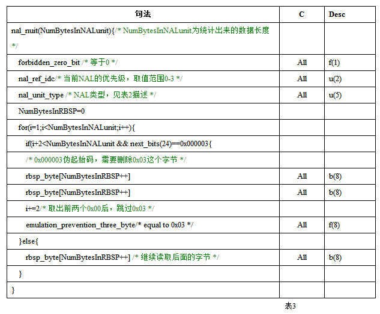

到此，NALU语法结构大致讲完了。

 

H.264码流中的NALU进行了一个简单的划分，标出了NALU的类型和长度等信息。因为我们在解析SPS和PPS中要使用到指数哥伦布编码的解析，所有有必要了解一下指数哥伦布编码。

## 指数哥伦布编码（理论篇）

指数哥伦布码（Exponential-Golomb code， 即Exp-Golomb code）是熵编码的一种编码方式，正常来说，可以拓展位k阶，但是在H264中使用的是0阶指数哥伦布编码，在H.264中使用ue(v)表示0阶无符号指数哥伦布编码的解码过程，用se(v)表示0阶有符号指数哥伦布编码过程

### 无符号指数哥伦布编码

用来表示无符号整数k阶指数哥伦布编码的生成步骤如下：

（1）将数字以二进制形式写出，去掉最低位的k个比特位，之后加1

（2）计算留下的比特数位数，将此数减1，即是需要增加的前导0的个数

（3）将第一步中去掉的最低个比特位补回到比特串尾部

#### 0阶无符号指数哥伦布编码过程

0阶无符号指数哥伦布编码最后生成的比特串格式为"前缀1后缀"，前缀和后缀的长度是相同的。

假如我们待编码的数字codeNum = 4，0阶无符号指数哥伦布编码的步骤如下：

（1）将数字以二进制写出，4的二进制为100，因为0阶指数哥伦布编码所有不用去掉低位

（2）将上面的二进制+1，100加1为101，留下的比特数为3，3-1=2，所有需要增加前导0的个数为2

（3）因为第一步没有去掉，所有这一步不进行任何操作，最终生成的比特串为00101

0阶指数哥伦布编码可以简化为如下步骤

（1）将codeNum+1，4+1=5

（2）将加1后的数字用二进制表示，5的二进制位101，1后缀=101，后缀位01，长度2

（3）前缀与后缀长度相同，在前面加上2个0 

下面对不同codeNum进行编码结果

| codeNum | codeNum+1 | codeNum+1的二进制 | 需补前缀0的个数 | 编码后的比特串（红色表示补的前缀0） |
| ------- | --------- | ----------------- | --------------- | ----------------------------------- |
| 0       | 1         | 1                 | 0               | 1                                   |
| 1       | 2         | 10                | 1（0）          | 010                                 |
| 2       | 3         | 11                | 1（0）          | 011                                 |
| 3       | 4         | 100               | 2（00）         | 00100                               |
| 4       | 5         | 101               | 2（00）         | 00101                               |
| 5       | 6         | 110               | 2（00）         | 00110                               |
| 6       | 7         | 111               | 2（00）         | 00111                               |

0阶无符号指数哥伦布编码的解析过程如下

（1）找到第一个不为0的bit，并记录总共找到了0的个数（num），这个时候读到的这个bit肯定是1

（2）然后读num个后缀

（3）1后缀转变成十进制就是原来的codeNum，codeNum = (1 <<i) + 后缀(十进制) - 1;

比如比特串的二进制为：00111，首先找到第一个不为0的比特，前面0的个数为2，然后再读2个后缀11，11十进制为3，这个时候codeNum = （1 << 2） + 3 - 1 = 4 + 3 - 1 = 6

#### k阶无符号指数哥伦布编码过程

（1）将codeNum加上2^k

（2）将加上2^k的数字用二进制表示

（3）计算二进制的长度len，然后再前面加上len-1-k个0

比特串的格式位"前缀1后缀"。前缀 = 后缀 - k

| codeNum | k=1          | len-1-k | 编码后比特串 | k=2           | len-1-k | 编码后比特串 |
| ------- | ------------ | ------- | ------------ | ------------- | ------- | ------------ |
| 1       | 1+2^1=3(11)  | 2-1-1=0 | 11           | 1+2^2=5(101)  | 3-1-2=0 | 101          |
| 2       | 2+2^1=4(100) | 3-1-1=1 | 0100         | 2+2^2=6(110)  | 3-1-2=0 | 110          |
| 3       | 3+2^1=5(101) | 3-1-1=1 | 0101         | 3+2^2=7(111)  | 3-1-2=0 | 111          |
| 4       | 4+2^1=6(110) | 3-1-1=1 | 0110         | 4+2^2=8(1000) | 4-1-2=1 | 01000        |

### 有符号指数哥伦布编码

有符号指数哥伦布编码一般使用se(v)表示，输出可能是负数，有符号指数哥伦布编码解析的过程是在无符号指数哥伦布编码解析过程之上进行的，遇到se(v)需要先调用ue(v)得到codeNum，然后再调用se(v)的过程.

value = (-1)^(codeNum+1) * (codeNum+1)/2;

(-1)^(codeNum+1)：表示如果codeNum为奇数那么是1，偶数为-1


## 实践

### 从SPS中提取宽高

```c
#include <stdio.h>
#include <stdint.h>
#include <string.h>
#include <math.h> typedef  unsigned int UINT;
typedef  unsigned char BYTE;
typedef  unsigned long DWORD; UINT Ue(BYTE *pBuff, UINT nLen, UINT &nStartBit)
{
    //计算0bit的个数
    UINT nZeroNum = ;
    while (nStartBit < nLen * )
    {
        if (pBuff[nStartBit / ] & (0x80 >> (nStartBit % ))) //&:按位与，%取余
        {
            break;
        }
        nZeroNum++;
        nStartBit++;
    }
    nStartBit ++;     //计算结果
    DWORD dwRet = ;
    for (UINT i=; i<nZeroNum; i++)
    {
        dwRet <<= ;
        if (pBuff[nStartBit / ] & (0x80 >> (nStartBit % )))
        {
            dwRet += ;
        }
        nStartBit++;
    }
    return ( << nZeroNum) -  + dwRet;
} int Se(BYTE *pBuff, UINT nLen, UINT &nStartBit)
{
    int UeVal=Ue(pBuff,nLen,nStartBit);
    double k=UeVal;
    int nValue=ceil(k/);//ceil函数：ceil函数的作用是求不小于给定实数的最小整数。ceil(2)=ceil(1.2)=cei(1.5)=2.00
    if (UeVal % ==)
        nValue=-nValue;
    return nValue;
} DWORD u(UINT BitCount,BYTE * buf,UINT &nStartBit)
{
    DWORD dwRet = ;
    for (UINT i=; i<BitCount; i++)
    {
        dwRet <<= ;
        if (buf[nStartBit / ] & (0x80 >> (nStartBit % )))
        {
            dwRet += ;
        }
        nStartBit++;
    }
    return dwRet;
} /**
 * H264的NAL起始码防竞争机制
 *
 * @param buf SPS数据内容
 *
 * @无返回值
 */
void de_emulation_prevention(BYTE* buf,unsigned int* buf_size)
{
    int i=,j=;
    BYTE* tmp_ptr=NULL;
    unsigned int tmp_buf_size=;
    int val=;     tmp_ptr=buf;
    tmp_buf_size=*buf_size;
    for(i=;i<(tmp_buf_size-);i++)
    {
        //check for 0x000003
        val=(tmp_ptr[i]^0x00) +(tmp_ptr[i+]^0x00)+(tmp_ptr[i+]^0x03);
        if(val==)
        {
            //kick out 0x03
            for(j=i+;j<tmp_buf_size-;j++)
                tmp_ptr[j]=tmp_ptr[j+];             //and so we should devrease bufsize
            (*buf_size)--;
        }
    }     return;
} /**
 * 解码SPS,获取视频图像宽、高信息
 *
 * @param buf SPS数据内容
 * @param nLen SPS数据的长度
 * @param width 图像宽度
 * @param height 图像高度  * @成功则返回1 , 失败则返回0
 */
int h264_decode_sps(BYTE * buf,unsigned int nLen,int &width,int &height,int &fps)
{
    UINT StartBit=;
    fps=;
    de_emulation_prevention(buf,&nLen);     int forbidden_zero_bit=u(,buf,StartBit);
    int nal_ref_idc=u(,buf,StartBit);
    int nal_unit_type=u(,buf,StartBit);
    if(nal_unit_type==)
    {
        int profile_idc=u(,buf,StartBit);
        int constraint_set0_flag=u(,buf,StartBit);//(buf[1] & 0x80)>>7;
        int constraint_set1_flag=u(,buf,StartBit);//(buf[1] & 0x40)>>6;
        int constraint_set2_flag=u(,buf,StartBit);//(buf[1] & 0x20)>>5;
        int constraint_set3_flag=u(,buf,StartBit);//(buf[1] & 0x10)>>4;
        int reserved_zero_4bits=u(,buf,StartBit);
        int level_idc=u(,buf,StartBit);         int seq_parameter_set_id=Ue(buf,nLen,StartBit);         if( profile_idc ==  || profile_idc ==  ||
            profile_idc ==  || profile_idc ==  )
        {
            int chroma_format_idc=Ue(buf,nLen,StartBit);
            if( chroma_format_idc ==  )
                int residual_colour_transform_flag=u(,buf,StartBit);
            int bit_depth_luma_minus8=Ue(buf,nLen,StartBit);
            int bit_depth_chroma_minus8=Ue(buf,nLen,StartBit);
            int qpprime_y_zero_transform_bypass_flag=u(,buf,StartBit);
            int seq_scaling_matrix_present_flag=u(,buf,StartBit);             int seq_scaling_list_present_flag[];
            if( seq_scaling_matrix_present_flag )
            {
                for( int i = ; i < ; i++ ) {
                    seq_scaling_list_present_flag[i]=u(,buf,StartBit);
                }
            }
        }
        int log2_max_frame_num_minus4=Ue(buf,nLen,StartBit);
        int pic_order_cnt_type=Ue(buf,nLen,StartBit);
        if( pic_order_cnt_type ==  )
            int log2_max_pic_order_cnt_lsb_minus4=Ue(buf,nLen,StartBit);
        else if( pic_order_cnt_type ==  )
        {
            int delta_pic_order_always_zero_flag=u(,buf,StartBit);
            int offset_for_non_ref_pic=Se(buf,nLen,StartBit);
            int offset_for_top_to_bottom_field=Se(buf,nLen,StartBit);
            int num_ref_frames_in_pic_order_cnt_cycle=Ue(buf,nLen,StartBit);             int *offset_for_ref_frame=new int[num_ref_frames_in_pic_order_cnt_cycle];
            for( int i = ; i < num_ref_frames_in_pic_order_cnt_cycle; i++ )
                offset_for_ref_frame[i]=Se(buf,nLen,StartBit);
            delete [] offset_for_ref_frame;
        }
        int num_ref_frames=Ue(buf,nLen,StartBit);
        int gaps_in_frame_num_value_allowed_flag=u(,buf,StartBit);
        int pic_width_in_mbs_minus1=Ue(buf,nLen,StartBit);
        int pic_height_in_map_units_minus1=Ue(buf,nLen,StartBit);         //width=(pic_width_in_mbs_minus1+1)*16;
        //height=(pic_height_in_map_units_minus1+1)*16;         int frame_mbs_only_flag=u(,buf,StartBit);
        if(!frame_mbs_only_flag)
            int mb_adaptive_frame_field_flag=u(,buf,StartBit);         int direct_8x8_inference_flag=u(,buf,StartBit);
        int frame_cropping_flag=u(,buf,StartBit);
        int frame_crop_left_offset=;
        int frame_crop_right_offset=;
        int frame_crop_top_offset=;
        int frame_crop_bottom_offset=;
        if(frame_cropping_flag)
        {
            frame_crop_left_offset=Ue(buf,nLen,StartBit);
            frame_crop_right_offset=Ue(buf,nLen,StartBit);
            frame_crop_top_offset=Ue(buf,nLen,StartBit);
            frame_crop_bottom_offset=Ue(buf,nLen,StartBit);
        }         width = ((pic_width_in_mbs_minus1 +)*) - frame_crop_left_offset* - frame_crop_right_offset*;
        height= (( - frame_mbs_only_flag)* (pic_height_in_map_units_minus1 +) * ) - (frame_crop_top_offset * ) - (frame_crop_bottom_offset * );         int vui_parameter_present_flag=u(,buf,StartBit);
        if(vui_parameter_present_flag)
        {
            int aspect_ratio_info_present_flag=u(,buf,StartBit);
            if(aspect_ratio_info_present_flag)
            {
                int aspect_ratio_idc=u(,buf,StartBit);
                if(aspect_ratio_idc==)
                {
                    int sar_width=u(,buf,StartBit);
                    int sar_height=u(,buf,StartBit);
                }
            }
            int overscan_info_present_flag=u(,buf,StartBit);
            if(overscan_info_present_flag)
                int overscan_appropriate_flagu=u(,buf,StartBit);
            int video_signal_type_present_flag=u(,buf,StartBit);
            if(video_signal_type_present_flag)
            {
                int video_format=u(,buf,StartBit);
                int video_full_range_flag=u(,buf,StartBit);
                int colour_description_present_flag=u(,buf,StartBit);
                if(colour_description_present_flag)
                {
                    int colour_primaries=u(,buf,StartBit);
                    int transfer_characteristics=u(,buf,StartBit);
                    int matrix_coefficients=u(,buf,StartBit);
                }
            }
            int chroma_loc_info_present_flag=u(,buf,StartBit);
            if(chroma_loc_info_present_flag)
            {
                int chroma_sample_loc_type_top_field=Ue(buf,nLen,StartBit);
                int chroma_sample_loc_type_bottom_field=Ue(buf,nLen,StartBit);
            }
            int timing_info_present_flag=u(,buf,StartBit);
            if(timing_info_present_flag)
            {
                int num_units_in_tick=u(,buf,StartBit);
                int time_scale=u(,buf,StartBit);
                fps=time_scale/(*num_units_in_tick);
            }
        }
        return true;
    }
    else
        return false;
}
```

