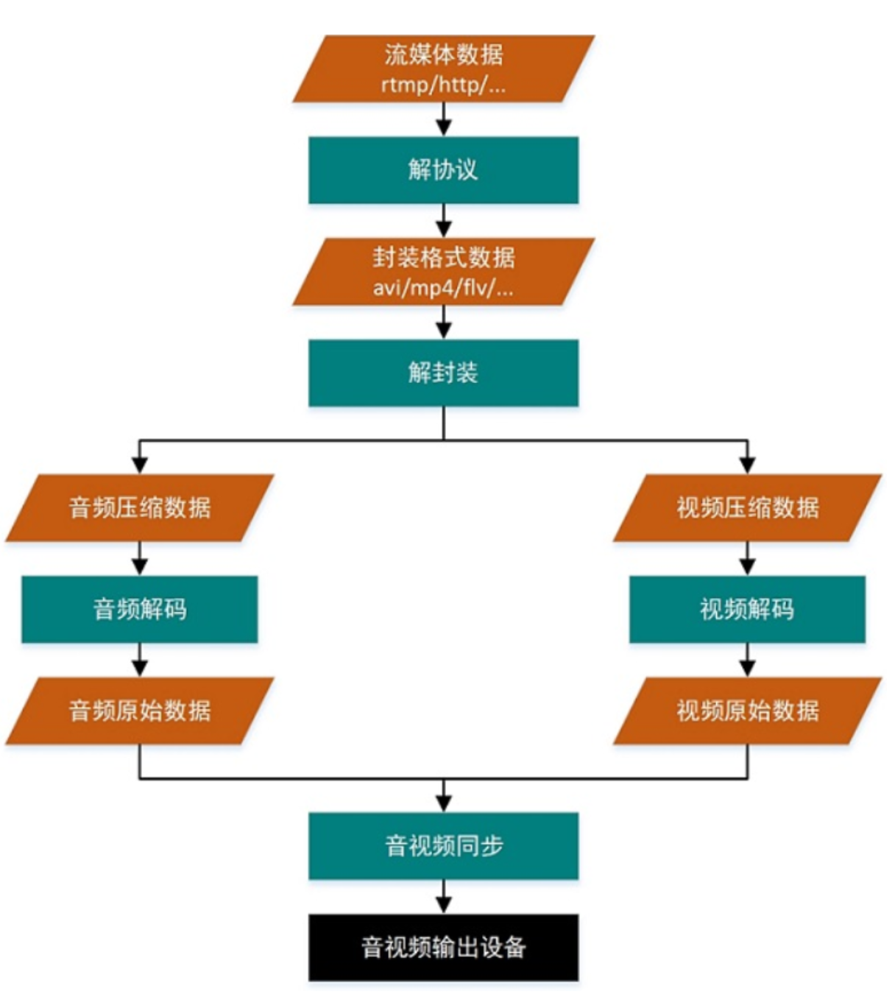
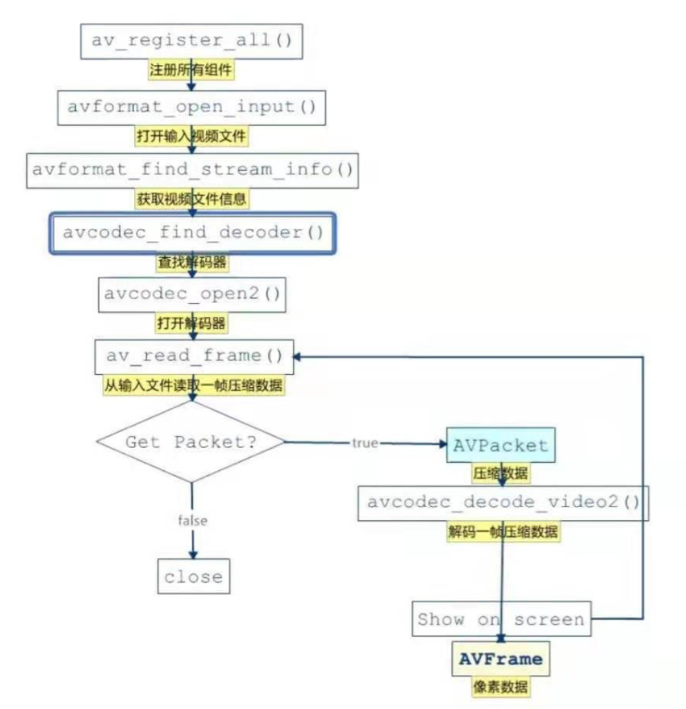
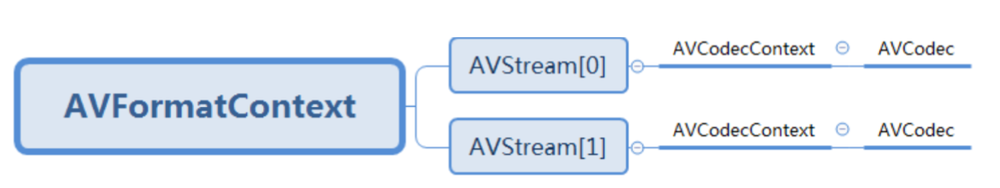

# API使用指南

## api功能

### 函数一 

 ```c++
int av_image_get_buffer_size(enum AVPixelFormat pix_fmt, int width, int height, int align); // 函数的作用是通过指定像素格式、图像宽、图像高来计算所需的内存大小
 ```

重点说明一个参数align:此参数是设定内存对齐的对齐数，也就是按多大的字节进行内存对齐。

> 1. 比如设置为1，表示按1字节对齐，那么得到的结果就是与实际的内存大小一样
> 2. 比如设置为4，表示按4字节对齐。也就是内存的起始地址必须是4的整倍数。


### 函数二 

```c++
int av_image_alloc(uint8_t *pointers[4], int linesizes[4], int w, int h, enum AVPixelFormat pix_fmt, int align); // av_image_alloc()是这样定义的。此函数的功能是按照指定的宽、高、像素格式来分析图像内存。
```

pointers[4]：保存图像通道的地址。如果是RGB，则前三个指针分别指向R,G,B的内存地址。第四个指针保留不用

linesizes[4]：保存图像每个通道的内存对齐的步长，即一行的对齐内存的宽度，此值大小等于图像宽度。

>  w:  要申请内存的图像宽度。
>
>  h:   要申请内存的图像高度。
>
>  pix_fmt:  要申请内存的图像的像素格式。
>
>  align:  用于内存对齐的值。
>
>  返回值：所申请的内存空间的总大小。如果是负值，表示申请失败。


### 函数三

```c++
int av_image_fill_arrays(uint8_t *dst_data[4], int dst_linesize[4],const uint8_t *src, enum AVPixelFormat pix_fmt, int width, int height, int align); // av_image_fill_arrays()函数自身不具备内存申请的功能，此函数类似于格式化已经申请的内存，即通过av_malloc()函数申请的内存空间。
```

av_image_fill_arrays()中参数具体说明：

>  dst_data[4]：    [out]对申请的内存格式化为三个通道后，分别保存其地址
>
>  dst_linesize[4]:    [out]格式化的内存的步长（即内存对齐后的宽度)
>
>  *src:    [in]av_alloc()函数申请的内存地址。
>
>  pix_fmt:  [in] 申请 src内存时的像素格式
>
>  width:    [in]申请src内存时指定的宽度
>
>  height:    [in]申请scr内存时指定的高度
>
>  align:    [in]申请src内存时指定的对齐字节数。

通过以上实例可以看到，

（a) 计算所需内存大小av_image_get_bufferz_size() --> 

   (b) 按计算的内存大小申请所需内存 av_malloc() --> (c) 对申请的内存进行格式化 av_image_fill_arrays();


### 函数四

```c++
int sws_getContext(width, height, vCodecCtx->pix_fmt, width, height, AV_PIX_FMT_RGBA, SWS_BICUBIC, NULL, NULL, NULL);
```


## 解码流程

### 解协议

将流媒体协议的数据，解析为标准的相应的封装格式数据。视音频在网络上传播的时候，常常采用各种流媒体协议，例如 HTTP，RTMP，或是 MMS 等等。这些协议在传输视音频数据的同时，也会传输一些信令数据。这些信令数据包括对播放的控制（播放，暂停，停止），或者对网络状态的描述等。解协议的过程中会去除掉信令数据而只保留视音频数据。例如，采用 RTMP 协议传输的数据，经过解协议操作后，输出 FLV 格式的数据。 

### 解封装

将输入的封装格式的数据，分离成为音频流压缩编码数据和视频流压缩编码数据。封装格式种类很多，例如 MP4，MKV，RMVB，TS，FLV，AVI 等等，它的作用就是将已经压缩编码的视频数据和音频数据按照一定的格式放到一起。例如，FLV 格式的数据，经过解封装操作后，输出 H.264 编码的视频码流和 AAC 编码的音频码流。

### 解码

将视频/音频压缩编码数据，解码成为非压缩的视频/音频原始数据。解码是整个系统中最重要也是最复杂的一个环节。通过解码，压缩编码的视频数据输出成为非压缩的颜色数据，例如 YUV420P，RGB 等等；

### 音视频同步

根据解封装模块处理过程中获取到的参数信息，同步解码出来的视频和音频数据，并将视频音频数据送至系统的显卡和声卡播放出来。



### FFmpeg音视频解码

通过前文，我们知道每一个媒体文件在被终端播放前主要经过了两个关键步骤，分别是解封装和解码。而在ffmpeg中，使用相关接口实现解封装和解码流程如下图：



由上图可知，我们需要重点关注下面这些FFmpeg的API接口：

- av_register_all()：注册所有组件。
- avformat_open_input()：打开输入视频文件。
- avformat_find_stream_info()：获取视频文件信息。
- avcodec_find_decoder()：查找解码器。
- avcodec_open2()：打开解码器。
- av_read_frame()：从输入文件读取一帧压缩数据。
- avcodec_decode_video2()：解码一帧压缩数据。


## FFmpeg接口使用

1.在使用FFmpeg解码媒体文件之前，首先需要注册了容器和编解码器有关的组件。

```cpp
av_register_all()
```

如果我们需要播放网络多媒体，则可以加载socket库以及网络加密协议相关的库，为后续使用网络相关提供支持。

```cpp
avformat_network_init();
```

2.我们通过avformat_open_input()来打开一个媒体文件，并获得媒体文件封装格式的上下文

```cpp
// 打开一个文件并解析。可解析的内容包括：视频流、音频流、视频流参数、音频流参数、视频帧索引
int res = avformat_open_input(&pAVFormatCtx, url, NULL, NULL);
LOGI("avformat_open_input %s %d", url, res);
if (res != 0) {
    LOGE("can not open url :%s", url);
    callJava->onCallError(CHILD_THREAD, 1001, "can not open url");
    exit = true;
    pthread_mutex_unlock(&init_mutex);
    return;
}
```

3.通过avformat_find_stream_info()获取媒体文件中，提取流的上下文信息，分离出音视频流。

```cpp
// 解码时，作用是从文件中提取流信，将所有的Stream的MetaData信息填充好，先read_packet一段数据解码分析流数据
if (avformat_find_stream_info(pAVFormatCtx, NULL) < 0) {
    LOGE("can not find streams from %s", url);
    callJava->onCallError(CHILD_THREAD, 1002,"can not find streams from url");
    exit = true;
    pthread_mutex_unlock(&init_mutex);
    return;
}
```

通过遍历找出文件中的音频流或视频流

```cpp
for (int i = 0; i < pAVFormatCtx->nb_streams; i++) {
    if (pAVFormatCtx->streams[i]->codecpar->codec_type == AVMEDIA_TYPE_AUDIO) {
        // 得到音频流
        if (audio == NULL) {
            audio = new FFAudio(playstatus, pAVFormatCtx->streams[i]->codecpar->sample_rate, callJava);
            audio->streamIndex = i;
            audio->codecpar = pAVFormatCtx->streams[i]->codecpar;
            audio->duration = pAVFormatCtx->duration / AV_TIME_BASE;
            audio->time_base = pAVFormatCtx->streams[i]->time_base;
            duration = audio->duration;

            // av_q2d(time_base)=每个刻度是多少秒
            LOGI("audio stream_info[%d], duration:%d, time_base den:%d, sample_rate:%d",
                 i, audio->duration, audio->time_base.den, pAVFormatCtx->streams[i]->codecpar->sample_rate);
            LOGI("audio stream_info[%d], duration %lld", i, pAVFormatCtx->duration);
        }
    } else if (pAVFormatCtx->streams[i]->codecpar->codec_type == AVMEDIA_TYPE_VIDEO) {
        // 得到视频流
        if (video == NULL) {
            video = new FFVideo(playstatus, callJava);
            video->streamIndex = i;
            video->codecpar = pAVFormatCtx->streams[i]->codecpar;
            video->time_base = pAVFormatCtx->streams[i]->time_base;
            int num = pAVFormatCtx->streams[i]->avg_frame_rate.num;
            int den = pAVFormatCtx->streams[i]->avg_frame_rate.den;
            LOGI("video stream_info[%d], frame_rate num %d,den %d", i, num, den);
            if (num != 0 && den != 0) {
                int fps = num / den;//[25 / 1]
                video->defaultDelayTime = 1.0 / fps;
            }
            LOGI("video stream_info[%d], defaultDelayTime is %f", i, video->defaultDelayTime);
        }
    }
}
```

4.分离出音视频流之后，可以找到对应的AVCodecContext，即编解码器的上下文，用来寻找对应的解码器并设置。

```cpp
// 查找对应的解码器 存储编解码器信息的结构体
AVCodec *avCodec = avcodec_find_decoder(codecpar->codec_id); // 软解
// avCodec = avcodec_find_decoder_by_name("mp3_mediacodec"); // 硬解
if (!avCodec) {
    LOGE("MFFmpeg::getCodecContext can not find decoder!");
    callJava->onCallError(CHILD_THREAD, 1003, "can not find decoder");
    exit = true;
    pthread_mutex_unlock(&init_mutex);
    return -1;
}
LOGI("getCodecContext  codecpar-> 解码类型:%d 编码格式:%s" , codecpar->codec_type, avCodec->name);

// 配置解码器
*avCodecContext = avcodec_alloc_context3(avCodec);
if (!*avCodecContext) {
    LOGE("can not alloc new decodecctx");
    callJava->onCallError(CHILD_THREAD, 1004, "can not alloc new decodecctx");
    exit = true;
    pthread_mutex_unlock(&init_mutex);
    return -1;
}
```

5.通过avcodec_open2()打开解码器，解码媒体文件。

```cpp
//打开编解码器
if (avcodec_open2(*avCodecContext, avCodec, 0) != 0) {
    LOGE("cant not open strames");
    callJava->onCallError(CHILD_THREAD, 1006, "cant not open strames");
    exit = true;
    pthread_mutex_unlock(&init_mutex);
    return -1;
}
```

所以第2，3，4，5四个步骤使用的关系如下图



6.打开解码器之后，通过av_read_frame()一帧一帧读取压缩数据。

```cpp
AVPacket *avPacket = av_packet_alloc();
// 读取具体的音/视频帧数据
int ret = av_read_frame(pAVFormatCtx, avPacket);
if (ret==0) {
    // stream_index：标识该AVPacket所属的视频/音频流
    if (avPacket->stream_index == audio->streamIndex) {
        // LOGI("audio 解码第 %d 帧  DTS:%lld PTS:%lld", count, avPacket->dts, avPacket->pts);
        audio->queue->putAVpacket(avPacket);
    } else if(avPacket->stream_index == video->streamIndex) {
        // LOGI("video 解码第 %d 帧  DTS:%lld PTS:%lld", count, avPacket->dts, avPacket->pts);
        count++;
        video->queue->putAVpacket(avPacket);
    } else {
        av_packet_free(&avPacket);
        av_free(avPacket);
        avPacket = NULL;
    }
}
```

  7.通过avcodec_decode_video2()/avcodec_decode_audio4解码一帧视频或者音压缩数据，通过AVPacket->

AVFrame得到视频像素数据。

```js
// 解码AVPacket->AVFrame
ret = avcodec_decode_audio4(pCodeCtx, frame, &got_frame, packet);
// 解码一帧视频压缩数据，得到视频像素数据
ret = avcodec_decode_video2(pCodecCtx, pFrame, &got_picture, packet);
```

