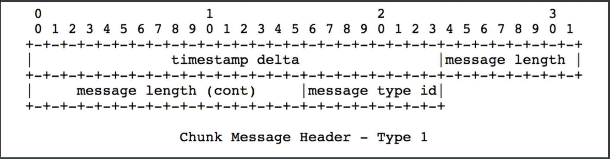
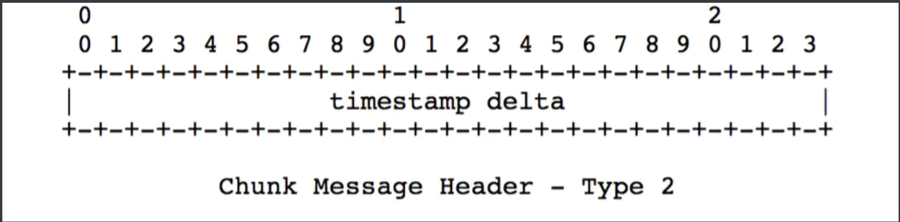

## 简介 

RTMP是`Real Time Messaging Protocol`（实时消息传输[协议](https://link.jianshu.com?t=https://baike.baidu.com/item/协议/13020269)）的首字母缩写。该协议基于TCP，是一个协议族，包括RTMP基本协议及RTMPT/RTMPS/RTMPE等多种变种。RTMP是一种设计用来进行实时数据通信的网络协议，主要用来在Flash/AIR平台和支持RTMP协议的流媒体/交互服务器之间进行音视频和数据通信。支持该协议的软件包括`Adobe Media Server/Ultrant Media Server/red5`等。

RTMP又是`Routing Table Maintenance Protocol`（[路由选择表](https://link.jianshu.com?t=https://baike.baidu.com/item/路由选择表)维护协议）的缩写。 在 AppleTalk 协议组中，路由选择表维护协议（`RTMP，Routing Table Protocol`）是一种[传输层](https://link.jianshu.com?t=https://baike.baidu.com/item/传输层)协议，它在 AppleTalk [路由器](https://link.jianshu.com?t=https://baike.baidu.com/item/路由器)中建立并维护路由选择表。RTMP 基于[路由选择信息协议](https://link.jianshu.com?t=https://baike.baidu.com/item/路由选择信息协议)（RIP）。正如 RIP 一样，RTMP 使用跳数作为路由计量标准。一个数据包从源网络发送到目标网络，必须通过的路由器或其它中间介质[节点](https://link.jianshu.com?t=https://baike.baidu.com/item/节点)数目的计算结果即为跳数。

下面我们看一下两张原理图理解一下。


------

## 概述

`RTMP(Real Time Messaging Protocol)`实时消息传送协议是[Adobe](https://link.jianshu.com?t=https://baike.baidu.com/item/Adobe) Systems公司为Flash播放器和服务器之间音频、视频和数据传输 开发的开放协议。

它有多种变种：

- `RTMP`工作在TCP之上，默认使用端口1935；
- `RTMPE`在RTMP的基础上增加了加密功能；
- `RTMPT`封装在[HTTP请求](https://link.jianshu.com?t=https://baike.baidu.com/item/HTTP请求)之上，可穿透[防火墙](https://link.jianshu.com?t=https://baike.baidu.com/item/防火墙)；
- `RTMPS`类似RTMPT，增加了`TLS/SSL`的安全功能。

------

## 介绍

`RTMP`协议`(Real Time Messaging Protocol)`是被Flash用于对象，视频，音频的传输。这个协议建立在TCP协议或者[轮询](https://link.jianshu.com?t=https://baike.baidu.com/item/轮询)[HTTP协议](https://link.jianshu.com?t=https://baike.baidu.com/item/HTTP协议)之上。

RTMP协议就像一个用来装数据包的容器,这些数据既可以是`AMF`格式的数据，也可以是`FLV`中的音/视频数据。

一个单一的连接可以通过不同的通道传输多路网络流，这些通道中的包都是按照固定大小的包传输的。网络连接`(Connection)`一个`Actionscript`连接并播放一个流的简单代码:

```jsx
var videoInstance:Video = your_video_instance;
var nc:NetConnection = new NetConnection();
var connected:Boolean = nc.connect("rtmp:/localhost/myapp");
var ns:NetStream = new NetStream(nc);
videoInstance.attachVideo(ns);
ns.play("flvName");
```

默认端口为`1935`

**这儿埋下一个小疑问？为什么传输层已经建立了TCP连接，RTMP还需要再次建立一个连接，有这个必要吗？**

> RTMP协议传输时会对数据做自己的格式化，这种格式的消息我们称之为RTMP Message，而实际传输的时候为了更好地实现多路复用、分包和信息的公平性，发送端会把Message划分为带有Message ID的Chunk，每个Chunk可能是一个单独的Message，也可能是Message的一部分，在接受端会根据chunk中包含的data的长度，message id和message的长度把chunk还原成完整的Message，从而实现信息的收发。

------

## 内容

### 1. 握手

`Client → Server`：向服务器发出握手请求.这不属于协议包一部分,该握手请求第一个字节为(0×03),其后跟着1536个字节。尽管看上去这部分的内容对于RTMP协议来说并不是至关重要的,但也不可随意对待。

`Server → Client` ：服务器向客户端回应握手请求，这部分的数据仍然不属于RTMP协议的部分。该回应的起始字节仍然为(0x03)，但是后边跟着两个长度为1536个字节(一共为3072字节 )的包块。

> 第一个1536块看上去似乎可以是任意内容，甚至好像可以是Null都没有关系。
> 第二个1536的代码块，是上一步客户端向服务器端发送的握手请求的内容。

`Client→Server`：把上一步服务器向客户端回应的第二块1536个字节的[数据块](https://link.jianshu.com?t=https://baike.baidu.com/item/数据块)。

至此客户端与服务器端的握手结束，下面将发送RTMP协议的包内容。

`Client → Server` ：向服务器发送连接包。
`Server → Client` ：服务器回应。

... .... 等等... ...

**还是再来个详细一点的吧！**

RTMP基于TCP，已知TCP需要3次握手才可以建立连接，在TCP3次握手成功之后，应用层的RTMP也是需要握手的，就是认证过程。具体的认证过程如下： 


- 客户端发送 C0、C1、 C2，服务器发送 S0、 S1、 S2。
- 首先，客户端发送 C0 表示自己的版本号，不必等对方的回复，然后发送 C1 表示自己的时间戳。
- 服务器只有在收到 C0 的时候，才能返回 S0，表明自己的版本号，如果版本不匹配，可以断开连接。
- 服务器发送完 S0 后，也不用等什么，就直接发送自己的时间戳 S1。客户端收到 S1 的时候，发一个知道了对方时间戳的 ACK C2。同理服务器收到 C1 的时候，发一个知道了对方时间戳的 ACK S2。
- 握手建立完成。

现在回答上面提出的问题，为什么RTMP还需要单独建立一个连接？ 

**因为它们需要商量一些事情，保证以后的传输能正常进行。主要就是两个事情，一个是版本号，如果客户端、服务器的版本号不一致，则不能工作。另一个就是时间戳，视频播放中，时间是很重要的，后面的数据流互通的时候，经常要带上时间戳的差值，因而一开始双方就要知道对方的时间戳。**

光讲纯理论，没意思，还是抓包看一下具体的流程吧。

1.首先TCP 3次握手


2.RTMP握手过程


我们发现真实发包是C0+C1一起发；S0、S1、S2一起发。但是发送的时候还是会严格按照时序来控制的，这样才能真正校验好版本号等字段。


### 2. 数据类型

```bash
0×01 Chunk Size changes the chunk size for packets
0×02 Unknown anyone know this one?
0×03 Bytes Read send every x bytes read by both sides
0×04 Ping ping is a stream control message, has subtypes
0×05 Server BW the servers downstream bw
0×06 Client BW the clients upstream bw
0×07 Unknown anyone know this one?
0×08 Audio Data packet containing audio
0×09 Video Data packet containing video data
0x0A - 0×11 Unknown anyone know?
0×12 Notify an invoke which does not expect a reply
0×13 Shared Object has subtypes
0×14 Invoke like remoting call, used for stream actions too.
Shared Object 数据类型
0×01 Connect
0×02 Disconnect
0×03 Set Attribute
0×04 Update Data
0×05 Update Attribute
0×06 Send Message
0×07 Status
0×08 Clear Data
0×09 Delete Data
0x0A Delete Attribute
0x0B
Initial Data
```


### 3. 包结构

RTMP包 包含一个固定长度的包头和一个最长为128字节的包体，包头可以是下面4种长度的任意一种：`12, 8, 4, or 1 byte(s)`。
第一个字节的前两个Bit很重要，它决定了包头的长度，它可以用[掩码](https://link.jianshu.com?t=https://baike.baidu.com/item/掩码)0xC0进行"与"计算。下面罗列了可能的包头长度`Bits Header Length`。

```bash
00 12 bytes
01 8 bytes
10 4 bytes
11 1 byte
```

其实`RTMP`包结构就是使用了`AMF`格式.

下面是一个关于客户端向服务器端发送流的流程：

- `Client → Server` :发送一个创建流的请求
- `Server → Client` :返回一个表示流的索引号
- `Client → Server` :开始发送
- `Client → Server` :发送视音频数据包(这些包在同一个频道(channel)并用流的索引号来唯一标识)


### 4. 块流(Chunk Stream)

`Chunk Stream`是对传输`RTMP Chunk`的流的逻辑上的抽象，客户端和服务器之间有关RTMP的信息都在这个流上通信。这个流上的操作也是我们关注RTMP协议的重点

**Message**

`Message`是指满足该协议格式的、可以切分成`Chunk`发送的消息，消息包含的字段如下所示。

- `Timestamp`（时间戳）：消息的时间戳（但不一定是当前时间，后面会介绍），4个字节。
- `Length`(长度)：是指`Message Payload`（消息负载）即音视频等信息的数据的长度，3个字节。
- `TypeId`(类型Id)：消息的类型Id，1个字节。
- `Message Stream ID`（消息的流ID）：每个消息的唯一标识，划分成`Chunk`和还原Chunk为`Message`的时候都是根据这个ID来辨识是否是同一个消息的`Chunk`的，4个字节，并且以小端格式存储。

**Chunking(Message分块)**

`RTMP`在收发数据的时候并不是以`Message`为单位的，而是把Message拆分成Chunk发送，而且必须在一个`Chunk`发送完成之后才能开始发送下一个Chunk。每个Chunk中带有MessageID代表属于哪个Message，接受端也会按照这个id来将chunk组装成Message。

为什么RTMP要将Message拆分成不同的Chunk呢？通过拆分，数据量较大的Message可以被拆分成较小的“Message”，这样就可以避免优先级低的消息持续发送阻塞优先级高的数据，比如在视频的传输过程中，会包括视频帧，音频帧和RTMP控制信息，如果持续发送音频数据或者控制数据的话可能就会造成视频帧的阻塞，然后就会造成看视频时最烦人的卡顿现象。同时对于数据量较小的Message，可以通过对Chunk Header的字段来压缩信息，从而减少信息的传输量。

Chunk的默认大小是128字节，在传输过程中，通过一个叫做Set Chunk Size的控制信息可以设置Chunk数据量的最大值，在发送端和接受端会各自维护一个Chunk Size，可以分别设置这个值来改变自己这一方发送的Chunk的最大大小。大一点的Chunk减少了计算每个chunk的时间从而减少了CPU的占用率，但是它会占用更多的时间在发送上，尤其是在低带宽的网络情况下，很可能会阻塞后面更重要信息的传输。小一点的Chunk可以减少这种阻塞问题，但小的Chunk会引入过多额外的信息（Chunk中的Header），少量多次的传输也可能会造成发送的间断导致不能充分利用高带宽的优势，因此并不适合在高比特率的流中传输。在实际发送时应对要发送的数据用不同的Chunk Size去尝试，通过抓包分析等手段得出合适的Chunk大小，并且在传输过程中可以根据当前的带宽信息和实际信息的大小动态调整Chunk的大小，从而尽量提高CPU的利用率并减少信息的阻塞机率。

**Chunk Format - Chunk格式**


下面就说一下快格式里面的组成。

- Basic Header：它是基本的头信息。

包含了`chunk stream ID`（流通道Id）和`chunk type`（chunk的类型），`chunk stream id`一般被简写为`CSID`，用来唯一标识一个特定的流通道，chunk type决定了后面Message Header的格式。Basic Header的长度可能是1，2，或3个字节，其中chunk type的长度是固定的（占2位，注意单位是位，bit），Basic Header的长度取决于CSID的大小，在足够存储这两个字段的前提下最好用尽量少的字节从而减少由于引入Header增加的数据量。

RTMP协议支持用户自定义［3，65599］之间的CSID，0，1，2由协议保留表示特殊信息。

> 0代表Basic Header总共要占用2个字节，CSID在［64，319］之间；
> 1代表占用3个字节，CSID在［64，65599］之间；
> 2代表该chunk是控制信息和一些命令信息，后面会有详细的介绍。

chunk type的长度固定为2位，因此CSID的长度是（6=8-2）、（14=16-2）、（22=24-2）中的一个。
当Basic Header为1个字节时，CSID占6位，6位最多可以表示64个数，因此这种情况下CSID在［0，63］之间，其中用户可自定义的范围为［3，63］。

下面看一下Basic Header不同字节时的字节示意图。


Basic Header为1个字节时

Basic Header为2或3个字节时

需要注意的是，Basic Header是采用小端存储的方式，越往后的字节数量级越高。可以看到2个字节和3个字节的Basic Header所能表示的CSID是有交集的`［64，319］`，但实际实现时还是应该秉着最少字节的原则使用2个字节的表示方式来表示`［64，319］`的`CSID`。

- Message Header

包含了要发送的实际信息（可能是完整的，也可能是一部分）的描述信息。Message Header的格式和长度取决于`Basic Header`的`chunk type`，共有4种不同的格式，由上面所提到的Basic Header中的fmt字段控制。其中第一种格式可以表示其他三种表示的所有数据，但由于其他三种格式是基于对之前chunk的差量化的表示，因此可以更简洁地表示相同的数据，实际使用的时候还是应该采用尽量少的字节表示相同意义的数据。以下按照字节数从多到少的顺序分别介绍这4种格式的`Message Header`。

(1) type=0时Message Header占用11个字节，其他三种能表示的数据它都能表示，但在chunk stream的开始的第一个chunk和头信息中的时间戳后退（即值与上一个chunk相比减小，通常在回退播放的时候会出现这种情况）的时候必须采用这种格式。

Message Header type 0

(2) type=1时Message Header占用7个字节，省去了表示msg stream id的4个字节，表示此chunk和上一次发的chunk所在的流相同，如果在发送端只和对端有一个流链接的时候可以尽量去采取这种格式。

Message Header type 1

(3) type=2时Message Header占用3个字节，相对于type＝1格式又省去了表示消息长度的3个字节和表示消息类型的1个字节，表示此chunk和上一次发送的chunk所在的流、消息的长度和消息的类型都相同。余下的这三个字节表示timestamp delta，使用同type＝1 。

Message Header type 2

(4) 0字节！！！好吧，它表示这个chunk的Message Header和上一个是完全相同的，自然就不用再传输一遍了。当它跟在Type＝0的chunk后面时，表示和前一个chunk的时间戳都是相同的。什么时候连时间戳都相同呢？就是一个Message拆分成了多个chunk，这个chunk和上一个chunk同属于一个Message。而当它跟在Type＝1或者Type＝2的chunk后面时，表示和前一个chunk的时间戳的差是相同的。比如第一个chunk的Type＝0，timestamp＝100，第二个chunk的Type＝2，timestamp delta＝20，表示时间戳为100+20=120，第三个chunk的Type＝3，表示timestamp delta＝20，时间戳为120+20=140。

- Extended Timestamp（扩展时间戳）

上面我们提到在chunk中会有时间戳timestamp和时间戳差timestamp delta，并且它们不会同时存在，只有这两者之一大于3个字节能表示的最大数值0xFFFFFF＝16777215时，才会用这个字段来表示真正的时间戳，否则这个字段为0。扩展时间戳占4个字节，能表示的最大数值就是0xFFFFFFFF＝4294967295。当扩展时间戳启用时，timestamp字段或者timestamp delta要全置为1，表示应该去扩展时间戳字段来提取真正的时间戳或者时间戳差。注意扩展时间戳存储的是完整值，而不是减去时间戳或者时间戳差的值。

- Chunk Data（块数据）：

用户层面上真正想要发送的与协议无关的数据，长度在`[0,chunkSize]`之间。

**协议控制消息（Protocol Control Message）**

在RTMP的chunk流会用一些特殊的值来代表协议的控制消息，它们的Message Stream ID必须为0（代表控制流信息），CSID必须为2，Message Type ID可以为1，2，3，5，6，具体代表的消息会在下面依次说明。控制消息的接受端会忽略掉chunk中的时间戳，收到后立即生效。

- `Set Chunk Size(Message Type ID=1)`：设置chunk中Data字段所能承载的最大字节数，默认为128B，通信过程中可以通过发送该消息来设置`chunk Size`的大小（不得小于128B），而且通信双方会各自维护一个chunkSize，两端的chunkSize是独立的。
- `Abort Message(Message Type ID=2)`：当一个Message被切分为多个chunk，接受端只接收到了部分chunk时，发送该控制消息表示发送端不再传输同Message的chunk，接受端接收到这个消息后要丢弃这些不完整的chunk。Data数据中只需要一个CSID，表示丢弃该CSID的所有已接收到的chunk。
- `Acknowledgement(Message Type ID=3)`：当收到对端的消息大小等于窗口大小（Window Size）时接受端要回馈一个ACK给发送端告知对方可以继续发送数据。窗口大小就是指收到接受端返回的ACK前最多可以发送的字节数量，返回的ACK中会带有从发送上一个ACK后接收到的字节数。
- `Window Acknowledgement Size(Message Type ID=5)`：发送端在接收到接受端返回的两个ACK间最多可以发送的字节数。
- `Set Peer Bandwidth(Message Type ID=6)`：限制对端的输出带宽。接受端接收到该消息后会通过设置消息中的Window ACK Size来限制已发送但未接受到反馈的消息的大小来限制发送端的发送带宽。如果消息中的Window ACK Size与上一次发送给发送端的size不同的话要回馈一个`Window Acknowledgement Size`的控制消息。

(1)`Hard(Limit Type＝0)`：接受端应该将`Window Ack Size`设置为消息中的值
(2)`Soft(Limit Type=1)`：接受端可以讲`Window Ack Size`设为消息中的值，也可以保存原来的值（前提是原来的Size小与该控制消息中的`Window Ack Size`）
(3)`Dynamic(Limit Type=2)`：如果上次的`Set Peer Bandwidth`消息中的Limit Type为0，本次也按Hard处理，否则忽略本消息，不去设置`Window Ack Size`。


### 5. 不同类型的消息(message)

- `Command Message`(命令消息，`Message Type ID＝17或20`)：表示在客户端和服务器间传递的在对端执行某些操作的命令消息，如connect表示连接对端，对端如果同意连接的话会记录发送端信息并返回连接成功消息，publish表示开始向对方推流，接受端接到命令后准备好接受对端发送的流信息，后面会对比较常见的Command Message具体介绍。当信息使用AMF0编码时，Message Type ID＝20，AMF3编码时Message Type ID＝17。
- `Data Message`（数据消息，`Message Type ID＝15或18`）：传递一些元数据（MetaData，比如视频名，分辨率等等）或者用户自定义的一些消息。当信息使用AMF0编码时，Message Type ID＝18，AMF3编码时Message Type ID＝15。
- `Shared Object Message`(共享消息，Message Type ID＝16或19)：表示一个Flash类型的对象，由键值对的集合组成，用于多客户端，多实例时使用。当信息使用AMF0编码时，`Message Type ID＝19，AMF3`编码时`Message Type ID＝16`。
- `Audio Message`（音频信息，`Message Type ID＝8`）：音频数据。
- `Video Message`（视频信息，`Message Type ID＝9`）：视频数据。
- `Aggregate Message` (聚集信息，`Message Type ID＝22`)：多个RTMP子消息的集合 。
- `User Control Message Events`(用户控制消息，Message Type ID=4):告知对方执行该信息中包含的用户控制事件，比如Stream Begin事件告知对方流信息开始传输。和前面提到的协议控制信息（Protocol Control Message）不同，这是在RTMP协议层的，而不是在RTMP chunk流协议层的，这个很容易弄混。该信息在chunk流中发送时，`Message Stream ID=0,Chunk Stream Id=2,Message Type Id=4`。


### 6. 推流过程


### 7. 拉流过程


## 部署参考

可直接使用打包后的 [下载链接](https://github.com/gf5353/mediadev/tree/master/Server/windows) 省去下面的配置
默认推流地址 rtmp://你的ip地址:1935/live/xxx

### 1. 下载

[nginx 1.7.11.3 Gryphon](http://nginx-win.ecsds.eu/download/nginx 1.7.11.3 Gryphon.zip)

下载完成后解压， 将解压后的目录命名为nginx_1.7.11.3_Gryphon

> （此处注意千万不要命名为nginx-1.7.11.3-Gryphon，笔者初次搭建rtmp推流服务器时，将解压后的目录命名为nginx-1.7.11.3-Gryphon，出现局域网内的其他电脑都无法访问rtmp服务器的问题，也是花了一天的时间填坑，将主文件名改为nginx_1.7.11.3_Gryphon时，其他电脑才能正常访问。为神马会如此，笔者也是疑问，好歹问题无意间解决了）

下载服务器状态检查程序 [stat.xsl](https://github.com/arut/nginx-rtmp-module/)（注：直接clone到nginx-1.7.11.3-Gryphon目录下）

### 2. 配置

 conf\nginx-win-rtmp.conf 内容如下:

```bash
#user  nobody;
# multiple workers works !
worker_processes  2;

#error_log  logs/error.log;
#error_log  logs/error.log  notice;
#error_log  logs/error.log  info;

#pid        logs/nginx.pid;
#worker_rlimit_nofile 100000;   #更改worker进程的最大打开文件数限制
                                               #如果没设置的话, 这个值为操作系统的限制.
                                               #设置后你的操作系统和Nginx可以处理比“ulimit -a”更多的文件
                                               #所以把这个值设高, 这样nginx就不会有“too many open files”问题了


events {
    worker_connections  8192;#设置可由一个worker进程同时打开的最大连接数
                              #如果设置了上面提到的worker_rlimit_nofile, 我们可以将这个值设得很高
    # max value 32768, nginx recycling connections+registry optimization = 
    #   this.value * 20 = max concurrent connections currently tested with one worker
    #   C1000K should be possible depending there is enough ram/cpu power
    # multi_accept on;
}

rtmp {
    server {
        listen 1935;#监听端口,若被占用,可以更改
        chunk_size 4000;#上传flv文件块儿的大小
        application live { #创建一个叫live的应用
             live on;#开启live的应用
             allow publish 127.0.0.1;#
             allow play all;
        }
    }
}

http {
    #include      /nginx/conf/naxsi_core.rules;
    include       mime.types;
    default_type  application/octet-stream;

    #log_format  main  '$remote_addr:$remote_port - $remote_user [$time_local] "$request" '
    #                  '$status $body_bytes_sent "$http_referer" '
    #                  '"$http_user_agent" "$http_x_forwarded_for"';

    #access_log  logs/access.log  main;

#     # loadbalancing PHP
#     upstream myLoadBalancer {
#         server 127.0.0.1:9001 weight=1 fail_timeout=5;
#         server 127.0.0.1:9002 weight=1 fail_timeout=5;
#         server 127.0.0.1:9003 weight=1 fail_timeout=5;
#         server 127.0.0.1:9004 weight=1 fail_timeout=5;
#         server 127.0.0.1:9005 weight=1 fail_timeout=5;
#         server 127.0.0.1:9006 weight=1 fail_timeout=5;
#         server 127.0.0.1:9007 weight=1 fail_timeout=5;
#         server 127.0.0.1:9008 weight=1 fail_timeout=5;
#         server 127.0.0.1:9009 weight=1 fail_timeout=5;
#         server 127.0.0.1:9010 weight=1 fail_timeout=5;
#         least_conn;
#     }

    sendfile        off;
    #tcp_nopush     on;

    server_names_hash_bucket_size 128;

## Start: Timeouts ##
    client_body_timeout   10;
    client_header_timeout 10;
    keepalive_timeout     30;
    send_timeout          10;
    keepalive_requests    10;
## End: Timeouts ##

    #gzip  on;

    server {
        listen       8088;
        server_name  localhost;

        #charset koi8-r;

        #access_log  logs/host.access.log  main;

        ## Caching Static Files, put before first location
        #location ~* \.(jpg|jpeg|png|gif|ico|css|js)$ {
        #    expires 14d;
        #    add_header Vary Accept-Encoding;
        #}

# For Naxsi remove the single # line for learn mode, or the ## lines for full WAF mode
        location / {
            #include    /nginx/conf/mysite.rules; # see also http block naxsi include line
            ##SecRulesEnabled;
              ##DeniedUrl "/RequestDenied";
              ##CheckRule "$SQL >= 8" BLOCK;
              ##CheckRule "$RFI >= 8" BLOCK;
              ##CheckRule "$TRAVERSAL >= 4" BLOCK;
              ##CheckRule "$XSS >= 8" BLOCK;
            root   html;
            index  index.html index.htm;
        }

# For Naxsi remove the ## lines for full WAF mode, redirect location block used by naxsi
        ##location /RequestDenied {
        ##    return 412;
        ##}

## Lua examples !
#         location /robots.txt {
#           rewrite_by_lua '
#             if ngx.var.http_host ~= "localhost" then
#               return ngx.exec("/robots_disallow.txt");
#             end
#           ';
#         }

        #error_page  404              /404.html;

        # redirect server error pages to the static page /50x.html
        #
        error_page   500 502 503 504  /50x.html;
        location = /50x.html {
            root   html;
        }

        # proxy the PHP scripts to Apache listening on 127.0.0.1:80
        #
        #location ~ \.php$ {
        #    proxy_pass   http://127.0.0.1;
        #}

        # pass the PHP scripts to FastCGI server listening on 127.0.0.1:9000
        #
        #location ~ \.php$ {
        #    root           html;
        #    fastcgi_pass   127.0.0.1:9000; # single backend process
        #    fastcgi_pass   myLoadBalancer; # or multiple, see example above
        #    fastcgi_index  index.php;
        #    fastcgi_param  SCRIPT_FILENAME  $document_root$fastcgi_script_name;
        #    include        fastcgi_params;
        #}

        # deny access to .htaccess files, if Apache's document root
        # concurs with nginx's one
        #
        #location ~ /\.ht {
        #    deny  all;
        #}
    }


    # another virtual host using mix of IP-, name-, and port-based configuration
    #
    #server {
    #    listen       8000;
    #    listen       somename:8080;
    #    server_name  somename  alias  another.alias;

    #    location / {
    #        root   html;
    #        index  index.html index.htm;
    #    }
    #}


    # HTTPS server
    #
    #server {
    #    listen       443 ssl spdy;
    #    server_name  localhost;

    #    ssl                  on;
    #    ssl_certificate      cert.pem;
    #    ssl_certificate_key  cert.key;

    #    ssl_session_timeout  5m;

    #    ssl_prefer_server_ciphers On;
    #    ssl_protocols TLSv1 TLSv1.1 TLSv1.2;
    #    ssl_ciphers ECDH+AESGCM:ECDH+AES256:ECDH+AES128:ECDH+3DES:RSA+AESGCM:RSA+AES:RSA+3DES:!aNULL:!eNULL:!MD5:!DSS:!EXP:!ADH:!LOW:!MEDIUM;

    #    location / {
    #        root   html;
    #        index  index.html index.htm;
    #    }
    #}

}

nginx-win-rtmp.conf
```


### 4. 启动

```bash
nginx -c conf\nginx-win-rtmp.conf
```


### 5. 推流

推流地址:rtmp://lP:监听端口/应用名/home，

步骤2配置文件配置出的推流地址为rtmp://192.168.xxxx.xxxx:1935/live/home

通过此推流地址，便可以成功推流


### 6. ngnix常用命令:

（1）终止服务器

```bash
nginx.exe -s stop # stop是快速停止nginx，可能并不保存相关信息；

nginx.exe -s quit # quit是完整有序的停止nginx，并保存相关信息。
```

（2）重新载入Nginx

```bash
nginx.exe -s reload # 当配置信息修改，需要重新载入这些配置时使用此命令。
```

（3）重新打开日志文件

```bash
nginx.exe -s reopen
```


## 其它

###  RTSP特点

 RTSP（Real Time Streaming Protocol）是用来控制声音或影像的多媒体串流协议，并允许同时多个串流需求控制， 服务器端可以自行选择使用TCP或UDP来传送串流内容，它的语法和运作跟HTTP 1.1类似，但并不特别强调时间同步，所以比较能容忍网络延迟 

**特点**

> 允许大量的网络延迟，
>
> 丢帧的现象很少出现

**应用**

> 主要用在监控领域，

### RTP特点

**特点**

> 延时性比较低
>
> 网络拥堵时会主动丢帧，达到发送消息最新
>
> 可以控制对方解码流程，操作流程
>
> RTP实时传输协议，广泛应用于流媒体传输应用场景， 

**应用场景**

> 简单多播音频会议（Simple Multicast Audio Conference）
>
> 音频和视频会议（Audioand Video Conference）
>
> 混频器和转换器（MixersandTranslators）


### RTCP特点

实时传输控制协议(**R**eal-**t**ime **C**ontrol**P**rotocol，RTCP)与RTP共同定义在1996年提出的RFC 1889中，是和 RTP一起工作的控制协议。RTCP单独运行在低层协议上，由低层协议提供数据与控制包的复用。在RTP会话期间，每个会话参与者周期性地向所有其他参与者发送RTCP控制信息包，如下图所示。对于RTP会话或者广播，通常使用单个多目标广播地址，属于这个会话的所有RTP和RTCP信息包都使用这个多目标广播地址，通过使用不同的端口号可把RTP信息包和RTCP信息包区分开来。

**特点** 

> 在rtp基础上 控制 和确定 RTP用户源
>
> 主要控制rtp数据包大小，转发目标
>
> rtp和rtcp 一般是结合一起用，rtp类似于 okhttp rtcp类似于Retrofit
