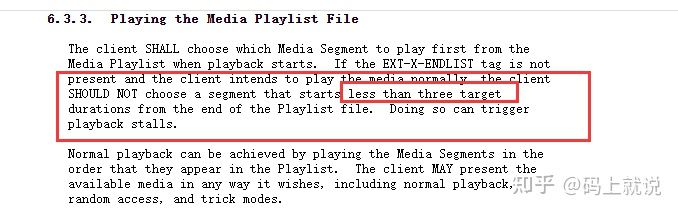

## 简介

[apple官方文档](https://developer.apple.com/documentation/http_live_streaming/example_playlists_for_http_live_streaming/live_playlist_sliding_window_construction)

M3U8，用 UTF-8 编码。"M3U" 和 "M3U8" 文件都是苹果公司使用的 HTTP Live Streaming（HLS） 协议格式的基础； 是 Unicode 版本的 M3U

M3U8文件是M3U文件的一种，只不过它的编码格式是UTF-8。M3U使用Latin-1字符集编码。M3U的全称是Moving Picture Experts Group Audio Layer 3 Uniform Resource Locator，即mp3 URL。M3U是纯文本文件；

所以UTF-8编码的M3U文件也简称为 M3U8；

HLS 是一个由苹果公司提出的基于 HTTP 的[流媒体](https://link.zhihu.com/?target=https%3A//zh.wikipedia.org/wiki/%E6%B5%81%E5%AA%92%E4%BD%93)网络传输协议。

HLS 的工作原理是把整个流分成一个个小的基于 HTTP 的文件来下载，每次只下载一些。当媒体流正在播放时，客户端可以选择从许多不同的备用源中以不同的速率下载同样的资源，允许流媒体会话适应不同的数据速率。在开始一个流媒体会话时，客户端会下载一个包含元数据的 extended M3U (m3u8) playlist文件，用于寻找可用的媒体流。

HLS 只请求基本的 HTTP 报文，与实时传输协议（RTP）不同，HLS 可以穿过任何允许 HTTP 数据通过的防火墙或者代理服务器。它也很容易使用内容分发网络来传输媒体流。这是HLS应用在直播上的一大优势。

如果在直播中使用HLS技术，那么执行流程如下：图片来源于苹果官网；


我们播放一个HLS，首先要对HLS流对应的M3U8文件进行解析，解析M3U8文件，首先要搞清楚M3U8的封装格式；


## 格式解析

HLS流可以用于直播，也可以用于点播；

M3U8 文件实质是一个播放列表（playlist），其可能是一个媒体播放列表（Media Playlist），或者是一个主列表（Master Playlist）。

### 1. 类型

当 M3U8 文件作为媒体播放列表（Media Playlist）时，其内部信息记录的是一系列媒体片段资源，顺序播放该片段资源，即可完整展示多媒体资源。其格式如下所示：

```text
#EXTM3U
#EXT-X-TARGETDURATION:10

#EXTINF:9.009,
http://media.example.com/first.ts
#EXTINF:9.009,
http://media.example.com/second.ts
#EXTINF:3.003,
http://media.example.com/third.ts
#EXT-X-ENDLIST
```

当 M3U8 作为主播放列表（Master Playlist）时，其内部提供的是同一份媒体资源的多份流列表资源。其格式如下所示：

```text
#EXTM3U
#EXT-X-STREAM-INF:BANDWIDTH=150000,RESOLUTION=416x234,CODECS="avc1.42e00a,mp4a.40.2"
http://example.com/low/index.m3u8
#EXT-X-STREAM-INF:BANDWIDTH=240000,RESOLUTION=416x234,CODECS="avc1.42e00a,mp4a.40.2"
http://example.com/lo_mid/index.m3u8
#EXT-X-STREAM-INF:BANDWIDTH=440000,RESOLUTION=416x234,CODECS="avc1.42e00a,mp4a.40.2"
http://example.com/hi_mid/index.m3u8
#EXT-X-STREAM-INF:BANDWIDTH=640000,RESOLUTION=640x360,CODECS="avc1.42e00a,mp4a.40.2"
http://example.com/high/index.m3u8
#EXT-X-STREAM-INF:BANDWIDTH=64000,CODECS="mp4a.40.5"
http://example.com/audio/index.m3u8
#EXT-X-ENDLIST
```


### 2. 基本字段

```text
#EXTM3U                    M3U8文件头，必须放在第一行;
#EXT-X-MEDIA-SEQUENCE      第一个TS分片的序列号，一般情况下是0，但是在直播场景下，这个序列号标识直播段的起始位置; #EXT-X-MEDIA-SEQUENCE:0
#EXT-X-TARGETDURATION      每个分片TS的最大的时长;   #EXT-X-TARGETDURATION:10     每个分片的最大时长是 10s
#EXT-X-ALLOW-CACHE         是否允许cache;          #EXT-X-ALLOW-CACHE:YES      #EXT-X-ALLOW-CACHE:NO    默认情况下是YES
#EXT-X-ENDLIST             M3U8文件结束符；
#EXTINF                    extra info，分片TS的信息，如时长，带宽等；一般情况下是    #EXTINF:<duration>,[<title>] 后面可以跟着其他的信息，逗号之前是当前分片的ts时长，分片时长 移动要小于 #EXT-X-TARGETDURATION 定义的值；
#EXT-X-VERSION             M3U8版本号
#EXT-X-DISCONTINUITY       该标签表明其前一个切片与下一个切片之间存在中断。下面会详解
#EXT-X-PLAYLIST-TYPE       表明流媒体类型；
#EXT-X-KEY                 是否加密解析，    #EXT-X-KEY:METHOD=AES-128,URI="https://priv.example.com/key.php?r=52"    加密方式是AES-128,秘钥需要请求   https://priv.example.com/key.php?r=52  ，请求回来存储在本地；
```


### 3. 如何判断是否是直播

- 判断是否存在 #EXT-X-ENDLIST
- 判断 #EXT-X-PLAYLIST-TYPE 类型

对于一个M3U8文件，如果结尾不存在 #EXT-X-ENDLIST，那么一定是直播，不是点播；

**#EXT-X-PLAYLIST-TYPE** 有两种类型，

VOD 即 Video on Demand，表示该视频流为点播源，因此服务器不能更改该 M3U8 文件；

EVENT 表示该视频流为直播源，因此服务器不能更改或删除该文件任意部分内容（但是可以在文件末尾添加新内容）（注：VOD 文件通常带有 EXT-X-ENDLIST 标签，因为其为点播源，不会改变；而 EVEVT 文件初始化时一般不会有 EXT-X-ENDLIST 标签，暗示有新的文件会添加到播放列表末尾，因此也需要客户端定时获取该 M3U8 文件，以获取新的媒体片段资源，直到访问到 EXT-X-ENDLIST 标签才停止）。


### 4. 提供多码率

上面的Master Playlist 就是会提供 多份码率的列表资源，如下：

```text
#EXTM3U
#EXT-X-STREAM-INF:BANDWIDTH=150000,RESOLUTION=416x234,CODECS="avc1.42e00a,mp4a.40.2"
http://example.com/low/index.m3u8
#EXT-X-STREAM-INF:BANDWIDTH=240000,RESOLUTION=416x234,CODECS="avc1.42e00a,mp4a.40.2"
http://example.com/lo_mid/index.m3u8
#EXT-X-STREAM-INF:BANDWIDTH=440000,RESOLUTION=416x234,CODECS="avc1.42e00a,mp4a.40.2"
http://example.com/hi_mid/index.m3u8
#EXT-X-STREAM-INF:BANDWIDTH=640000,RESOLUTION=640x360,CODECS="avc1.42e00a,mp4a.40.2"
http://example.com/high/index.m3u8
#EXT-X-STREAM-INF:BANDWIDTH=64000,CODECS="mp4a.40.5"
http://example.com/audio/index.m3u8
#EXT-X-ENDLIST
```

'#EXT-X-STREAM-INF' 字段后面有：
BANDWIDTH 指定码率
RESOLUTION 分辨率
PROGRAM-ID 唯一ID
CODECS 指定流的编码类型

码率、码流是同一个概念，是数据传输时单位时间传送的数据量，一般用单位kbps表示。

视频码率就是指视频文件在单位时间内使用的数据量。简单理解就是要播放一秒的视频需要多少数据，从这个角度就不难理解通常码率越高视频质量也越好，相应的文件体积也会越大。码率、视频质量、文件体积是正相关的。但当码率超过一定数值后，对图像的质量影响就不大了。几乎所有的编码算法都在追求用最低的码率达到最少的失真(最好的清晰度)；


### 5. 插入广告

M3U8文件中插入广告，要想灵活的控制广告，则广告可以插入任何视频中，那么无法保证广告的编码格式和码率等信息和原视频的编码格式等信息保持一致，就必须告知播放器，在插入广告的地方，ts片段发生的信息变更，需要播放器适配处理。

'#EXT-X-DISCONTINUITY' 该标签表明其前一个切片与下一个切片之间存在中断。说明有不连续的视频出现，这个视频绝大多数情况下就是广告；
'#EXT-X-DISCONTINUITY' 这个字段就是来做这个事情的；
当出现以下情况时，必须使用该标签：

- file format
- encoding parameters

下面展示一个插入广告的例子：

```text
#EXTM3U
#EXT-X-TARGETDURATION:10
#EXT-X-VERSION:4
#EXT-X-MEDIA-SEQUENCE:0
#EXTINF:10.0,
movieA.ts
#EXTINF:10.0,
movieB.ts
 ...
#EXT-X-ENDLIST
```

想在开头插入广告：

```text
#EXTM3U
#EXT-X-TARGETDURATION:10
#EXT-X-VERSION:4
#EXT-X-MEDIA-SEQUENCE:0
#EXTINF:10.0,
ad0.ts
#EXTINF:8.0,
ad1.ts
#EXT-X-DISCONTINUITY
#EXTINF:10.0,
movieA.ts
#EXTINF:10.0,
movieB.ts
...
#EXT-X-ENDLIST
```

当然你可以在任意位置插入广告。

HLS协议草案：HLS协议中还有很多字段，但是有些字段其实就是协议，在实际应用中并不大；大家可以参考看看；

[链接](https://datatracker.ietf.org/doc/html/rfc8216)


## 高级字段

### EXT-X-BYTERANGE

我们知道M3U8需要切片,但是有时候我们不想切片(为什么? 我比较懒), 我只想用一个ts来构建一个类似M3U8的分片索引, 这时候EXT-X-BYTERANGE就派上用场了.
表达的格式如下:

```text
#EXT-X-BYTERANGE:<length>[@<offset>]
```

其中length表示range的长度, offset表示这个range从分片的什么位置开始读.

据一个例子吧:

```text
#EXTM3U
#EXT-X-TARGETDURATION:11
#EXT-X-MEDIA-SEQUENCE:0
#EXT-X-VERSION:4
#EXTINF:9.009,
#EXT-X-BYTERANGE:12345@0
media.ts
#EXTINF:9.009,
#EXT-X-BYTERANGE:82112@12345
media.ts
#EXTINF:3.003,
#EXT-X-BYTERANGE:69864
media.ts
#EXT-X-ENDLIST
```

这个M3U8索引文件中,只有media.ts一个分片文件,这个文件可能很大, 第一个指定的分片是从media.ts的0位置开始读12345长度的数据; 第二个指定的分片是从media.ts的12345位置开始读82112长度的数据;第三个没有指定offset, 那么默认从上一个指定分为的结束处开始读.

**当然只有VERSION版本不低于4才可以应用这个属性**


### EXT-X-KEY

M3U8索引文件中有了#EXT-X-KEY 字段,说明当前的M3U8视频片段可能被加密了.这一行是告诉你应该怎么解密这些视频分片.
表达的格式如下:

```text
#EXT-X-KEY:<attribute-list>
```

这个属性列表中有如下几个字段:

- METHOD
    这个是一个枚举值,可以为NONE, AES-128, SAMPLE-AES
    NONE表述分片并没有被加密,其他的属性集就没有必要出现了,后面介绍如何解密
- URI
    密钥的地址存放的地方,也是一个url
- IV
    该值是一个十六进制序列, 它指定要与密钥一起使用的128位无符号整数初始化向量
- KEYFORMAT
    这个密钥的格式, 可选字段, 默认情况下是"identity", 主要是加强数字证书校验安全性设定的.

M3U8加密和解密非常重要, 是M3U8的优势之一, 毕竟现代社会越来越注重安全,版权意识也非常重要.
解密的流程需要专门介绍了


### EXT-X-MAP

这个字段是视频的初始化片段, 简而言之,有了这个字段,说明后续的每一个分片文件必须和通过这个初始化片段才能完整解读,缺少这个初始化片段, M3U8视频根本播放不了.
表达的格式如下:

```text
#EXT-X-MAP:<attribute-list>
```

这个属性集有下面这些字段:

- URI
    初始化片段的地址, 这个信息是必须的.
- BYTERANGE
    这个可以参考 #EXT-X-BYTERANGE 字段

据一个例子:

[链接](https://europe.olemovienews.com/hlstimeofffmp4/20210226/fICqcpqr/mp4/fICqcpqr.mp4/master.m3u8)

其中有一行:

```text
#EXT-X-MAP:URI="init-v1-a1.mp4"
```

说明后续的每一个分片都需要这个init-v1-a1.mp4才能真正解码播放出来:

取出第一个分片：

[链接](https://link.zhihu.com/?target=https%3A//europe.olemovienews.com/hlstimeofffmp4/20210226/fICqcpqr/mp4/fICqcpqr.mp4/seg-1-v1-a1.m4s)

```text
ffprobe version 4.2.4-1ubuntu0.1 Copyright (c) 2007-2020 the FFmpeg developers
  built with gcc 9 (Ubuntu 9.3.0-10ubuntu2)
  configuration: --prefix=/usr --extra-version=1ubuntu0.1 --toolchain=hardened --libdir=/usr/lib/x86_64-linux-gnu --incdir=/usr/include/x86_64-linux-gnu --arch=amd64 --enable-gpl --disable-stripping --enable-avresample --disable-filter=resample --enable-avisynth --enable-gnutls --enable-ladspa --enable-libaom --enable-libass --enable-libbluray --enable-libbs2b --enable-libcaca --enable-libcdio --enable-libcodec2 --enable-libflite --enable-libfontconfig --enable-libfreetype --enable-libfribidi --enable-libgme --enable-libgsm --enable-libjack --enable-libmp3lame --enable-libmysofa --enable-libopenjpeg --enable-libopenmpt --enable-libopus --enable-libpulse --enable-librsvg --enable-librubberband --enable-libshine --enable-libsnappy --enable-libsoxr --enable-libspeex --enable-libssh --enable-libtheora --enable-libtwolame --enable-libvidstab --enable-libvorbis --enable-libvpx --enable-libwavpack --enable-libwebp --enable-libx265 --enable-libxml2 --enable-libxvid --enable-libzmq --enable-libzvbi --enable-lv2 --enable-omx --enable-openal --enable-opencl --enable-opengl --enable-sdl2 --enable-libdc1394 --enable-libdrm --enable-libiec61883 --enable-nvenc --enable-chromaprint --enable-frei0r --enable-libx264 --enable-shared
  libavutil      56. 31.100 / 56. 31.100
  libavcodec     58. 54.100 / 58. 54.100
  libavformat    58. 29.100 / 58. 29.100
  libavdevice    58.  8.100 / 58.  8.100
  libavfilter     7. 57.100 /  7. 57.100
  libavresample   4.  0.  0 /  4.  0.  0
  libswscale      5.  5.100 /  5.  5.100
  libswresample   3.  5.100 /  3.  5.100
  libpostproc    55.  5.100 / 55.  5.100
[mov,mp4,m4a,3gp,3g2,mj2 @ 0x55fd8bd5ff00] could not find corresponding trex (id 1)
[mov,mp4,m4a,3gp,3g2,mj2 @ 0x55fd8bd5ff00] could not find corresponding track id 0
[mov,mp4,m4a,3gp,3g2,mj2 @ 0x55fd8bd5ff00] trun track id unknown, no tfhd was found
[mov,mp4,m4a,3gp,3g2,mj2 @ 0x55fd8bd5ff00] error reading header
https://europe.olemovienews.com/hlstimeofffmp4/20210226/fICqcpqr/mp4/fICqcpqr.mp4/seg-1-v1-a1.m4s: Invalid data found when processing input
```


这是因为光解析第一个分片是不行的,因为真正的视频头部信息在init-v1-a1.mp4中.

[详细讲解#EXT-X-MAP是如何工作的](https://zhuanlan.zhihu.com/p/358488699)


### EXT-X-I-FRAMES-ONLY

这个字段表示每个片段只有一个I帧, I帧是什么大家应该很清楚, 音视频的兄弟们, 为什么会出现这个字段?
如果做过视频特效处理的同学应该很清楚, 处理视频的时候,如果都是I帧,那么特效/反转/快进/快退非常方便.

当然实际上M3U8上用到 #EXT-X-I-FRAMES-ONLY并不多, 大家了解即可.


### EXT-X-MEDIA

这个字段表示针对同一个内容的不同角度的演绎, 例如同一段视频有视频/音频/字幕, 甚至还不止一个音频轨道, 很有很多种语言的字幕, 一段视频有这么多信息, #EXT-X-MEDIA 就是干这个的.
表达的格式如下:

```text
#EXT-X-MEDIA:<attribute-list>
```

属性集有下面的字段:

- TYPE
    这是一个枚举值, 可以是AUDIO, VIDEO, SUBTITLES, CLOSED-CAPTIONS, 这个字段是必须的.
- URI
    数据源的url, 如果TYPE是CLOSED-CAPTIONS, URI就没有了
- GROUP-ID
    表示源属于的组ID, 这只是一个标识
- DEFAULT
    YES 或者 NO
- AUTOSELECT
    YES 或者 NO
    举个例子:

```text
#EXTM3U
#EXT-X-MEDIA:TYPE=AUDIO,GROUP-ID="test_audio",LANGUAGE="eng",NAME="Test Audio",AUTOSELECT=NO,DEFAULT=NO,URI="test_audio_aac/index.m3u8"

#EXT-X-MEDIA:TYPE=SUBTITLES,GROUP-ID="subs",NAME="English",DEFAULT=YES,AUTOSELECT=YES,FORCED=NO,LANGUAGE="en",CHARACTERISTICS="public.accessibility.transcribes-spoken-dialog, public.accessibility.describes-music-and-sound",URI="subtitles/eng/index.m3u8"

#EXT-X-STREAM-INF:BANDWIDTH=263851,CODECS="mp4a.40.2, avc1.4d400d",RESOLUTION=416x234,AUDIO="test_audio",SUBTITLES="subs"
high_test/index.m3u8
#EXT-X-STREAM-INF:BANDWIDTH=41457,CODECS="mp4a.40.2",AUDIO="test_audio",SUBTITLES="subs"
middle_test/index.m3u8
```


### 示例

1.HLS基础例子:

```text
#EXTM3U
#EXT-X-TARGETDURATION:10
#EXT-X-VERSION:3
#EXTINF:9.009,
http://media.example.com/first.ts
#EXTINF:9.009,
http://media.example.com/second.ts
#EXTINF:3.003,
http://media.example.com/third.ts
#EXT-X-ENDLIST
```

2.直播的例子:

```text
#EXTM3U
#EXT-X-VERSION:3
#EXT-X-TARGETDURATION:8
#EXT-X-MEDIA-SEQUENCE:2680
#EXTINF:7.975,
https://priv.example.com/fileSequence2680.ts
#EXTINF:7.941,
https://priv.example.com/fileSequence2681.ts
#EXTINF:7.975,
https://priv.example.com/fileSequence2682.ts
```

3.master HLS的例子:

```text
#EXTM3U
#EXT-X-STREAM-INF:BANDWIDTH=1280000,AVERAGE-BANDWIDTH=1000000
http://example.com/low.m3u8
#EXT-X-STREAM-INF:BANDWIDTH=2560000,AVERAGE-BANDWIDTH=2000000
http://example.com/mid.m3u8
#EXT-X-STREAM-INF:BANDWIDTH=7680000,AVERAGE-BANDWIDTH=6000000
http://example.com/hi.m3u8
#EXT-X-STREAM-INF:BANDWIDTH=65000,CODECS="mp4a.40.5"
http://example.com/audio-only.m3u
```

4.EXT-X-MEDIA例子:

```text
#EXTM3U
#EXT-X-MEDIA:TYPE=AUDIO,GROUP-ID="aac",NAME="English", \
      DEFAULT=YES,AUTOSELECT=YES,LANGUAGE="en", \
      URI="main/english-audio.m3u8"
#EXT-X-MEDIA:TYPE=AUDIO,GROUP-ID="aac",NAME="Deutsch", \
      DEFAULT=NO,AUTOSELECT=YES,LANGUAGE="de", \
      URI="main/german-audio.m3u8"
#EXT-X-MEDIA:TYPE=AUDIO,GROUP-ID="aac",NAME="Commentary", \
      DEFAULT=NO,AUTOSELECT=NO,LANGUAGE="en", \
      URI="commentary/audio-only.m3u8"
#EXT-X-STREAM-INF:BANDWIDTH=1280000,CODECS="...",AUDIO="aac"
low/video-only.m3u8
#EXT-X-STREAM-INF:BANDWIDTH=2560000,CODECS="...",AUDIO="aac"
mid/video-only.m3u8
#EXT-X-STREAM-INF:BANDWIDTH=7680000,CODECS="...",AUDIO="aac"
hi/video-only.m3u8
#EXT-X-STREAM-INF:BANDWIDTH=65000,CODECS="mp4a.40.5",AUDIO="aac"
main/english-audio.m3u8
```


## URL生成规则

M3U8中的URL的表示无处不在, 不管是基础的HLS片段还是Master的HLS类型, 都需要了解URL的计算规则:

下面介绍四种URL的表示:

### 1. 直接给出url

```text
#EXTM3U
#EXT-X-TARGETDURATION:10
#EXT-X-VERSION:3
#EXTINF:9.009,
http://media.example.com/first.ts
#EXTINF:9.009,
http://media.example.com/second.ts
#EXTINF:3.003,
http://media.example.com/third.ts
#EXT-X-ENDLIST
```

上面的每一个片段都直接指出了片段的具体url是什么,就是完整的url请求,我们在解析的时候就不需要对片段的具体为值进行拼接了,直接请求url即可


### 2. 单文件名相对位置

```text
#EXTM3U
#EXT-X-TARGETDURATION:10
#EXT-X-VERSION:3
#EXTINF:9.009,
first.ts
#EXTINF:9.009,
second.ts
#EXTINF:3.003,
third.ts
#EXT-X-ENDLIST
```

这儿没有任何url, 只有片段的名字, 例如我们请求的视频url是

[http://media.example.com/index.m3u8](https://link.zhihu.com/?target=http%3A//media.example.com/index.m3u8)

这样我们请求 [http://media.example.com/index.m3u8](https://link.zhihu.com/?target=http%3A//media.example.com/index.m3u8) 的时候,解析到first.ts的时候,我们会默认接上 [http://media.example.com/](https://link.zhihu.com/?target=http%3A//media.example.com/) 变成 [http://media.example.com/first.ts](https://link.zhihu.com/?target=http%3A//media.example.com/first.ts)


### 3. 带文件路径的相对位置

例如 [https://douban.donghongzuida.com/20210109/15467_73a719b2/index.m3u8](https://link.zhihu.com/?target=https%3A//douban.donghongzuida.com/20210109/15467_73a719b2/index.m3u8) 解析出来如下:

```text
#EXTM3U
#EXT-X-STREAM-INF:PROGRAM-ID=1,BANDWIDTH=800000,RESOLUTION=1080x608
1000k/hls/index.m3u8
```

这个1000k/hls/index.m3u8 就不是文件名这个简单了,是一个相对路径, 完整的路径是:

[https://douban.donghongzuida.com/20210109/15467_73a719b2/1000k/hls/index.m3u8](https://link.zhihu.com/?target=https%3A//douban.donghongzuida.com/20210109/15467_73a719b2/1000k/hls/index.m3u8)

有时候也可以写成如下:

```text
#EXTM3U
#EXT-X-STREAM-INF:PROGRAM-ID=1,BANDWIDTH=800000,RESOLUTION=1080x608
/1000k/hls/index.m3u8
```

甚至可以写成如下:

```text
#EXTM3U
#EXT-X-STREAM-INF:PROGRAM-ID=1,BANDWIDTH=800000,RESOLUTION=1080x608
/15467_73a719b2/1000k/hls/index.m3u8
```

这时候你会生成 [https://douban.donghongzuida.com/20210109/15467_73a719b2/15467_73a719b2/1000k/hls/index.m3u8](https://link.zhihu.com/?target=https%3A//douban.donghongzuida.com/20210109/15467_73a719b2/15467_73a719b2/1000k/hls/index.m3u8) 吗？显然是不对的.

这时候应该找 [https://douban.donghongzuida.com/20210109/15467_73a719b2/](https://link.zhihu.com/?target=https%3A//douban.donghongzuida.com/20210109/15467_73a719b2/) 和 /15467_73a719b2/1000k/hls/index.m3u8 共同的那部分,然后将共同的部分抹掉, 这样就能得到新的url了。


### 4.  双斜杠相对位置

双斜杠后面一般直接就是域名了, 例如下面

```text
#EXTM3U
#EXT-X-STREAM-INF:PROGRAM-ID=1,BANDWIDTH=800000,RESOLUTION=1080x608
//douban.donghongzuida.com/20210109/15467_73a719b2/1000k/hls/index.m3u8
```

这时候直接增加一个协议就可以的.

推荐一个视频下载的github项目:

[https://github.com/JeffMony/VideoDownloader](https://link.zhihu.com/?target=https%3A//github.com/JeffMony/VideoDownloader)


## 低延时HLS===>LL-HLS

HLS====> HTTP LIVE STREAMING 是苹果公司2009推出的一种流媒体协议, 从推出到现在, 得到了非常广泛的应用, 不管在点播还是直播中, 使用的公司非常多, 点播的情况下不必多说. 我们都知道直播场景下, RTMP使用的显然比HLS更加广泛, 肯定是HLS存在某些缺陷才会导致在直播场景下应用不太广泛.

|            | RTMP                       | HTTP-FLV             | HLS                     |
| ---------- | -------------------------- | -------------------- | ----------------------- |
| 全称       | Real Time Message Protocol | RTMP over HTTP       | HTTP Live Streaming     |
| 所在层     | 传输层                     | 网络层               | 网络层                  |
| 是否长链接 | 是                         | 是                   | 否                      |
| 延时       | 1 ~ 3s                     | 1 ~ 3s               | 10s以上                 |
| 兼容性     | 部分平台不一定支持         | 全平台支持           | 全平台支持              |
| 扩展性     | 差,Adobe已经不维护了       | 差,Adobe已经不维护了 | Apple全力支持, 扩展性强 |

显而易见, RTMP在传输时延方面确实有很大的优势, 这是目前直播用RTMP的主要原因, 但是苹果公司也不是吃素的, 他们也在积极努力, 改进HLS的时延, 降低直播的耗时, 改善直播观看体验.

经过多年的努力, 2019年苹果公司推出LL-HLS====> Low Latency HLS来着重解决这类问题.

### 1. 为什么HLS这么慢

首先看看HLS 标准协议文档中是怎么介绍的? ====> [RFC 8216 - HTTP Live Streaming](https://link.zhihu.com/?target=https%3A//tools.ietf.org/html/rfc8216%23section-6.3.3)




简而言之, 必须至少加载3个分片视频, 当前的分片才能被启动播放, HLS标准的分片时长是10s, 加载3个分片, 也就说标准的时延要达到30s, 这在正常直播场景中是无法忍受的. 

### 2. LL-HLS 做了什么改进

#### 2.1 生成分片的一部分

LL-HLS将大的分片且分为一个个较小的分片, 这种切分方式不是简单的将源分片等分, 而是结合fMP4封装和#EXT-X-MAP规则, 将整视频的头部和内容分开, 而且内容源被划分的很细, 例如原来一个分片6s左右, 可能被切分为30个200ms的fMP4分片, 这些分片使用#EXT-X-PART来标注:

```text
#EXTINF:6.003,
LLHLS_Video1_67750710.mp4
#EXT-X-PROGRAM-DATE-TIME:2021-03-18T09:20:29.482Z
#EXT-X-PART:DURATION=1.000,URI="LLHLS_Video1_67750711.0.mp4",INDEPENDENT=YES
#EXT-X-PART:DURATION=1.000,URI="LLHLS_Video1_67750711.1.mp4",INDEPENDENT=YES
#EXT-X-PART:DURATION=1.000,URI="LLHLS_Video1_67750711.2.mp4",INDEPENDENT=YES
#EXT-X-PART:DURATION=1.000,URI="LLHLS_Video1_67750711.3.mp4",INDEPENDENT=YES
#EXT-X-PART:DURATION=1.000,URI="LLHLS_Video1_67750711.4.mp4",INDEPENDENT=YES
#EXT-X-PART:DURATION=1.000,URI="LLHLS_Video1_67750711.5.mp4",INDEPENDENT=YES
```

一个整分片LLHLS_Video1_67750710.mp4被切分为6个小分片, 每一个小分片用 #EXT-X-PART 标准
这样的好处是原来要把一整个分片请求下来才能播放, 现在不需要了, 我只要请求一两个小分片就可以播放可, 时间上肯定是大大减少了.


#### 2.2 播放列表增量更新

直播过程中, M3U8索引文件是不断更新的, M3U8索引中会有每一分片的时间戳和真实的时间戳, 这样我们明确知道当前播放到什么问题, 这段分片视频是什么时候下发的, 直播过程中如果出现网络不好, 累积的时延会越来越大, 但是有了时间戳的校验, 网络差的情况下我们也会实时追上最新的播放点.
====> #EXT-X-SERVER-CONTROL 会告诉你那些分片会被丢弃调.

```text
#EXT-X-SERVER-CONTROL:CAN-BLOCK-RELOAD=YES,PART-HOLD-BACK=3.150,CAN-SKIP-UNTIL=36.000
```

CAN-SKIP-UNTIL=36.000 说明之前36的视频都是可以舍弃的.

例如紧接着的文件描述为:

```text
#EXT-X-SERVER-CONTROL:CAN-BLOCK-RELOAD=YES,PART-HOLD-BACK=3.150,CAN-SKIP-UNTIL=36.000
#EXT-X-MEDIA-SEQUENCE:67750702
#EXT-X-PROGRAM-DATE-TIME:2021-03-18T09:19:35.479Z
#EXTINF:6.000,
LLHLS_Video1_67750702.mp4
#EXT-X-PROGRAM-DATE-TIME:2021-03-18T09:19:41.479Z
#EXTINF:6.000,
LLHLS_Video1_67750703.mp4
#EXT-X-PROGRAM-DATE-TIME:2021-03-18T09:19:47.479Z
#EXTINF:6.000,
LLHLS_Video1_67750704.mp4
#EXT-X-PROGRAM-DATE-TIME:2021-03-18T09:19:53.479Z
#EXTINF:6.000,
LLHLS_Video1_67750705.mp4
#EXT-X-PROGRAM-DATE-TIME:2021-03-18T09:19:59.479Z
#EXTINF:6.000,
LLHLS_Video1_67750706.mp4
#EXT-X-PROGRAM-DATE-TIME:2021-03-18T09:20:05.479Z
#EXTINF:6.000,
LLHLS_Video1_67750707.mp4
#EXT-X-PROGRAM-DATE-TIME:2021-03-18T09:20:11.479Z
#EXTINF:6.000,
LLHLS_Video1_67750708.mp4
#EXT-X-PROGRAM-DATE-TIME:2021-03-18T09:20:17.479Z
#EXT-X-PART:DURATION=1.000,URI="LLHLS_Video1_67750709.0.mp4",INDEPENDENT=YES
#EXT-X-PART:DURATION=1.000,URI="LLHLS_Video1_67750709.1.mp4",INDEPENDENT=YES
#EXT-X-PART:DURATION=1.000,URI="LLHLS_Video1_67750709.2.mp4",INDEPENDENT=YES
#EXT-X-PART:DURATION=1.000,URI="LLHLS_Video1_67750709.3.mp4",INDEPENDENT=YES
#EXT-X-PART:DURATION=1.000,URI="LLHLS_Video1_67750709.4.mp4",INDEPENDENT=YES
#EXT-X-PART:DURATION=1.000,URI="LLHLS_Video1_67750709.5.mp4",INDEPENDENT=YES
```

服务器明确告知我们, 36s之前的内容都是可以SKIP的, 36s之后开始再切片, 之前之所以不切片因为之前的内容可能比较老了, 没有比较再切片.

36s之后如果发现#EXT-X-SKIP 说明也是可以丢弃的, 这些都是为了解决直播的实时性问题.


#### 2.3 阻止播放列表重新加载

阻止播放列表重新加载, 直播中M3U8索引文件不断更新, 每隔一段时间重新请求以获取最新的M3U8索引列表, 但是重新请求可能浪费的时间更多, 现在采用的方式是在LL-HLS中加入一些设置指定未来要请求的特定片段.
我们在M3U8中会加入一个MSN===> Media Sequence Number来表示即将请求的MSN是哪一个, 这样可以不用重新加载M3U8索引文件, 就提前知道要请求哪一个分片, 哪一个索引文件.


#### 2.4 预加载支持

预加载的支持是通过#EXT-X-PRELOAD-HINT来表示:

```text
#EXT-X-PRELOAD-HINT:TYPE=PART,URI="LLHLS_Video1_67750712.5.mp4"
```

通常在加载完一个分片之后, 即将要加载某一个分片之前, 标注一下未来要请求哪一个分片, 这种在索引文件中提前预告的行为确实能为我们省下很多时间.


#### 2.5 多渲染报告支持

LL-HLS播放过程中有时候会遇到#EXT-X-RENDITION-REPORT, 这说明接下来需要加载不一样的类型的视频了, 可能是分辨率/码率/格式发生了变化, LAST-MSN表示是在哪一个MSN结束之后开始加载这个新的索引文件.

```text
#EXT-X-RENDITION-REPORT:URI="LLHLS_Video2.m3u8",LAST-MSN=67750884,LAST-PART=3
```

举一个LL-HLS的例子:

[https://d18lkalz24uryj.cloudfront.net/LLHLS_Video1.m3u8](https://link.zhihu.com/?target=https%3A//d18lkalz24uryj.cloudfront.net/LLHLS_Video1.m3u8)


### 3.小结

- LL-HLS在直播中的延时大大降低, 可以降低值3s内, 但是即使这样, 还是不如RTMP, 不过Apple还会努力的, 我觉得LL-HLS还是可以优化的, 例如多服务器控制源
- LL-HLS的控制粒度更细了, 对预加载/H2 push的利用效率更好, 核心原理还是要减少RTT和HLS的原有耗时点.
- 国内使用LL-HLS并不多, 主要是目前RTMP并没有什么大的瓶颈, 而且RTC也在发展, 选择比较多, 不过LL-HLS很简单, 接入简单, 成本小, 需要维护的成本也小, 也不失为一种选择.
- Android 平台上ExoPlayer 2.13.0版本已经支持了LL-HLS, 可以体验实测下.