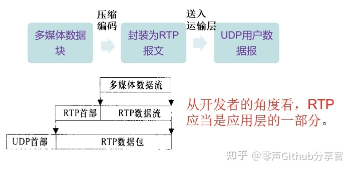
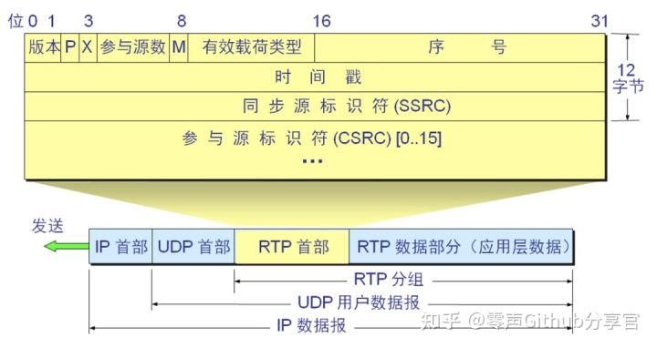

## [简介](https://baike.baidu.com/item/实时传输协议/9365206?fromtitle=RTP&fromid=8974125&fr=aladdin)

**实时传输协议**（**Real-time Transport Protocol**或简写**RTP**）是一个[网络传输协议](https://baike.baidu.com/item/网络传输协议)，它是由IETF的多媒体传输工作小组1996年在RFC 1889中公布的。

[国际电信联盟](https://baike.baidu.com/item/国际电信联盟)ITU-T也发布了自己的RTP文档，作为H.225.0，但是后来当IETF发布了关于它的稳定的标准RFC后就被取消了。它作为[因特网](https://baike.baidu.com/item/因特网)标准在RFC 3550（该文档的旧版本是RFC 1889）有详细说明。RFC 3551（STD 65，旧版本是RFC 1890）详细描述了使用最小控制的音频和视频会议。

RTP协议详细说明了在[互联网](https://baike.baidu.com/item/互联网)上传递音频和视频的标准数据包格式。它一开始被设计为一个[多播](https://baike.baidu.com/item/多播)协议，但后来被用在很多[单播](https://baike.baidu.com/item/单播)应用中。RTP协议常用于[流媒体](https://baike.baidu.com/item/流媒体)系统（配合RTSP协议），视频会议和[一键通](https://baike.baidu.com/item/一键通)（Push to Talk）系统（配合H.323或SIP），使它成为[IP电话](https://baike.baidu.com/item/IP电话)产业的技术基础。RTP协议和RTP控制协议[RTCP](https://baike.baidu.com/item/RTCP)一起使用，而且它是创建在[UDP协议](https://baike.baidu.com/item/UDP协议)上的。

## 概述

RTP全名是Real-time Transport Protocol（实时传输协议）。它是IETF提出的一个标准，对应的RFC文档为RFC3550。RFC3550不仅定义了RTP，而且定义了配套的相关协议RTCP（Real-time Transport Control Protocol，即实时传输控制协议）。RTP用来为IP网上的语音、图像、传真等多种需要实时传输的多媒体数据提供端到端的实时传输服务。RTP为Internet上端到端的实时传输提供时间信息和流同步，但并不保证服务质量，服务质量由RTCP来提供。

### 协议封装

### 详细讲解

- 填充位（1bit）若p=1则在该报文的尾部填充一个或多个额外的八位组，它们不是有效载荷的一部分。填充可能用于某些具有固定长度的加密算法或者用在底层数据单元中传输多个RTP包
- 扩展（X）：1个比特，置“1”表示RTP报头后紧随一个扩展报头
- 参与源数（CSRC计数（CC） ）4位，CSRC计数包括紧接在固定头后CSRC标识符个数。
- 标记（M）：1个比特，其具体解释由应用文档来定义。例如，对于视频流，它表示一帧的结束，而对于音频，则表示一次谈话的开始
- 有效载荷类型，7个比特，它指示在用户数据字段中承载数据的载荷类别，记录后面资料使用哪种编码，接收端找出相应的 decoder 解码出来
- 序列号16比特 每发送一个RTP数据包,序列号加一,接收机可以据此检测包损和重建包序列.序列号的初始值是随机的(不可预测),以使即便在源本身不加密时(有时包要通过翻译器,它会这样做),对加密算法泛知的普通文本攻击也会更加困难
- 时间戳，32位，时标反映RTP数据包中第一个八进制数的采样时刻，采样时刻必须从单调、线性增加的时钟导出，以允许同步与抖动计算。时标可以让receiver端知道在正确的时间将资料播放出来。只有系列号而没有时标，并不能完整按照顺序的将data播放出来，因为如果data中间有一段是没有资料的，只有系列号的话会造成错误.
- SSRC ，32位，SSRC段标识同步源。此标识不是随机选择的，目的在于使同一RTP包连接中没有两个同步源有相同的SSRC标识。尽管多个源选择同一个标识的概率很低，所有RTP实现都必须探测并解决冲突。
- CSRC列表，0到15项，每项32位。CSRC列表表示包内的对载荷起作用的源。标识数量由CC段给出。如超出15个作用源，也仅标识15个。。