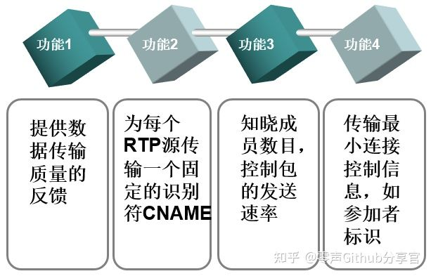
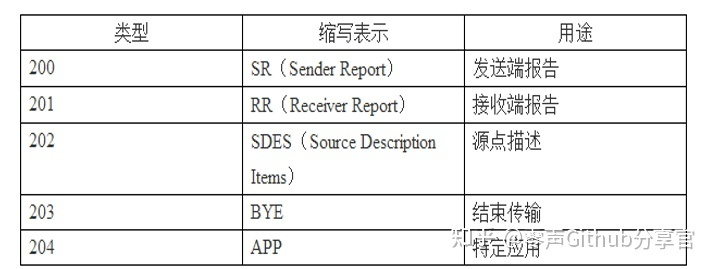

## [简介](https://baike.baidu.com/item/RTCP-实时传输协议/2174166?fr=aladdin)

Real-time Transport Control Protocol或RTP Control Protocol或简写RTCP）是实时传输[协议](https://baike.baidu.com/item/协议/670528)（RTP）的一个姐妹协议。RTCP由RFC 3550定义（取代作废的RFC 1889）。RTP 使用一个 偶数 UDP port ；而RTCP 则使用 RTP 的下一个 port，也就是一个奇数 port。RTCP与RTP联合工作，RTP实施实际数据的传输，RTCP则负责将控制包送至电话中的每个人。其主要功能是就RTP正在提供的[服务](https://baike.baidu.com/item/服务/85523)质量做出反馈。

## 协议详解

**RTCP也是用UDP来传送的，但RTCP封装的仅仅是一些控制信息，因而分组很短，所以可以将多个RTCP分组封装在一个UDP包中。RTCP有如下五种分组类型。**

