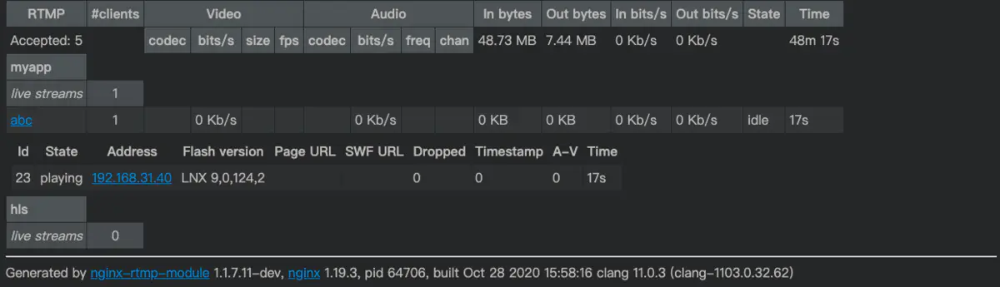

# webrtc服务器端

如果你对这些不是很熟悉，请看这篇博客，请按照步骤做一遍

[服务器配置](https://blog.csdn.net/u011077027/article/details/86225524)

---
## 简介

服务器端代码和浏览器端代码

目前只支持chrome和opera浏览器

## 安装和使用

1. 安装Node.js及npm环境
2. 部署turnserver，参见https://github.com/coturn/coturn.git
3. 下载源码到本地，并解压缩
4. 移动到解压后的目录下
5. 使用命令`npm install`安装所需要的库
6. 运行命令`npm start`，建议配合`forever`
7. 访问`localhost:3000#roomName`查看效果，其中`roomName`为进入的房间名，不同房间的用户无法交互
8. 部署服务器的话需要使用nginx或者apache2配置https和wss的代理

##   nginx代理https和wss

```shell
 #代理https
 upstream web {
    server 0.0.0.0:3000;      
 }
 #代理websocket
 upstream websocket {
    server 0.0.0.0:3000;   
 }
        
 server { 
    listen       443; 
    server_name  localhost;
	ssl          on;

    ssl_certificate     /cert/cert.crt;#配置证书
    ssl_certificate_key  /cert/cert.key;#配置密钥

	ssl_session_cache    shared:SSL:1m;
    ssl_session_timeout  50m;
	ssl_protocols TLSv1 TLSv1.1 TLSv1.2 SSLv2 SSLv3;
    ssl_ciphers  HIGH:!aNULL:!MD5;
    ssl_prefer_server_ciphers  on;

    #charset koi8-r;
    #access_log  logs/host.access.log  main;
    
  #wss 反向代理  
  location /wss {
     proxy_pass http://websocket/; # 代理到上面的地址去
     proxy_read_timeout 60s;
     proxy_set_header Host $host;
     proxy_set_header X-Real_IP $remote_addr;
     proxy_set_header X-Forwarded-for $remote_addr;
     proxy_set_header Upgrade $http_upgrade;
     proxy_set_header Connection 'Upgrade';	
  }
  #https 反向代理
  location / {
     proxy_pass         http://web/;
     proxy_set_header   Host             $host;
     proxy_set_header   X-Real-IP        $remote_addr;
     proxy_set_header   X-Forwarded-For  $proxy_add_x_forwarded_for;
  }
}
```

# 系统环境

> 阿里云服务器最低版本即可 ，建议买香港服务器，
>
> centos 7以上  

如果不愿意买的同学可以使用班级服务器(班级服务器配置比较差 香港地区)

> 公网IP地址: 8.210.239.39
>
> 用户名  root
>
> 密码      Maniu110

> **1.创建根目录**
>
> ```bash
> cd ~
> mkdir rtmp
> cd rtmp
> ```
>
> **2.安装git**
>
> ```bash
> yum install git -y 
> ```
>
> **3.下载nvm是node版本控制器**
>
> ```bash
> git clone git://github.com/creationix/nvm.git ~/nvm
> ```
>
> **4.设置nvm自动运行**
>
> ```bash
> echo "source ~/nvm/nvm.sh" >> ~/.bashrc
> source ~/.bashrc
> ```
>
> **5.查询node版本**
>
> ```bash
> nvm list-remote
> ```
>
> **6.安装node**
>
> ```bash
> nvm install v11.6.0  版本号
> ```
>
> **7.Nginx服务器安装**
>
> **7.1.安装pcre依赖**
>
> ```bash
> yum -y install pcre*
> ```
>
> **7.2.安装openssl依赖**
>
> ```bash
> yum -y install openssl*
> ```
>
> 以上两个都安装玩之后，接下来开始正式安装了
>
> **7.3.首先需要下载**
>
> wget http://nginx.org/download/nginx-1.15.3.tar.gz
>
> wget https://codeload.github.com/arut/nginx-rtmp-module/tar.gz/v1.2.1
>
> **7.4.安装git工具**
>
> ```bash
> yum install git
> ```
>
> **7.5.解压**
>
> ```bash
> tar xvf v1.2.1
> tar xvf nginx-1.15.3.tar.gz
> ```
>
> **7.6.进入nginx目录**
>
> ```bash
> cd nginx-1.15.3
> ```
>
> **7.7.生成nginx安装文件**
>
> ```bash
> #--add-module 指向rtmp模块目录
> ./configure --prefix=./bin --add-module=../nginx-rtmp-module-1.2.1
> make -j4
> make install
> ```
>
> 在这个过程中可能因为环境不同而出现不同错误，比如缺少pcre、openssl等，这时候就需要安装这些库。 https://blog.csdn.net/z920954494/article/details/52132125
>
> **7.8.cd到 cd bin/conf目录下**
>
> **7.9.配置**
>
> ```bash
> # 修改默认监听端口
> vi conf/nginx.conf
> ```
>
> 

搭建流媒体服务器相关配置,继续上面的第4步

```bash
user root;
worker_processes 1;
error_log /root/nginx-1.14.2/bin/logs/error.log debug;
events {
	worker_connections  1024;
}

rtmp {
	server {
    	listen 1935;#之后推流拉流的端
        application live {
        	live on;
        }
    }
}
http {
	server {
        listen 8080;
    	server_name  localhost;
    	location /stat.xsl
    {
    root /root/nginx-rtmp-module-1.2.1;
}

location /stat {
	rtmp_stat all;
	rtmp_stat_stylesheet stat.xsl;
}
location /control{
	rtmp_control all;
}
location -publisher { #注意目录
	root /root/nginx-rtmp-module-1.2.1/test;
}
location / {
	#注意目录
	root /root/nginx-rtmp-module-1.2.1/test/www;
}
}
}

```

> **7.10. 回退到  nginx-rtmp-module-1.2.1目录下**
>
> ```bash
> cd   /root/nginx-1.15.3
> ```
>
> 7.11运行nginx，进入安装完后的nginx文件    
>
> ```bash
> ./bin/sbin/nginx -c conf/nginx.conf
> ```
>
> 设置行号
>
> ```bash
> # 如果linux没有行号
> # 修改vi ~/.vimrc 文件，添加：set number
> # 检查nginx是否重启成功
> ./sbin/nginx -t
> # 停止nginx进程
> ps -ef|grep nginx
> # 配置完成后重启nginx
> ./sbin/nginx -s reload
> ```
>
> 执行上面命令后控制台的大致样子
> 此时ffmpeg正将MP4文件以rtmp协议推送给上面的nginx流媒体服务器，此时可以进入 http:// + 服务器ip +： + 端口号 + /stat 网页查看信息
> 如下图，先不要看红框中的，应该会出现蓝框中的信息，publishing，就是推流端，可以看到有一个流正在一直被推送给nginx服务器
> 
>
> 然后可以使用播放器收看该直播流，这里推荐时用VLC
> VLC收看直播流
>
> 填入上面推流的url：rtmp://nemtech.cn:82/live/test
>
> 就可以收看刚才推送的MP4文件直播了
>

### mac搭建

# mac + nginx + rtmp 模块

> 1. brew tap denji/nginx
> 2. brew install nginx-full --with-rtmp-module
> 3. 配置

接下来配置config，在 /usr/local/etc/nginx 下的nginx.conf
添加rtmp

```bash
rtmp {    
	server {        
		listen 1935;        
		ping 30s;        
		notify_method get;        
		application myapp {            
			live on;            
			record off;            
			#丢弃闲置5s的连接             
			drop_idle_publisher 5s;            
			max_connections 1024;        
		}    
		#增加对HLS支持开始    
		application hls {        
			live on;        
			hls on;        
			hls_path /usr/local/var/www/hls;        
			hls_fragment 5s;    
		}    
		#增加对HLS支持结束    
	}
}
```

下载模块并解压

> wget [https://codeload.github.com/arut/nginx-rtmp-module/tar.gz/v1.2.1](https://links.jianshu.com/go?to=https%3A%2F%2Fcodeload.github.com%2Farut%2Fnginx-rtmp-module%2Ftar.gz%2Fv1.2.1)

> tar xvf v1.2.1

解压的到  nginx-rtmp-module-1.2.1

配置

```bash
server {
        listen       8080;
        server_name  localhost;

        #charset koi8-r;

        #access_log  logs/host.access.log  main;

         #...................
        #添加的部分
        location /stat {
            rtmp_stat all;
            rtmp_stat_stylesheet stat.xsl;
        }
        location /stat.xsl {
            #为nginx-rtmp-module解压的地址
            #root /usr/local/live/nginx-rtmp-module-master/;
            root /xxxx/dev/server_workspace/nginx-rtmp-module-1.2.1;
        }
        #...................

        location / {
            root   html;
            index  index.html index.htm;
        }

省略后面默认的。。。。
}
```

1. 测试启动

nginx 启动

ngix -s  reload 重启

nginx -s stop 停止

**注意点**

```
其实就是从 nginx-rtmp-module-1.2.1/test/nginx.conf 中拷贝。
端口占用检查: lsof -i:8080 需要注意的是目录与端口是否被占用，比如8080端口被占用，可以改为了8081，然后需要开放端口。
 如果使用的阿里云服务器可以进入阿里云控制台开放
```

1. 测试
    ip:8080/stat
2. 推流测试

[https://obsproject.com/welcome](https://links.jianshu.com/go?to=https%3A%2F%2Fobsproject.com%2Fwelcome)

先用Obs测试

在OBS 推流软件设置
 地址： [rtmp://ip:1935/myapp](https://links.jianshu.com/go?to=rtmp%3A%2F%2Fip%3A1935%2Fmyapp)
秘钥：abc
成功后会有记录



推流服务显示.png


然后用vlc输入播放的流地址

[rtmp://ip:1935/myapp/abc](https://links.jianshu.com/go?to=rtmp%3A%2F%2Fip%3A1935%2Fmyapp%2Fabc)


 