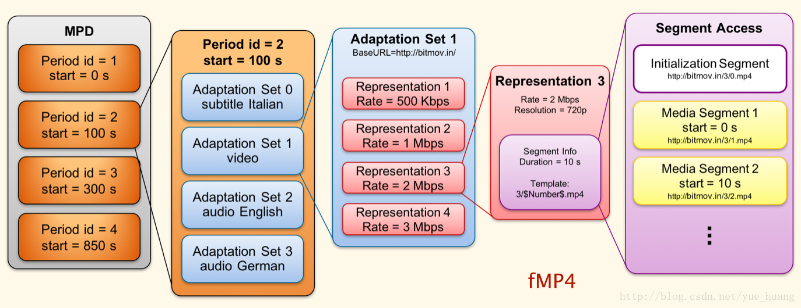
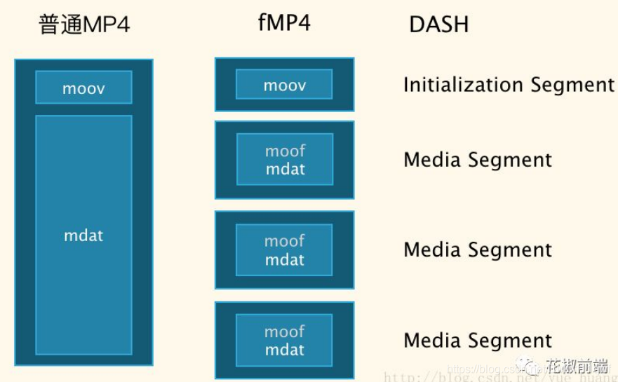
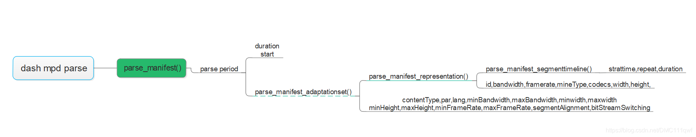

# ffmpeg之DASH

## 简介

在dash 协议出现以前， 各家公司都开发自己的私有流媒体协议，如微软的SS, 苹果的HLS,Adobe 公司的HDS, 3GPP组织的AHS。这给客户端开发者带来了很大的困扰，后由MPEG 组织牵头，参考前几家公司的流媒体协议，共同制定DASH 协议，也称MPEG-DASH，协议标准号为：ISO/IEC23009, 标准共计八部分，其中媒体呈现（MPD）是最重要的一部分，占据正文的70% 以上。关于DASH 协议的演进历史如下图所示。



dash 协议一经推出，就被很多公司接入，有着一统江湖的趋势，除了由MPEG 组织背书外，还与DASH 技术优势由莫大的关系，如下图是dash 协议与其他流媒体协议的比较。

| Feature                | HDS  | Smooth | HLS  | MPEG-DASH |
| ---------------------- | ---- | ------ | ---- | --------- |
| 可由普通http服务器部署 |      |        | √    | √         |
| 由标准组织制定         |      |        |      | √         |
| 支持多音轨             |      | √      | √    | √         |
| 可由DRM保护            | √    | √      | √    | √         |
| CC与字幕支持           | √    | √      | √    | √         |
| 高效广告插入           |      |        |      | √         |
| 快速频道切换           | √    | √      |      | √         |
| 多CDN支持              |      |        |      | √         |
| HTML5支持              |      |        |      | √         |
| HbbTV支持              |      |        |      | √         |
| HEVC与4k支持           |      |        | √    | √         |
| 支持未知Video Codec    |      |        |      | √         |
| 支持未知Audio Codec    |      |        |      | √         |
| ISO BMFF文件支持       | √    | √      |      | √         |
| TS文件支持             |      |        | √    | √         |
| Segment格式可扩展      |      |        |      | √         |
| 支持音视频混编的文件   | √    |        | √    | √         |
| 支持音视频分离的文件   |      | √      | √    | √         |
| 质量指标的定义         |      |        |      | √         |
| 支持客户日志的报告     |      |        |      | √         |
| 支持客户端容错         |      |        |      | √         |
| 支持动态增删音视频流   |      |        |      | √         |
| 支持多视频视角         |      |        |      | √         |
| 支持高校快播模式       |      |        |      | √         |

## mpd文件分析

## MPD 

媒体文件的描述文件（manifest），作用类似HLS的m3u8文件。MPD文件以XML格式组织，其层次结构参图1。

### Period

 一条完整的mpeg dash stream可能由一个或者多个period构成，同一period内意味着可用媒体内容及其各个可用的码率不会发生变化。直播情况下，需要定期更新mpd文件。

### Adaptationset

 一个Period由一个或者多个Adaptationset组成， Adaptationset由一组可供切换的不同码率的码流组成，这些码流中可能包含一个或者多个media content components。

### media content component

 一个media content component表示一个不同音视频内容，比如不同语言的音轨属于不同的media content component，而同一音轨的不同码率属于相同的media content component .对应一个可选择的输出（alternative）。如，480p video，720p video, 44100采样 audio，22050采样audio，都使用Representation描述。

### Representation

 每个Adaptationset包含一个或者多个Representation， 一个Representation包含一个或者多个media stream，每个media stream对应一个media content component，为了适应不同带宽，dash网络可能从一个Representation切换到另一个Representation。

### Segment

与HLS协议的**segment**一样，每个Representation由一个或者多个segment组成， 每个segment由一个对应的url指定，也可能由相同url + 不同的byte range指定。每个Representation会划分为多个Segment。Segment分为4类，其中，最重要的是：Initialization Segment（每个Representation都包含1个Init Seg），Media Segment（每个Representation的媒体内容包含若干Media Seg）！

mpd的数据格式组成如下图所示： period - > adaptation -> Representation -> segment 


以上就是关于MPD格式的介绍， 下面我们根据一个原始MPD文件来分析下mpd格式内容

```html
<?xml version="1.0" encoding="utf-8"?>
<MPD xmlns:xsi="http://www.w3.org/2001/XMLSchema-instance"
	xmlns="urn:mpeg:dash:schema:mpd:2011"
	xmlns:xlink="http://www.w3.org/1999/xlink"
	xsi:schemaLocation="urn:mpeg:DASH:schema:MPD:2011 http://standards.iso.org/ittf/PubliclyAvailableStandards/MPEG-DASH_schema_files/DASH-MPD.xsd"
	profiles="urn:mpeg:dash:profile:isoff-live:2011"
	type="static"
	mediaPresentationDuration="PT38M57.3S"
	minBufferTime="PT27.7S">
	<ProgramInformation>
	</ProgramInformation>
	<Period id="0" start="PT0.0S">   <-- period 字段 ，最外面一层壳 -->
		<AdaptationSet id="0" contentType="video" segmentAlignment="true" bitstreamSwitching="true" lang="eng">  <-- Adaptationset 字段，video/audio 属不同的Adaptationset-->
			<Representation id="0" mimeType="video/mp4" codecs="mp4v.20" bandwidth="197991" width="320" height="240" frameRate="18/1">  <-- Representation 里面存放不同码率的stream -->
				<SegmentTemplate timescale="18432" initialization="init-stream$RepresentationID$.mp4" media="chunk-stream$RepresentationID$-$Number%05d$.mp4" startNumber="202">  <--segment , init segment (存放媒体初始化信息)+ stream segment(实际的音视频数据)-->
					<SegmentTimeline>
						<S t="42299392" d="256000" r="2" />
						<S d="14336" />
					</SegmentTimeline>
				</SegmentTemplate>
			</Representation>
		</AdaptationSet>
		<AdaptationSet id="1" contentType="audio" segmentAlignment="true" bitstreamSwitching="true" lang="eng">
			<Representation id="1" mimeType="audio/mp4" codecs="mp4a.40.2" bandwidth="125579" audioSamplingRate="44100">
				<AudioChannelConfiguration schemeIdUri="urn:mpeg:dash:23003:3:audio_channel_configuration:2011" value="2" />
				<SegmentTemplate timescale="44100" initialization="init-stream$RepresentationID$.mp4" media="chunk-stream$RepresentationID$-$Number%05d$.mp4" startNumber="100">
					<SegmentTimeline>
						<S t="49667072" d="612352" r="2" />
						<S d="31744" />
					</SegmentTimeline>
				</SegmentTemplate>
			</Representation>
		</AdaptationSet>
	</Period>
</MPD>
```

### ffmpeg对dash切片

```bash
ffmpeg.exe -re -i test.mp4 -codec copy -f dash -window_size 4 -extra_window_size 5 index.mpd
```

用ffmeg对音视频进行切片时，它会生成三类文件，mpd + init-stream0/1.mp4 + chunk-streamx-xxxx.mp4 。 其中mpd用来记录切片的整体信息，init-stream0/1.mp4相当于MP4文件的moov box ， 它记录了当前stream的metadata信息，还有sps,pps等等信息。

dash切片成的格式为fmp4, 可以简单理解成分片化的MP4，是dash采用的媒体文件格式。普通的MP4文件由moov + mdat 组成， 而fmp4用 moov + N * segment组成， segment = moof + mdat。 其中moov描述文件层次的metadata信息，moof描述segment层次metadata信息。



###  ffmpeg-parse-mpd文件

mpd文件是xml格式的，具由层次结构，主题里面包含子主题，从上到下，period -> adaptationset -> representation -> segmenttimeline 。由下图可是period 字段除了具有duration信息，还包含子主题adaptationset 信息，以此类推....， 在parse mpd文件时，也是从上往下parse.



假设当前有一stream， 具有不同码率video/audio，那么mpd 文件又是如何描述此信息的呢？

stream 用总字段duration , video/audio 用adaptationset 描述，不同码率的video/audio 用representation 描述，在往下是segmenttimeline 代表实际的data.。 

### dash-data-read

```cpp
static int dash_read_packet(AVFormatContext *s, AVPacket *pkt)
{
 
    ....
    while (!ff_check_interrupt(c->interrupt_callback) && !ret) {
        ret = av_read_frame(cur->ctx, pkt);//如果当前segment 还有data，直接调用av_read_frame
        if (ret >= 0) {
            /* If we got a packet, return it */
            cur->cur_timestamp = av_rescale(pkt->pts, (int64_t)cur->ctx->streams[0]->time_base.num * 90000, cur->ctx->streams[0]->time_base.den);
            pkt->stream_index = cur->stream_index;
            return 0;
        }
        if (cur->is_restart_needed) {//需要open 下一个segment ，调用reopen_demux_for_componet(), 重新建立url 连接
            cur->cur_seg_offset = 0;
            cur->init_sec_buf_read_offset = 0;
            if (cur->input)
                ff_format_io_close(cur->parent, &cur->input);
            ret = reopen_demux_for_component(s, cur);
            cur->is_restart_needed = 0;
        }
    }
    return AVERROR_EOF;
}
```

### dash-seek

dash seek相关code如下，总结来说就是单一fragment, 和普通片源没差异。 如果是多个fragment组成的，则需要寻找最靠近的那个fragment ，然后重新建立连接，open这个fragment。此处有个疑问，假如fragment duration很长，会不会seek不精准？

```cpp
static int dash_seek(AVFormatContext *s, struct representation *pls, int64_t seek_pos_msec, int flags, int dry_run)
{
 
    // 如果时单一fragment ， 直接call av_seek_frame()
    if (pls->n_fragments == 1) {
        pls->cur_timestamp = 0;
        pls->cur_seg_offset = 0;
        if (dry_run)
            return 0;
        ff_read_frame_flush(pls->ctx);
        return av_seek_frame(pls->ctx, -1, seek_pos_msec * 1000, flags);
    }
 
    // 如果不是单一fragment ，则寻找靠近的frament
    ...... //此处删除如何寻找最靠近frament 的代码逻辑
    ret = dry_run ? 0 : reopen_demux_for_component(s, pls); //找到最靠近的fragment后，重新建立url 连接
 
    return ret;
}
```

### 应用

#### FFmpeg转码

FFMPEG DASH支持的[参数](https://ffmpeg.org/ffmpeg-formats.html#dash-2)如下：

1.  window_size： number of segments kept in the manifest，默认值：0
2.  extra_window_size：number of segments kept outside of the manifest before removing from disk，默认值：5
3.  min_seg_duration：minimum segment duration (in microseconds)，默认值：5000000，即5秒
4.  remove_at_exit：remove all segments when finished，默认值：0
5.  use_template：Use SegmentTemplate instead of SegmentList，默认值：1
6.  use_timeline：Use SegmentTemplate instead of SegmentList，默认值：1
7.  single_file：Store all segments in one file, accessed using byte ranges，默认值：0
8.  single_file_name：DASH-templated name to be used for baseURL. Implies storing all segments in one file, accessed using byte ranges，默认值：NULL
9.  init_seg_name：DASH-templated name to used for the initialization segment，默认值："init-stream$RepresentationID$.m4s"
10.  media_seg_name：DASH-templated name to used for the media segments，默认值："chunk-stream$RepresentationID$-$Number%05d$.m4s"

FFmpeg支持DASH封装，仿YouTube格式的命令：

```basic
ffmpeg -hide_banner -y -threads 0 -i INPUT_VIDEO -filter_complex 'split=2[s0][s1];[s0]scale=480:-2[480s];[s1]scale=360:-2[360s]' -map '[480s]' -c:v:0 libx264 -crf 25 -preset veryslow -map '[360s]' -c:v:1 libx264 -crf 27 -preset veryslow -map a -c:a:0 libfdk_aac -ar:a:0 22050 -map a -c:a:1 libfdk_aac -ar:a:1 44100 -g 150 -sc_threshold 0 -b_strategy 0 -min_seg_duration 5000 -use_timeline 0 -use_template 1 -single_file  1 -window_size 5 -adaptation_sets "id=0,streams=v id=1,streams=a" -f dash OUTPUT.mpd
```

>   输出：
>
>   -   mpd描述文件
>   -   m4s 输出文件 
>       视频两个文件分别是480p crf25 和360p crf 27。 
>       音频两个文件分别是22050采样率和44100采样率。 
>       独立文件内部每个分片时长5s。

#### FFmpeg转封装

若存在兼容普通mp4转码的需求，可以直接对已编码视频转封装得到DASH文件，避免重复编码。 
要点在于保证编码命令中的GOP length与DASH要求匹配，否则会发生卡顿问题，需要在播放器端做额外处理。

#### MP4Box转封装

```bash
mp4box -dash 5000 -frag 5000 -rap -frag-rap -profile dashavc264:onDemand ld.mp4 hd.mp4 audio.m4a -out OUTPUT.mpd
```


### 总结

从宏观角度看，dash协议，会将一个stream切成很多不同码率的segment ，我们parse出相应的segment ，然后建立网络连接，去读取相应的segment就好了，当然牵涉如何具体实现，不会这么简单。回看HLS协议，其实他们两做法很相似，切片，然后去请求这些切片据。